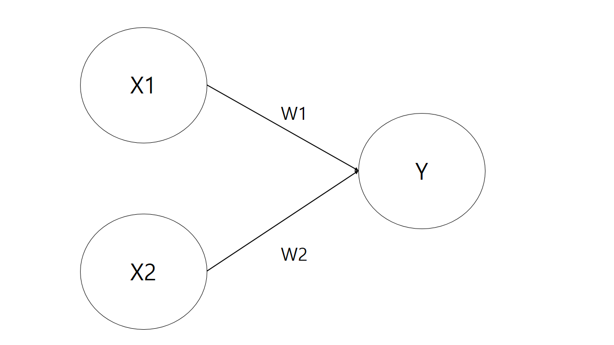
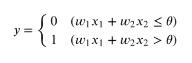
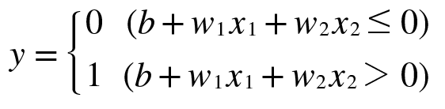
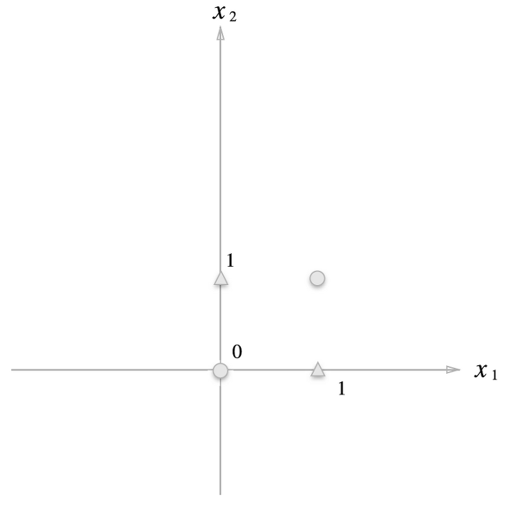
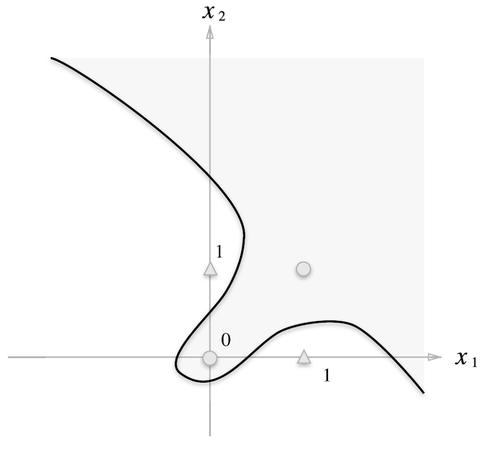
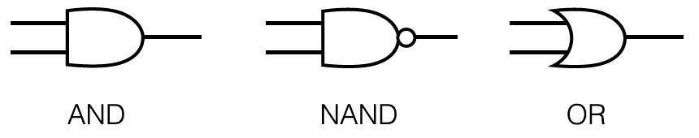

# Chapter 2 퍼셉트론
퍼셉트론(Perceptron) 알고리즘은 신경망(딥러닝)의 기원이 되는 알고리즘이다.  
이번 장에서 기술하는 퍼셉트론은 정확히는 '인공 뉴런' 혹은 '단순 퍼셉트론'으로 불리는 것이다. 단, 기본적인 처리는 거의 비슷하니 여기서는 단순히 '퍼셉트론'이라고 하겠다.

## 2.1 퍼셉트론이란?
퍼셉트론은 다수의 신호를 입력으로 받아 하나의 신호를 출력한다. 전류가 전선을 타고 흐르는 전자를 내보내듯, 퍼셉트론 신호도 흐름을 만들고 정보를 앞으로 전달한다. 다만, 실제 전류와 달리 퍼셉트론 신호는 '흐른다/안 흐른다(1/0)'의 두 가지 값을 가질 수 있다. 

  
[그림 2_1]  
입력으로 2개의 신호를 받은 퍼셉트론의 예이다. x1과 x2는 입력 신호, y는 출력 신호, w1, w2는 가중치를 뜻한다. 그림의 원을 **뉴런** 혹은 **노드**라고 부른다. 입력 신호가 뉴런에 보내질 때는 각각 고유한 **가중치**가 곱해진다(w1x1, w2x2). 뉴런에서 보내온 신호의 총합이 정해진 한계를 넘어설 때만 1을 출력한다. 이를 `뉴런이 활성화한다`라 표현하기도 한다. 그 한계를 **임계값**이라 하며, Θ 기호(세타)로 나타낸다.  

  
[식 2.1]  
퍼셉트론의 동작 원리를 수식으로 나타내면 위와 같다. 퍼셉트론은 복수의 입력 신호에 각각에 고유한 가중치를 부여한다. 가중치는 각 신호가 결과에 주는 영향력을 조절하는 요소로 작용한다. 즉, 가중치가 클수록 해당 신호가 그만큼 더 중요함을 뜻한다.  
`가중치는 전류에서 말하는 **저항**에 해당한다.`

## 2.2 단순한 논리 회로
### 2.2.1 AND 게이트
두 입력이 모두 1일 때만 1을 출력하고, 그 외에는 0을 출력한다. 이 AND 게이트를 퍼셉트론으로 표현하고자 하면 w1, w2, Θ의 값을 정해야 한다.  
사실 AND 게이트의 진리표를 만족하는 매개변수 조합은 무한히 많다. 가령 (w1, w2, Θ)가 (0.5, 0.5, 0.7)일 때, 또 (0.5, 0.5, 0.8)이나 (1.0, 1.0, 1.0) 때 모두 AND 게이트의 조건을 만족한다. 매개변수를 이렇게 설정하면 x1, x2가 모두 1일 때만 가중 신호의 총합이 주어진 임계값을 웃돌게 된다.  

### 2.2.2 NAND 게이트와 OR 게이트
NAND는 Not AND를 의미하며, AND 게이트의 출력을 뒤집은 것이 된다. x1과 x2가 모두 1일 때만 0을 출력하고 그 외에는 1을 출력한다.  
NAND 게이트를 표현하려면 예를 들어 (w1, w2, Θ) = (-0.5, -0.5, -0.7) 조합이 있다. 다른 조합도 무한히 있다. 사실 AND 게이트를 구현하는 매개변수의 부호를 모두 반전하기만 하면 NAND 게이트가 된다.  
OR 게이트는 입력 신호 중 하나 이상이 1이면 출력이 1이 되는 논리 회로이다. OR 게이트를 표현하려면 (w1, w2, Θ) = (0.5, 0.5, 0.3) 조합이 될 수 있다.  

퍼셉트론으로 AND, NAND, OR 논리 회로를 표현할 수 있다. 여기서 중요한 점은 퍼셉트론의 구조는 AND, NAND, OR 게이트 모두에서 똑같다는 것이다. 세 가지 게이트에서 다른 것은 매개변수(가중치와 임계값)의 값뿐이다.  

## 2.3 퍼셉트론 구현하기
### 2.3.1 간단한 구현부터
논리 회로를 파이썬으로 구현해볼 수 있다. 다음은 x1과 x2를 인수로 받는 AND라는 함수이다.  
```
def AND(x1, x2) :
    w1, w2, theta = 0.5, 0.5, 0.7
    tmp = x1*w1 + x2*w2
    
    if tmp <= theta :
        return 0
    elif tmp > theta :
        return 1
```
매개변수 w1, w2, theta는 함수 안에서 초기화하고, 가중치를 곱한 입력의 총합이 임계값을 넘으면 1을 반환하고 그 외에는 0을 반환한다. 이 함수의 출력은 다음과 같다.
```
AND(0, 0) >> 0
AND(1, 0) >> 0
AND(0, 1) >> 0
AND(1, 1) >> 1
```   

### 2.3.2 가중치와 편향 도입
앞에서 구현한 AND 게이트는 직관적이고 알기 쉽지만, 앞으로를 생각해서 다른 방식으로 수정하고자 한다. 그 전에 [식 2.1]의 Θ를 -b로 치환하면 퍼셉트론의 동작이 [식 2.2]처럼 된다.  
  
[식 2.2]    
[식 2.1]과 [식 2.2]는 기호 표기만 바꿨을 뿐, 그 의미는 같다. 여기에서 b를 **편향**이라 하며 w1과 w2는 그대로 **가중치**이다. [식 2.2] 관점에서 해석해보자면, 퍼셉트론은 입력 신호에 가중치를 곱한 값과 편향을 합하여, 그 값이 0을 넘으면 1을 출력하고 그렇지 않으면 0을 출력한다. 그럼 넘파이를 사용해서 [식 2.2] 방식으로 구현해보자.   
```
>>> import numpy as np
>>> x = np.array([0, 1])
>>> w = np.array([0.5, 0.5])
>>> b = -0.7
>>> w*x  
array([0. , 0.5])
>>> np.sum(w*x)
0.5
>>> np.sum(w*x) + b
-0.19999999999999996
```   
넘파이 배열끼리의 곱셈은 두 배열의 원소 수가 같다면 각 원소끼리 곱한다. 그래서 w*x에서는 인덱스가 같은 원소끼리 곱한다([0, 1] * [0.5, 0.5] => [0, 0.5]). 또, np.sum() 메서드는 입력한 배열에 담긴 모든 원소의 총합을 계산한다. 이 가중치에 편향을 더하면 [식 2.2]의 계산이 완료된다.  

### 2.3.3 가중치와 편향 구현하기
`가중치와 편향을 도입`한 AND 게이트는 다음과 같이 구현할 수 있다.   
```
import numpy as np

def AND(x1, x2) :
    x = np.array([x1, x2])
    w = np.array([0.5, 0.5])
    b = -0.7
    tmp = np.sum(w*x) + b
    
    if tmp <= 0 :
        return 0
    else :
        return 1
```  
-0가 편향 b로 치환되었다. 그리고 편향은 가중치 w1, w2와 기능이 다르다는 사실에 주의해야 한다. 구체적으로 말하면 w1과 w2는 각 입력 신호가 결과에 주는 영향력(중요도)을 조절하는 매개변수고, 편향은 뉴런이 얼마나 쉽게 활성화(결과로 1을 출력)하느냐를 조정하는 매개변수이다. 예를 들어 b가 -0.1이면 각 입력 신호에 가중치를 곱한 값들의 합이 0.1을 초과할 때만 뉴런이 활성화한다. 반면 b가 -20.0이면 각 입력 신호에 가중치를 곱한 값들의 합이 20.0을 넘지 않으면 뉴런은 활성화하지 않는다. 이처럼 편향의 값은 뉴런이 얼마나 쉽게 활성화되는지를 결정한다. 하지만 이 책에서는 문맥에 따라 w1, w2, b 셋 모두를 '가중치'라고 한다.  

NAND 게이트와 OR 게이트를 구현해보자.  
```
def NAND(x1, x2) :
    x = np.array([x1, x2])
    w = np.array([-0.5, -0.5])  # AND와는 가중치(w와 b)만 다르다.
    b = 0.7
    tmp = np.sum(w*x) + b

    if tmp <= 0 :
        return 0
    else :
        return 1

def OR(x1, x2) :
    x = np.array([x1, x2])
    w = np.array([0.5, 0.5])
    b = -0.2    # AND와는 가중치(b)만 다르다.
    tmp = np.sum(w*x) + b

    if tmp <= 0 :
        return 0
    else :
        return 1
```  
앞 절에서 AND, NAND, OR는 모두 같은 구조의 퍼셉트론이고, 차이는 가중치 매개변수의 값뿐이라 했다. 실제로 파이썬으로 작성한 NAND와 OR 게이트의 코드에서도 AND와 다른 곳은 가중치와 편향 값을 설정하는 부분뿐이다.  

## 2.4 퍼셉트론의 한계
지금까지 살펴본 것처럼 퍼셉트론을 이용하면 AND, NAND, OR의 3가지 논리 회로를 구현할 수 있었다. XOR 게이트도 생각해보자.

### 2.4.1 XOR 게이트
XOR 게이트는 **배타적 논리합**이라는 논리 회로이다. x1과 x2 중 한쪽이 1일 때만 1을 출력한다. 하지만 지금까지 본 퍼셉트론으로는 이 XOR 게이트를 구현할 수 없다. 그 이유는 무엇일까?  
우선 OR 게이트는 예를 들어 가중치 매개변수가 (b, w1, w2) = (-0.5, 1.0, 1.0)일 때 진리표를 만족한다. 이때의 퍼셉트론은 직선으로 나뉜 두 영역을 만든다. 직선으로 나뉜 한쪽 영역은 1을 출력하고 다른 한쪽은 0을 출력한다. 이를 그려보면 [그림 2-6]처럼 된다.  
  
[그림 2-6] 회색 영역은 0을 출력하는 영역이며, 전체 영역은 OR 게이트의 성질을 만족한다.    
OR 게이트는 (x1, x2) = (0, 0)일 때 0을 출력하고 (0, 1), (1, 0), (1, 1)일 때는 1을 출력한다. 그림에서는 0을 원, 1을 삼각형으로 표시했다. OR 게이트를 만들려면 원과 삼각형을 직선으로 나눠야 한다. 실제로 이 그림의 직선은 네 점을 제대로 나누고 있다. 그럼 XOR 게이트는 OR 게이트 때처럼 직선 하나로 원과 삼각형을 나누는 영역을 만들어낼 수 있을까?  
  
[그림 2-7]  
[그림 2-7]의 원과 삼각형을 직선 하나로 나누기란 사실상 불가능하다.  

### 2.4.2 선형과 비선형
직선 하나로 [그림 2-7]의 원과 삼각형을 나눌 수 없다. 하지만 '직선'이라는 제약을 없앤다면 가능하다. 예를 들어 [그림 2-8]처럼 나눌 수 있다.  
  
[그림 2-8]  
퍼셉트론은 직선 하나로 나눈 영역만 표현할 수 있다는 한계가 있다. [그림 2-8] 같은 곡선은 표현할 수 없다. 덧붙여서 [그림 2-8]과 같은 곡선의 영역을 **비선형** 영역, 직선의 영역을 **선형** 영역이라고 한다. 선형, 비선형이라는 말은 기계학습 분야에서 자주 쓰이는 용어로, [그림 2-6]과 [그림 2-8] 같은 이미지를 떠올리면 된다.  


## 2.5 다층 퍼셉트론이 충돌한다면 
안타깝게도 퍼셉트론으로는 XOR 게이트를 표현할 수 없었지만, 퍼셉트론은 '층을 쌓아' **다층 퍼셉트론**을 만들 수 있다. 이번 절에서는 층을 하나 더 쌓아서 XOR를 표현해볼 것이다.  

### 2.5.1 기존 게이트 조합하기
Xor 게이트를 만드는 방법은 다양하다. 그중 하나는 앞서 만든 AND, NAND, OR 게이트를 조합하는 방법이다. 여기에서는 AND, NAND, OR 게이트를 [그림 2-9]와 같은 기호로 표기한다. 참고로 [그림 2-9]의 NAND 게이트 출력부에 있는 ○ 기호는 출력을 반전한다는 뜻이다.  
  
[그림 2-9]  

  
[그림 2-11]  
[그림 2-11]과 같은 조합이라면 XOR 게이트를 구현할 수 있다. x1과 x2가 입력 신호, y가 출력 신호이다. x1과 x2는 NAND와 OR 게이트의 입력이 되고, NAND와 OR의 출력이 AND 게이트의 입력으로 이어진다. NAND의 출력을 s1, OR의 출력을 s2로 해서 진리표를 만들면 XOR의 출력과 같음을 알 수 있다.  

### 2.5.2 XOR 게이트 구현하기
[그림 2-11]처럼 조합된 XOR 게이트를 파이썬으로 구현해보자. 지금까지 정의한 함수 AND, NAND, OR를 사용하면 다음과 같이 구현할 수 있다.  
```
def XOR(x1, x2) :
    s1 = NAND(x1, x2)
    s2 = OR(x1, x2)
    y = AND(s1, s2)

    return y
```
