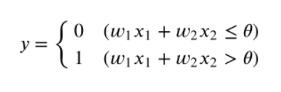
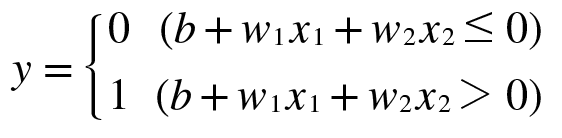

# Chapter 2 퍼셉트론
퍼셉트론(Perceptron) 알고리즘은 신경망(딥러닝)의 기원이 되는 알고리즘이다.  
이번 장에서 기술하는 퍼셉트론은 정확히는 '인공 뉴런' 혹은 '단순 퍼셉트론'으로 불리는 것이다. 단, 기본적인 처리는 거의 비슷하니 여기서는 단순히 '퍼셉트론'이라고 하겠다.

## 2.1 퍼셉트론이란?
퍼셉트론은 다수의 신호를 입력으로 받아 하나의 신호를 출력한다. 전류가 전선을 타고 흐르는 전자를 내보내듯, 퍼셉트론 신호도 흐름을 만들고 정보를 앞으로 전달한다. 다만, 실제 전류와 달리 퍼셉트론 신호는 '흐른다/안 흐른다(1/0)'의 두 가지 값을 가질 수 있다. 

  
입력으로 2개의 신호를 받은 퍼셉트론의 예이다. x1과 x2는 입력 신호, y는 출력 신호, w1, w2는 가중치를 뜻한다. 그림의 원을 **뉴런** 혹은 **노드**라고 부른다. 입력 신호가 뉴런에 보내질 때는 각각 고유한 **가중치**가 곱해진다(w1x1, w2x2). 뉴런에서 보내온 신호의 총합이 정해진 한계를 넘어설 때만 1을 출력한다. 이를 `뉴런이 활성화한다`라 표현하기도 한다. 그 한계를 **임계값**이라 하며, Θ 기호(세타)로 나타낸다.  

  
[식 2.1]  
퍼셉트론의 동작 원리를 수식으로 나타내면 위와 같다. 퍼셉트론은 복수의 입력 신호에 각각에 고유한 가중치를 부여한다. 가중치는 각 신호가 결과에 주는 영향력을 조절하는 요소로 작용한다. 즉, 가중치가 클수록 해당 신호가 그만큼 더 중요함을 뜻한다.  
`가중치는 전류에서 말하는 **저항**에 해당한다.`

## 2.2 단순한 논리 회로
### 2.2.1 AND 게이트
두 입력이 모두 1일 때만 1을 출력하고, 그 외에는 0을 출력한다. 이 AND 게이트를 퍼셉트론으로 표현하고자 하면 w1, w2, Θ의 값을 정해야 한다.  
사실 AND 게이트의 진리표를 만족하는 매개변수 조합은 무한히 많다. 가령 (w1, w2, Θ)가 (0.5, 0.5, 0.7)일 때, 또 (0.5, 0.5, 0.8)이나 (1.0, 1.0, 1.0) 때 모두 AND 게이트의 조건을 만족한다. 매개변수를 이렇게 설정하면 x1, x2가 모두 1일 때만 가중 신호의 총합이 주어진 임계값을 웃돌게 된다.  

### 2.2.2 NAND 게이트와 OR 게이트
NAND는 Not AND를 의미하며, AND 게이트의 출력을 뒤집은 것이 된다. x1과 x2가 모두 1일 때만 0을 출력하고 그 외에는 1을 출력한다.  
NAND 게이트를 표현하려면 예를 들어 (w1, w2, Θ) = (-0.5, -0.5, -0.7) 조합이 있다. 다른 조합도 무한히 있다. 사실 AND 게이트를 구현하는 매개변수의 부호를 모두 반전하기만 하면 NAND 게이트가 된다.  
OR 게이트는 입력 신호 중 하나 이상이 1이면 출력이 1이 되는 논리 회로이다. OR 게이트를 표현하려면 (w1, w2, Θ) = (0.5, 0.5, 0.3) 조합이 될 수 있다.  

퍼셉트론으로 AND, NAND, OR 논리 회로를 표현할 수 있다. 여기서 중요한 점은 퍼셉트론의 구조는 AND, NAND, OR 게이트 모두에서 똑같다는 것이다. 세 가지 게이트에서 다른 것은 매개변수(가중치와 임계값)의 값뿐이다.  

## 2.3 퍼셉트론 구현하기
### 2.3.1 간단한 구현부터
논리 회로를 파이썬으로 구현해볼 수 있다. 다음은 x1과 x2를 인수로 받는 AND라는 함수이다.  
```
def AND(x1, x2) :
    w1, w2, theta = 0.5, 0.5, 0.7
    tmp = x1*w1 + x2*w2
    
    if tmp <= theta :
        return 0
    elif tmp > theta :
        return 1
```
매개변수 w1, w2, theta는 함수 안에서 초기화하고, 가중치를 곱한 입력의 총합이 임계값을 넘으면 1을 반환하고 그 외에는 0을 반환한다. 이 함수의 출력은 다음과 같다.
```
AND(0, 0) >> 0
AND(1, 0) >> 0
AND(0, 1) >> 0
AND(1, 1) >> 1
```   

### 2.3.2 가중치와 편향 도입
앞에서 구현한 AND 게이트는 직관적이고 알기 쉽지만, 앞으로를 생각해서 다른 방식으로 수정하고자 한다. 그 전에 [식 2.1]의 Θ를 -b로 치환하면 퍼셉트론의 동작이 [식 2.2]처럼 된다.  
  
[식 2.2]    
[식 2.1]과 [식 2.2]는 기호 표기만 바꿨을 뿐, 그 의미는 같다. 여기에서 b를 **편향**이라 하며 w1과 w2는 그대로 **가중치**이다. [식2.2] 관점에서 