# Chapter 3 신경망

퍼셉트론으로 복잡한 함수도 표현할 수 있지만, 가중치를 설정하는 작업(원하는 결과를 출력하도록 가중치 값을 적절히 정하는 작업)은 여전히 사람이 수동으로 한다. 하지만, 신경망은 가중치 매개변수의 적절한 값을 데이터로부터 자동으로 학습하는 능력이 있다. 데이터에서 가중치 매개변수 값을 학습하는 방법은 다음 장에서 배우게 된다.    

## 3.1 퍼셉트론에서 신경망으로
신경망은 앞 장에서 설명한 퍼셉트론과 공통점이 많다. 이번 절에서는 퍼셉트론과 다른 점을 중심으로 신경망의 구조를 설명한다.   

### 3.1.1 신경망의 예
신경망을 그림으로 나타내면 [그림 3-1]처럼 된다. 여기에서 가장 왼쪽 줄을 입력층, 맨 오른쪽 줄을 출력층, 중간 줄을 은닉층이라고 한다. 은닉층의 뉴런은 입력층이나 출력층과 달리 사람 눈에 보이지 않는다. 그래서 '은닉'인 것이다. 또한, 이 책에서는 입력층에서 출력층 방향으로 차례로 0층(입력층), 1층(은닉층), 2층(출력층)이라 하겠다.  
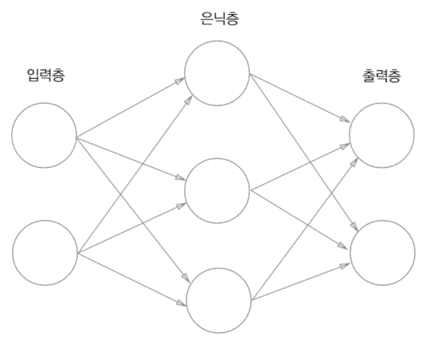  
[그림 3-1]  

`[그림 3-1]의 신경망은 모두 3츠응로 구성되지만, 가중치를 갖는 층은 2개뿐이기 때문에 '2층 신경망'이라고 한다. 문헌에 따라 '3층 신경망'이라고 하는 경우도 있지만, 이 책에서는 실제로 가중치를 갖는 층의 개수를 기준으로 하겠다.`    

실제로 뉴런이 연결되는 방식은 앞 장의 퍼셉트론에섣 달라진 것이 없다. 신경망에서는 신호를 어떻게 전달할까?  

### 3.1.2. 퍼셉트론 복습
[그림 3-2]는 x1과 x2라는 두 신호를 입력받아 y를 출력하는 퍼셉트론이다.  
  
[그림 3-2]  
이 퍼셉트론을 수식으로 나타내면 [식 3-1]이 된다.  
  
[식 3-1]  
여기서 b는 **편향**을 나타내는 매개변수로, 뉴런이 얼마나 쉽게 활성화되느냐를 제어한다. 한편 w1, w2는 각 신호의 가중치를 나타내는 매개변수로, 각 신호의 영향력을 제어한다. 그런데 [그림 3-2]의 네트워크에는 편향 b가 보이지 않는다. 여기에 편향을 명시한다면 [그림 3-3]과 같이 나타낼 수 있다.  
  
[그림 3-3]  
[그림 3-3]에서는 가중치가 b이고 입력이 1인 뉴런이 추가되었다. 이 퍼셉트론의 동작은 x1, x2, 1이라는 3개의 신호가 뉴런에 입력되어, 각 신호에 가중치를 곱한 후, 다음 뉴런에 전달된다. 다음 뉴런에서는 이들 신호의 값을 더하여, 그 합이 0을 넘으면 1을 출력하고 그렇지 않으면 0을 출력한다. 참고로, 편향의 입력 신호는 항상 0이다. [식 3-1]을 간결한 형태로 작성해보면 위와 같다. 조건 분기의 동작(0을 넘으면 1을 출력하고 그렇지 않으면 0을 출력)을 하나의 함수로 나타낸다. 이 함수를 h(x)라 하면, 위와 같이 표현할 수 있다.  
입력 신호의 총합이 h(x)라는 함수를 거쳐 변환되어, 변환된 값이 y의 출력이 됨을 보여준다.  

### 3.1.3 활성화 함수의 등장
h(x)와 같이 입력 신호의 총합을 출력 신호로 변환하는 함수를 일반적으로 **활성화 함수**라 한다. 활성화 함수는 입력 신호의 총합이 활성화를 일으키는지를 정하는 역할을 한다.  
가중치가 곱해진 입력 신호의 총합을 계산하고, 그 합을 활성화 함수에 입력해 결과를 내는 2단계로 처리된다. 이 식은 다음과 같이 2개의 식으로 나눌 수 있다.  
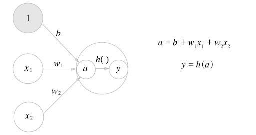  
[그림 3-4]  
먼저 가중치가 달린 입력 신호와 편향의 총합을 계산하고, 이를 a라 한다. 그리고 a를 함수 h()에 넣어 y를 출력하는 흐름을 가진다.  
[그림 3-4]에서는 기존 뉴런의 원을 키우고, 그 안에 활성화 함수 처리 과정을 명시적으로 그려 넣었다. 즉, 가중치 신호를 조합한 결과가 a라는 노드가 되고, 활성화 함수 h()를 통과하여 y라는 노드로 변환되는 과정이 분명하게 나타나있다. 참고로 이 책에서는 **뉴런**과 **노드**라는 용어를 같은 의미로 사용한다.  
```
단순 퍼셉트론 : 단층 네트워크에서 계단 함수(임계값을 경계로 출력이 바뀌는 함수)를 활성화 함수로 사용한 모델
다층 퍼셉트론 : 신경망(여러 층으로 구성되고 시그모이드 함수 등의 매끈한 활성화 함수를 사용하는 네트워크)
```

## 3.2 활성화 함수
h(x)와 같은 활성화 함수는 임계값을 경계로 출력이 바뀌는데, 이런 함수를 **계단 함수**라 한다. 그래서 `퍼셉트론에서는 활성화 함수로 계단 함수를 이용한다.`라 할 수 있다. 활성화 함수를 계단 함수에서 다른 함수로 변경하는 것이 신경망의 세계로 나아가는 열쇠이다.  

### 3.2.1 시그모이드 함수
다음은 **시그모이드 함수**를 나타낸 식이다.  
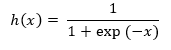  
[식 3-6]  
신경망에서는 활성화 함수로 시그모이드 함수를 이용하여 신호를 변환하고, 그 변환된 신호를 다음 뉴런에 전달한다. 퍼셉트론과 신경망의 주된 차이는 이 `활성화 함수`뿐이다.  

### 3.2.3 계단 함수의 그래프
```python
import numpy as np
import matplotlib.pylab as plt

def step_function(x) :
    '''
    넘파이 배열에 부등호 연산을 수행하면 배열의 원소 각각에 부등호 연산을 수행한 bool 배열 생성
    배열 x의 원소 각각이 0보다 크면 True, 0 이하면 False로 변환한 새로운 배열 y가 생성된다.
    하지만 0이나 1의 'int형'을 출력하는 함수기 때문에 astype() 메서드로 int형으로 바꿔준다.
    '''
    return np.array(x > 0, dtype=np.int)

x = np.arange(-5.0, 5.0, 0.1)   # -5.0부터 5.0 전까지 0.1 간격의 넘파이 배열 생성 ([-5.0, -4.9, ..., 4.9])
y = step_function(x)
plt.plot(x, y)
plt.ylim(-0.1, 1.1)     # y축의 범위 지정
plt.show()
```
step_function()은 인수로 받은 넘파이 배열의 원소 각각을 인수로 계단 함수 실행해, 그 결과를 다시 배열로 만들어 돌려준다. 이 x, y 배열을 그래프로 그리면 결과는 다음과 같다.  
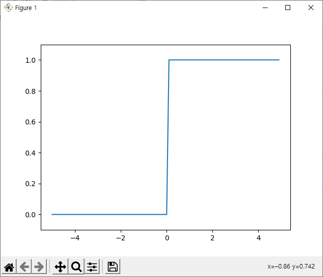  
[그림 3-6]  
계단 함수는 0을 경계로 출력이 0에서 1(또는 1에서 0)로 바뀐다.  

### 3.2.4 시그모이드 함수 구현하기
```python
import numpy as np
import matplotlib.pylab as plt

def sigmoid(x) :
    return 1/ (1 + np.exp(-x))

x = np.arange(-5.0, 5.0, 0.1)
y = sigmoid(x)
plt.plot(x, y)
plt.ylim(-0.1, 1.1)     # y축 범위 지정
plt.show()
```
실행하면 아래와 같은 그래프가 나타난다.  
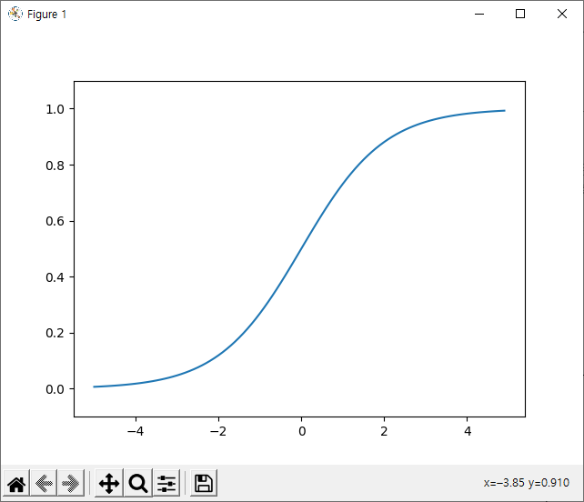  
[그림 3-7]  
시그모이드 함수는 부드러운 곡선이며, 입력에 따라 출력이 연속적으로 변화한다. 한편, 계단 함수는 0을 경계로 출력이 갑자기 바뀌어버린다. 시그모이드 함수의 이 매끄러움이 신경망 학습에서 아주 중요한 역할을 하게 된다.  
계단 함수가 0과 1 중 하나의 값만 돌려주는 반면 시그모이드 함수는 실수를 돌려준다는 점도 다르다. 다시 말해 퍼셉트론에서는 뉴런 사이에 0 혹은 1이 흘렀다면, 신경망에서는 연속적인 실수가 흐른다.  
큰 관점에서 보면 둘은 같은 모양을 하고 있다. 둘 다 입력이 작을 때의 출력은 0에 가깝고(혹은 0이고), 입력이 커지면 출력이 1에 가까워지는(혹은 1이 되는) 구조이다. 입력이 중요하면 큰 값을 출력하고 입력이 중요하지 않으면 작은 값을 출력한다. 그리고 입력이 아무리 작거나 커도 출력은 0에서 1 사이라는 것도 둘의 공통점이다.  


### 3.2.6 비선형 함수
계단 함수와 시그모이드 함수의 공통점은 그 밖에도 있다. 중요한 공통점으로, 둘 모두는 **비선형 함수**이다. 시그모이드 함수는 곡선, 계단 함수는 계단처럼 구부러진 직선으로 나타나며, 동시에 비선형 함수로 분류된다.  

함수에 무언가 입력했을 때 출력이 입력의 상수배만큼 변하는 함수를 **선형함수**라고 하고, 곧은 1개의 직선이 된다. **비선형 함수**는 직선 1개로 그릴 수 없는 함수를 말한다.  

신경망에서는 활성화 함수로 비선형 함수를 사용해야 한다. 선형 함수를 이용하면 신경망의 층을 깊게 하는 의미가 없어지기 때문이다.  
선형 함수의 문제는 층을 아무리 깊게 해도 '은닉층이 없는 네트워크'로도 똑같은 기능을 할 수 있다는 데 있다. 선형 함수를 이용해서는 여러 층으로 구성하는 이점을 살릴 수 없다. 그래서 층을 쌓는 혜택을 얻고 싶다면 활성화 함수로는 반드시 비선형 함수를 사용해야 한다.    

### 3.2.7 ReLU 함수
지금까지 활성화 함수로서 계단 함수와 시그모이드 함수를 공부했다. 시그모이드 함수는 신경망 분야에서 오래전부터 이용해왔으나, 최근에는 ReLU 함수를 주로 이용한다.    
ReLU는 입력이 0을 넘으면 그 입력을 그대로 출력하고, 0 이하면 0을 출력하는 함수이다. 
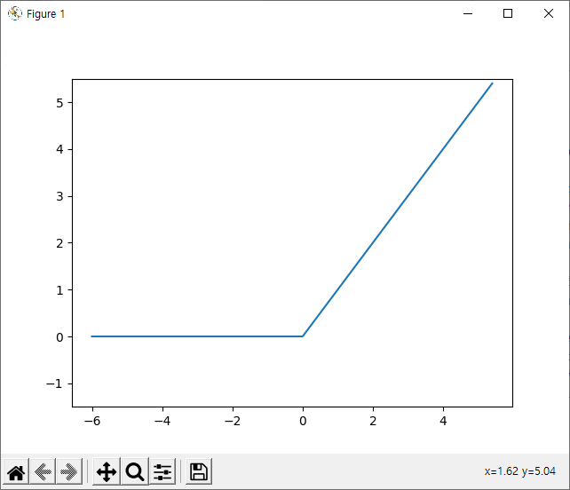  
[그림 3-9]  
그래프로 나타내면 위와 같고, 코드도 간단하게 작성할 수 있다.  
```python
def relu(x) :
    return np.maximum(0, x)
```
넘파이의 maximum 함수를 사용해서 두 입력 중 큰 값을 선택해 반환했다.  


## 3.3 다차원 배열의 계산

### 3.3.1 다차원 배열
```python
>>> import numpy as np
>>> A = np.array([1, 2, 3, 4])
>>> print(A)
[1 2 3 4]
>>> np.ndim(A)
1
>>> A.shape  
(4,)
>>> A.shape[0]
4
```
배열의 차원 수는 `np.ndim()` 함수로 확인할 수 있다. 또, 배열의 형상은 인스턴스 변수인 `shape`으로 알 수 있다.  

```python
>>> B = np.array([[1,2], [3,4], [5,6]])
>>> print(B)
[[1 2]
 [3 4]
 [5 6]]
>>> np.ndim(B)
2
>>> B.shape
(3, 2)
```
B는 3x2의 2차원 배열이다. 2차원 배열은 **행렬**이라 부르며, 배열의 가로 방향을 **행**, 세로 방향을 **열**이라고 한다.  

### 3.3.2 행렬의 내적(행렬 곱)
```python
>>> A = np.array([[1,2], [3,4]])
>>> A.shape
(2, 2)
>>> B = np.array([[5,6], [7,8]])
>>> B.shape
(2, 2)
>>> np.dot(A, B)
array([[19, 22],
       [43, 50]])
```
행렬의 내적(곱)은 넘파이 함수 `np.dot()`으로 계산한다. `np.dot()`은 넘파이 배열 2개를 인수로 받아 그 내적을 반환한다. 여기서 주의할 점은 `np.dot(A,B)`와 `np.dot(B,A)`는 다른 값이 될 수 있다. 또한 행렬을 곱할 때 행렬 A의 1번째 차원의 원소 수(열 수)와 행렬 B의 0번째 차원의 원소 수(행 수)가 같아야 한다.  
```python
>>> A = np.array([[1,2,3], [4,5,6]])
>>> B = np.array([[1,2], [3,4]])
>>> A.shape
(2, 3)
>>> B.shape
(2, 2)
>>> np.dot(A, B)
Traceback (most recent call last):
  File "<stdin>", line 1, in <module>
  File "<__array_function__ internals>", line 5, in dot
ValueError: shapes (2,3) and (2,2) not aligned: 3 (dim 1) != 2 (dim 0)
```
실제로 2x3 행렬과 2x2 행렬을 곱하면 오류를 출력한다.  


### 3.3.3 신경망의 내적
넘파이 행렬을 이용해 편향과 활성화 함수를 생략하고 가중치만 갖는 신경망을 구현해보자.  
```python
>>> X = np.array([1,2])
>>> X.shape
(2,)
>>> W = np.array([[1, 3, 5], [2, 4, 6]])
>>> print(W)
[[1 3 5]
 [2 4 6]]
>>> W.shape
(2, 3)
>>> Y = np.dot(X, W)
>>> print(Y)
[ 5 11 17]
```


## 3.4 3층 신경망 구현하기

### 3.4.2 각 층의 신호 전달 구현하기
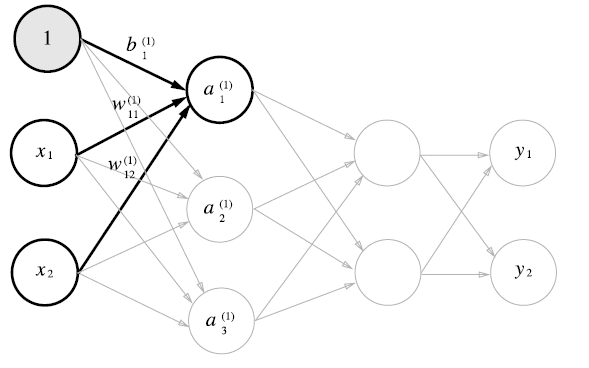  
[그림 3-17]  
1층의 첫 번째 뉴런으로 가는 신호를 구현해보자.  
```python
import numpy as np

X = np.array([1.0, 0.5])
W1 = np.array([[0.1, 0.3, 0.5], [0.2, 0.4, 0.6]])
B1 = np.array([0.1, 0.2, 0.3])

print(W1.shape) # (2, 3)
print(X.shape)  # (2,)
print(B1.shape) # (3,)

# 가중치를 곱한 신호 두 개와 편향을 합해서 계산
A1 = np.dot(X, W1) + B1    # [0.3 0.7 1.1]
```  
1층의 활성화 함수에서의 처리를 그림으로 나타내면 다음과 같다.  
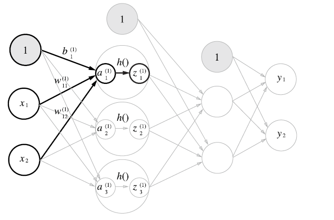  
[그림 3-18]  
은닉층에서의 가중치 합(가중 신호와 편향의 총합)을 a로 표기하고 활성화 함수 h()로 변환된 신호를 z로 표기한다. 여기에서는 활성화 함수로 시그모이드 함수를 사용하기로 한다. 이를 파이썬으로 구현하면 다음과 같다.  
```python
def sigmoid(x) :
    return 1/ (1 + np.exp(-x))

Z1 = sigmoid(A1)

print(A1) # [0.3 0.7 1.1]
print(Z1) # [0.57444252 0.66818777 0.75026011]
```
이 sigmoid() 함수는 앞에서 정의한 함수이다. 이어서 1층에서 2층으로 가는 과정과 그 구현을 살펴보자.  
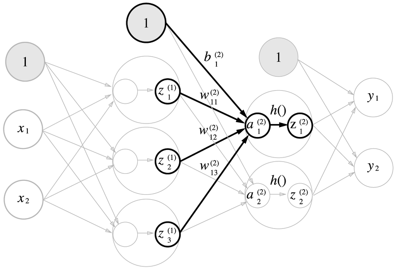  
[그림 3-19]  
```python
W2 = np.array([[0.1, 0.4], [0.2, 0.5], [0.3, 0.6]])
B2 = np.array([0.1, 0.2])

print(Z1.shape) # (3,)
print(W2.shape) # (3, 2)
print(B2.shape) # (2,)

A2 = np.dot(Z1, W2) + B2
Z2 = sigmoid(A2)
```
1층의 출력 Z1이 2층의 입력이 된다는 점을 제외하면 조금 전의 구현과 똑같다. 마지막으로 2층에서 출력층으로의 신호 전달이다. 출력층의 구현도 거의 같지만 활성화 함수만 지그까지의 은닉층과 다르다.  
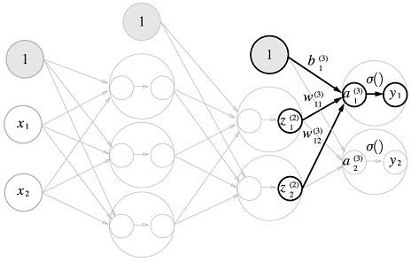  
[그림 3-20]  
```python
def identity_function(x) :
    return x

W3 = np.array([[0.1, 0.3], [0.2, 0.4]])
B3 = np.array([0.1, 0.2])

A3 = np.dot(Z2, W3) + B3
Y = identity_function(A3)   # Y = A3
```
항등 함수인 `identity_function()`을 정의하고, 이를 출력층의 활성화 함수로 이용했다. 항등 함수는 입력을 그대로 출력하는 함수이다. 그래서 이 예에서 identity_function()을 굳이 정의할 필요는 없지만, 그동안의 흐름과 통일하기 위해 이렇게 구현했다. 또한 [그림 3-20]에서 출력층의 함수를 시그마로 표시하여 은닉층의 활성화 함수 h()와는 다름을 명시했다.  
`출력층의 활성화 함수는 풀고자 하는 문제의 성질에 맞게 정한다. 예를 들어 회귀에는 항등 함수를, 2클래스 분류에는 시그모이드 함수를, 다중 클래스 분류에는 소프트맥스 함수를 사용하는 것이 일반적이다.`    

### 3.4.3 구현 정리
```python
import numpy as np

def init_network() :
    network = {}
    network['W1'] = np.array([[0.1, 0.3, 0.5], [0.2, 0.4, 0.6]])
    network['b1'] = np.array([0.1, 0.2, 0.3])
    network['W2'] = np.array([[0.1, 0.4], [0.2, 0.5], [0.3, 0.6]])
    network['b2'] = np.array([0.1, 0.2])
    network['W3'] = np.array([[0.1, 0.3], [0.2, 0.4]])
    network['b3'] = np.array([0.1, 0.2])

    return network

def sigmoid(x) :
    return 1/ (1 + np.exp(-x))

def identity_function(x) :
    return x

def forward(network, x) :
    W1, W2, W3 = network['W1'], network['W2'], network['W3']
    b1, b2, b3 = network['b1'], network['b2'], network['b3']

    a1 = np.dot(x, W1) + b1
    z1 = sigmoid(a1)
    a2 = np.dot(z1, W2) + b2
    z2 = sigmoid(a2)
    a3 = np.dot(z2, W3) + b3
    y = identity_function(a3)

    return y

network = init_network()
x = np.array([1.0, 0.5])
y = forward(network, x)
print(y)    # [0.31682708 0.69627909]
```
신경망 구현의 관례에 따라 가중치만 W1과 같이 대문자로 쓰고, 그 외 편향과 중간 결과 등은 모두 소문자로 썼다. 함수 이름을 forward()라 한 것은 신호가 순방향(입력에서 출력 방향)으로 전달됨(순전파)을 알리기 위해서이다. 앞으로 신경망 학습을 다룰 때 역방향(backward, 출력에서 입력 방향) 처리에 대해서도 살펴볼 예정이다.  


## 3.5 출력층 설계하기
신경망은 분류와 회귀 모두에 이용할 수 있다. 다만 둘 중 어떤 문제냐에 따라 출력층에서 사용하는 활성화 함수가 달라진다. 일반적으로 회귀에는 항등 함수를, 분류에는 소프트맥스 함수를 사용한다. 기계학습 문제는 **분류(classification)**와 **회귀(regression)**로 나뉜다. 분류는 데이터가 어느 클래스에 속하느냐는 문제이다. 사진 속 동물의 종류를 분류하는 문제가 여기 속한다. 한편, 회귀는 입력 데이터에서 (연속적인) 수치를 예측하는 문제이다. 사진 속 동물의 몸무게를 예측하는 문제가 회귀이다.    

### 3.5.1 항등 함수와 소프트맥스 함수 구현하기
회귀에서 사용하는 **항등 함수**는 입력을 그대로 출력한다. 한편, 분류에서 사용하는 **소프트맥스 함수(softmax function)**의 식은 다음과 같다.   
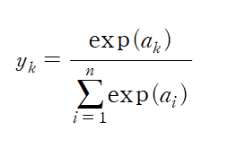  
[식 3-10]  
exp(x)는 e^x을 뜻하는 지수 함수이다. n은 출력층의 뉴런 수, yk는 그중 k번째 출력임을 뜻한다. 소프트맥스 함수의 분자는 입력 신호 ak의 지수 함수, 분모는 모든 입력 신호의 지수 함수의 합으로 구성된다.  
```python
def softmax(a) :
    exp_a = np.exp(a)
    sum_exp_a = np.sum(exp_a)
    y = exp_a / sum_exp_a

    return y
```

### 3.5.2 소프트맥스 함수 구현 시 주의점
앞 절에서 구현한 softmax() 함수의 코드는 [식 3-10]을 ㅈ대로 표현하고 있지만, 컴퓨터로 계산할 때는 결함이 있다. **오버플로** 문제이다. 소프트맥스 함수는 지수 함수를 사용하는데 지수 함수는 아주 큰 값을 낸다. 그리고 이런 큰 값끼리 나눗셈을 하면 결과 수치가 '불안정'해진다. 다음은 이 문제를 해결하도록 소프트맥스 함수 구현을 개선한 수식이다.  
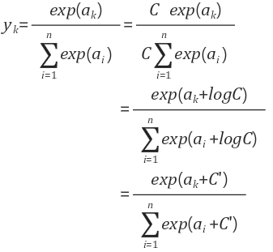  
[식 3-11]    
첫 번째 변형에서는 C라는 임의의 정수를 분자와 분모 양쪽에 곱했다. 그다음으로 C를 지수 함수 exp() 안으로 옮겨 logC로 만든다. 마지막으로 logC를 C'라는 새로운 기호로 바꾼다.    
[식 3-11]에서 말하는 것은 소프트맥스의 지수 함수를 계산할 때 어떤 정수를 더해도(혹은 빼도) 결과는 바뀌지 않는다는 것이다. 여기서 C'에 어떤 값을 대입해도 상관 없지만, 오버플로를 막을 목적으로는 입력 신호 중 최댓값을 이용하는 것이 일반적이다.  
```python
>>> a = np.array([1010, 1000, 990])
>>> np.exp(a) / np.sum(np.exp(a))
array([nan, nan, nan])  # 제대로 계산되지 않는다.
>>>
>>> c = np.max(a)   # c = 1010 (최댓값)
>>> a - c
array([  0, -10, -20])
>>>
>>> np.exp(a - c) / np.sum(np.exp(a - c))
array([9.99954600e-01, 4.53978686e-05, 2.06106005e-09])
```  
이 예에서 보는 것처럼 아무런 조치 없이 그냥 계산하면 nan이 출력된다(nan은 not a number의 약자). 하지만 입력 신호 중 최댓값(이 예에서는 c)을 빼주면 올바르게 계산할 수 있다. 이를 바탕으로 소프트맥수 함수를 다시 구현하면 다음과 같다.  
```python
def softmax(a) :
    c = np.max(a)
    exp_a = np.exp(a - c)   # 오버플로 대책
    sum_exp_a = np.sum(exp_a)
    y = exp_a / sum_exp_a

    return y
```    

### 3.5.3 소프트맥스 함수의 특징
```python
>>> a = np.array([0.3, 2.9, 4.0])
>>> y = softmax(a)                
>>> print(y)
[0.01821127 0.24519181 0.73659691]
>>> np.sum(y)
1.0
```
보는 바와 같이 소프트맥스 함수의 출력은 0에서 1.0 사이의 실수이다. 또 소프트맥스 함수 출력의 총합은 1이다. 출력 총합이 1이 된다는 점은 소프트맥스 함수의 중요한 성질이다. 이 성질 덕분에 소프트맥스 함수의 출력을 '확률'로 해석할 수 있다.  
가령 앞의 예에서 y[0]의 확률은 0.018(1.8%), y[1]의 확률은 0.245(24.5%), y[2]의 화귤은 0.737(73.7%)로 해석할 수 있다. 그리고 이 결과 확률들로부터 `2번째 원소의 확률이 가장 높으니, 답은 2번째 클래스다`라고 할 수 있다. 즉, 소프트맥스 함수를 이용함으로써 문제를 확률적(통계적)으로 대응할 수 있게 되는 것이다.  
여기서 주의점으로, 소프트맥스 함수를 적용해도 각 원소의 대소 관계는 변하지 않는다. y = exp(x)가 단조 증가 함수이기 때문이다. 실제로 앞의 예에서는 a의 원소들 사이의 대소 관계가 y의 원소들 사이의 대소 관계로 그대로 이어진다. 예를 들어 a에서 가장 큰 원소는 2번째 원소이고, y에서 가장 큰 원소도 2번째 원소이다.    

## 3.6 손글씨 숫자 인식
이번 절에서는 이미 학습된 매개변수를 사용하여 학습 과정은 생략하고, 추론 과정만 구현할 것이다. 이 추론 과정을 신경망의 **순전파**라고도 한다.  

### 3.6.1 MNIST 데이터셋
MNIST는 기계 학습 분야에서 아주 유명한 데이터셋으로, 이번 예에서 사용하는 데이터셋은 손글씨 숫자 이미지 집합이다.  
```python
import sys, os
sys.path.append(os.pardir)  # 부모 디렉터리의 파일을 가져올 수 있도록 설정
from dataset.mnist import load_mnist

(x_train, t_train), (x_test, t_test) = load_mnist(flatten=True, normalize=False)

# 각 데이터의 형상 출력
print(x_train.shape)    # (60000, 784)
print(t_train.shape)    # (60000,)
print(x_test.shape)     # (10000, 784)
print(t_test.shape)     # (10000,)
```
*mnist.py 파일을 import 하고 실행할 때 현재 python 파일이 존재하는 디렉토리에서 실행해야 한다. 까먹고 이 문제로 시간을 좀 허비했다.*  
코드를 보면 가장 먼저 부모 디레겉리의 파일을 가져올 수 있도록 설정하고 `dataset/mnist.py`의 load_mnist 함수를 임포트한다. 그런 다음 load_mnist 함수로 MNIST 데이터셋을 읽는다. load_mnist가 MNIST 데이터를 받아와야 하니 최초 실행 시에는 인터넷 연결된 상태여야 하고, 시간이 꽤 걸린다. 두 번째부터는 로컬에 저장된 파일(pickle 파일)을 읽기 때문에 순식간에 끝난다.    

load_mnist 함수는 읽은 MNIST 데이터를 "(**훈련 이미지, 훈련 레이블**), (**시험 이미지, 시험 레이블**)" 형식으로 반환한다. 인수로는 normalize, flaten, one_hot_label 세 가지를 설정할 수 있다. 세 인수 모두 bool 값이다.  
- normalize는 입력 이미지의 픽셀값을 0.0~1.0 사이의 값으로 정규화할지 정한다. False로 설정하면 입력 이미지의 픽셀은 원래 값 그대로 0~255 사이의 값을 유지한다. 
- flatten은 입력 이미지를 평탄하게, 즉 1차원 배열로 만들지를 정한다. False로 설정하면 입력 이미지를 1x28x28의 3차원 배열로, True로 설정하면 784개의 원소로 이뤄진 1차원 배열로 저장한다.
- one_hot_label은 레이블을 **원-핫 인코딩** 형태로 저장할지 정한다. obe_hot_label이 False면 '7'이나 '2'와 같이 숫자 형태의 레이블을 저장하고, True일 때는 레이블을 원-핫 인코딩하여 저장한다.  
`원-핫 인코딩이란 예를 들어 [0,0,1,0,0,0,0,0,0,0]처럼 정답을 뜻하는 원소만 1이고(hot) 나머지는 모두 0인 배열이다.`    

```python
import sys, os
sys.path.append(os.pardir)  # 부모 디렉터리의 파일을 가져올 수 있도록 설정
import numpy as np
from dataset.mnist import load_mnist
from PIL import Image

def img_show(img) :
    pil_img = Image.fromarray(np.uint8(img))
    pil_img.show()

(x_train, t_train), (x_test, t_test) = load_mnist(flatten=True, normalize=False)

img = x_train[0]
label = t_train[0]
print(label)    # 5

print(img.shape)    # (784,)
img = img.reshape(28, 28)   # 원래 이미지의 모양으로 변형
print(img.shape)    # (28, 28)

img_show(img)
```
flatten=True로 설정해 읽어 들인 이미지는 1차원 넘파이 배열로 저장되어 있다. 그래서 이미지를 표시할 때는 원래 형상인 28x28 크기로 다시 변형해야 한다. reshape() 메서드에 원하는 형상을 인수로 지정하면 넘파이 배열의 형상을 바꿀 수 있다. 또한, 넘파이로 저장된 이미지 데이터를 PIL용 데이터 객체로 변환해야 하며, 이 변환은 Image.fromarray()가 수행한다.    

### 3.6.2 신경망의 추론 처리
```python
def get_data() :
    (x_train, t_train), (x_test, t_test) = \
        load_mnist(normalize=True, flatten=True, one_hot_label=False)

    return x_test, t_test

def init_network() :
    with open('sample_weight.pkl', 'rb') as f :
        network = pickle.load(f)

    return network

def predict(network, x) :
    W1, W2, W3 = network['W1'], network['W2'], network['W3']
    b1, b2, b3 = network['b1'], network['b2'], network['b3']

    a1 = np.dot(x, W1) + b1
    z1 = sigmoid(a1)
    a2 = np.dot(z1, W2) + b2
    z2 = sigmoid(a2)
    a3 = np.dot(z2, W3) + b3
    y = softmax(a3)

    return y
```
`init_network()`에서는 pickle 파일인 sample_weight.pkl에 저장된 '학습된 가중치 매개변수'를 읽는다. 이 파일에는 가중치와 편향 매개변수가 딕셔너리 변수로 저장되어 있다. 이들 세 함수를 사용해 신경망에 의한 추론을 수행해보고, **정확도**도 평가해보자.   

```python
x, t = get_data()
network = init_network()

accuracy_cnt = 0
for i in range(len(x)) :
    y = predict(network, x[i])
    p = np.argmax(y)    # 확률이 가장 높은 원소의 인덱스를 얻는다.
    if p == t[i] :
        accuracy_cnt += 1

print("Accuracy:" + str(float(accuracy_cnt) / len(x)))
```


