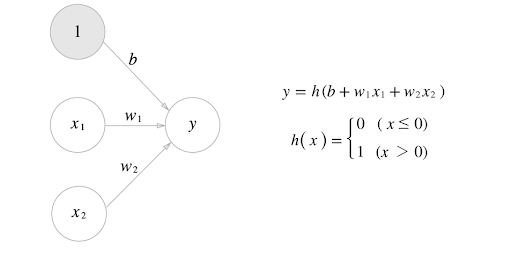

# Chapter 3 신경망

퍼셉트론으로 복잡한 함수도 표현할 수 있지만, 가중치를 설정하는 작업(원하는 결과를 출력하도록 가중치 값을 적절히 정하는 작업)은 여전히 사람이 수동으로 한다. 하지만, 신경망은 가중치 매개변수의 적절한 값을 데이터로부터 자동으로 학습하는 능력이 있다. 데이터에서 가중치 매개변수 값을 학습하는 방법은 다음 장에서 배우게 된다.    

## 3.1 퍼셉트론에서 신경망으로
신경망은 앞 장에서 설명한 퍼셉트론과 공통점이 많다. 이번 절에서는 퍼셉트론과 다른 점을 중심으로 신경망의 구조를 설명한다.   

### 3.1.1 신경망의 예
신경망을 그림으로 나타내면 [그림 3-1]처럼 된다. 여기에서 가장 왼쪽 줄을 입력층, 맨 오른쪽 줄을 출력층, 중간 줄을 은닉층이라고 한다. 은닉층의 뉴런은 입력층이나 출력층과 달리 사람 눈에 보이지 않는다. 그래서 '은닉'인 것이다. 또한, 이 책에서는 입력층에서 출력층 방향으로 차례로 0층(입력층), 1층(은닉층), 2층(출력층)이라 하겠다.  
  
[그림 3-1]  

`[그림 3-1]의 신경망은 모두 3츠응로 구성되지만, 가중치를 갖는 층은 2개뿐이기 때문에 '2층 신경망'이라고 한다. 문헌에 따라 '3층 신경망'이라고 하는 경우도 있지만, 이 책에서는 실제로 가중치를 갖는 층의 개수를 기준으로 하겠다.`    

실제로 뉴런이 연결되는 방식은 앞 장의 퍼셉트론에섣 달라진 것이 없다. 신경망에서는 신호를 어떻게 전달할까?  

### 3.1.2. 퍼셉트론 복습
[그림 3-2]는 x1과 x2라는 두 신호를 입력받아 y를 출력하는 퍼셉트론이다.  
  
[그림 3-2]  
이 퍼셉트론을 수식으로 나타내면 [식 3-1]이 된다.  
  
[식 3-1]  
여기서 b는 **편향**을 나타내는 매개변수로, 뉴런이 얼마나 쉽게 활성화되느냐를 제어한다. 한편 w1, w2는 각 신호의 가중치를 나타내는 매개변수로, 각 신호의 영향력을 제어한다. 그런데 [그림 3-2]의 네트워크에는 편향 b가 보이지 않는다. 여기에 편향을 명시한다면 [그림 3-3]과 같이 나타낼 수 있다.  
  
[그림 3-3]  
[그림 3-3]에서는 가중치가 b이고 입력이 1인 뉴런이 추가되었다. 이 퍼셉트론의 동작은 x1, x2, 1이라는 3개의 신호가 뉴런에 입력되어, 각 신호에 가중치를 곱한 후, 다음 뉴런에 전달된다. 다음 뉴런에서는 이들 신호의 값을 더하여, 그 합이 0을 넘으면 1을 출력하고 그렇지 않으면 0을 출력한다. 참고로, 편향의 입력 신호는 항상 0이다. [식 3-1]을 간결한 형태로 작성해보면 위와 같다. 조건 분기의 동작(0을 넘으면 1을 출력하고 그렇지 않으면 0을 출력)을 하나의 함수로 나타낸다. 이 함수를 h(x)라 하면, 위와 같이 표현할 수 있다.  
입력 신호의 총합이 h(x)라는 함수를 거쳐 변환되어, 변환된 값이 y의 출력이 됨을 보여준다.  

### 3.1.3 활성화 함수의 등장
h(x)와 같이 입력 신호의 총합을 출력 신호로 변환하는 함수를 일반적으로 **활성화 함수**라 한다. 활성화 함수는 입력 신호의 총합이 활성화를 일으키는지를 정하는 역할을 한다.  
가중치가 곱해진 입력 신호의 총합을 계산하고, 그 합을 활성화 함수에 입력해 결과를 내는 2단계로 처리된다. 이 식은 다음과 같이 2개의 식으로 나눌 수 있다.  
  
[그림 3-4]  
먼저 가중치가 달린 입력 신호와 편향의 총합을 계산하고, 이를 a라 한다. 그리고 a를 함수 h()에 넣어 y를 출력하는 흐름을 가진다.  
[그림 3-4]에서는 기존 뉴런의 원을 키우고, 그 안에 활성화 함수 처리 과정을 명시적으로 그려 넣었다. 즉, 가중치 신호를 조합한 결과가 a라는 노드가 되고, 활성화 함수 h()를 통과하여 y라는 노드로 변환되는 과정이 분명하게 나타나있다. 참고로 이 책에서는 **뉴런**과 **노드**라는 용어를 같은 의미로 사용한다.  
```
단순 퍼셉트론 : 단층 네트워크에서 계단 함수(임계값을 경계로 출력이 바뀌는 함수)를 활성화 함수로 사용한 모델
다층 퍼셉트론 : 신경망(여러 층으로 구성되고 시그모이드 함수 등의 매끈한 활성화 함수를 사용하는 네트워크)
```

## 3.2 활성화 함수
h(x)와 같은 활성화 함수는 임계값을 경계로 출력이 바뀌는데, 이런 함수를 **계단 함수**라 한다. 그래서 `퍼셉트론에서는 활성화 함수로 계단 함수를 이용한다.`라 할 수 있다. 활성화 함수를 계단 함수에서 다른 함수로 변경하는 것이 신경망의 세계로 나아가는 열쇠이다.  

### 3.2.1 시그모이드 함수
다음은 **시그모이드 함수**를 나타낸 식이다.  
  
[식 3-6]  
신경망에서는 활성화 함수로 시그모이드 함수를 이용하여 신호를 변환하고, 그 변환된 신호를 다음 뉴런에 전달한다. 퍼셉트론과 신경망의 주된 차이는 이 `활성화 함수`뿐이다.  

### 3.2.3 계단 함수의 그래프
```python
import numpy as np
import matplotlib.pylab as plt

def step_function(x) :
    '''
    넘파이 배열에 부등호 연산을 수행하면 배열의 원소 각각에 부등호 연산을 수행한 bool 배열 생성
    배열 x의 원소 각각이 0보다 크면 True, 0 이하면 False로 변환한 새로운 배열 y가 생성된다.
    하지만 0이나 1의 'int형'을 출력하는 함수기 때문에 astype() 메서드로 int형으로 바꿔준다.
    '''
    return np.array(x > 0, dtype=np.int)

x = np.arange(-5.0, 5.0, 0.1)   # -5.0부터 5.0 전까지 0.1 간격의 넘파이 배열 생성 ([-5.0, -4.9, ..., 4.9])
y = step_function(x)
plt.plot(x, y)
plt.ylim(-0.1, 1.1)     # y축의 범위 지정
plt.show()
```
step_function()은 인수로 받은 넘파이 배열의 원소 각각을 인수로 계단 함수 실행해, 그 결과를 다시 배열로 만들어 돌려준다. 이 x, y 배열을 그래프로 그리면 결과는 다음과 같다.  
  
[그림 3-6]  
계단 함수는 0을 경계로 출력이 0에서 1(또는 1에서 0)로 바뀐다.  

### 3.2.4 시그모이드 함수 구현하기
```python
import numpy as np
import matplotlib.pylab as plt

def sigmoid(x) :
    return 1/ (1 + np.exp(-x))

x = np.arange(-5.0, 5.0, 0.1)
y = sigmoid(x)
plt.plot(x, y)
plt.ylim(-0.1, 1.1)     # y축 범위 지정
plt.show()
```
실행하면 아래와 같은 그래프가 나타난다.  
  
[그림 3-7]  
시그모이드 함수는 부드러운 곡선이며, 입력에 따라 출력이 연속적으로 변화한다. 한편, 계단 함수는 0을 경계로 출력이 갑자기 바뀌어버린다. 시그모이드 함수의 이 매끄러움이 신경망 학습에서 아주 중요한 역할을 하게 된다.  
계단 함수가 0과 1 중 하나의 값만 돌려주는 반면 시그모이드 함수는 실수를 돌려준다는 점도 다르다. 다시 말해 퍼셉트론에서는 뉴런 사이에 0 혹은 1이 흘렀다면, 신경망에서는 연속적인 실수가 흐른다.  
큰 관점에서 보면 둘은 같은 모양을 하고 있다. 둘 다 입력이 작을 때의 출력은 0에 가깝고(혹은 0이고), 입력이 커지면 출력이 1에 가까워지는(혹은 1이 되는) 구조이다. 입력이 중요하면 큰 값을 출력하고 입력이 중요하지 않으면 작은 값을 출력한다. 그리고 입력이 아무리 작거나 커도 출력은 0에서 1 사이라는 것도 둘의 공통점이다.  


### 3.2.6 비선형 함수
계단 함수와 시그모이드 함수의 공통점은 그 밖에도 있다. 중요한 공통점으로, 둘 모두는 **비선형 함수**이다. 시그모이드 함수는 곡선, 계단 함수는 계단처럼 구부러진 직선으로 나타나며, 동시에 비선형 함수로 분류된다.  

함수에 무언가 입력했을 때 출력이 입력의 상수배만큼 변하는 함수를 **선형함수**라고 하고, 곧은 1개의 직선이 된다. **비선형 함수**는 직선 1개로 그릴 수 없는 함수를 말한다.  

신경망에서는 활성화 함수로 비선형 함수를 사용해야 한다. 선형 함수를 이용하면 신경망의 층을 깊게 하는 의미가 없어지기 때문이다.  
선형 함수의 문제는 층을 아무리 깊게 해도 '은닉층이 없는 네트워크'로도 똑같은 기능을 할 수 있다는 데 있다. 선형 함수를 이용해서는 여러 층으로 구성하는 이점을 살릴 수 없다. 그래서 층을 쌓는 혜택을 얻고 싶다면 활성화 함수로는 반드시 비선형 함수를 사용해야 한다.    

### 3.2.7 ReLU 함수
지금까지 활성화 함수로서 계단 함수와 시그모이드 함수를 공부했다. 시그모이드 함수는 신경망 분야에서 오래전부터 이용해왔으나, 최근에는 ReLU 함수를 주로 이용한다.    
ReLU는 입력이 0을 넘으면 그 입력을 그대로 출력하고, 0 이하면 0을 출력하는 함수이다. 
  
[그림 3-9]  
그래프로 나타내면 위와 같고, 코드도 간단하게 작성할 수 있다.  
```python
def relu(x) :
    return np.maximum(0, x)
```
넘파이의 maximum 함수를 사용해서 두 입력 중 큰 값을 선택해 반환했다.  


## 3.3 다차원 배열의 계산

### 3.3.1 다차원 배열


