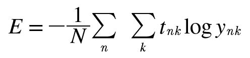

# Chapter 4 신경망 학습
**학습**이란 훈련 데이터로부터 가중치 매개변수의 최적값을 자동으로 획득하는 것을 뜻한다. 이번 장에서는 신경망이 학습할 수 있도록 해주는 **지표**인 **손실 함수**를 배운다. 이 손실 함수의 결과값을 가장 작게 만드는 가중치 매개변수를 찾는 것이 학습의 목표이다. 이번 장에서는 손실 함수의 값을 가급적 작게 만드는 기법으로, 함수의 기울기를 활용하는 경사법을 소개한다.      

## 4.1 데이터에서 학습
신경망의 특징은 데이터를 보고 학습할 수 있다. 데이터에서 학습한다는 것은 가중치 매개변수의 값을 데이터를 보고 자동으로 결정한다는 뜻이다. 파이썬으로 MNIST 데이터셋의 손글씨 숫자를 학습하는 코드를 구현해보자.  
`2장의 퍼셉트론도 직선으로 분리할 수 있는(선형 분리 가능) 문제라면 데이터로부터 자동으로 학습 가능하다(퍼셉트론 수렴 정리). 하지만 비선형 분리 문제는 자동으로 학습할 수 없다.`    

### 4.1.1 데이터 주도 학습
기계학습에서 모아진 데이터로부터 규칙을 찾아내는 역할을 '기계'가 담당한다. 이미지에서 특징을 추출하고 그 특징의 패턴을 기계학습 기술로 학습하는 방법이 있는데, 여기서 말하는 특징은 입력 데이터(입력 이미지)에서 본질적인 데이터(중요한 데이터)를 정확하게 추출할 수 있도록 설계된 변환기를 가리킨다. 이미지의 특징은 보통 벡터로 기술하고, 컴퓨터 비전 분야에서는 SIF, SURF, HOG 등의 특징을 많이 사용한다. 이런 특징을 사용하여 이미지 데이터를 벡터로 변환하고, 변환된 벡터를 가지고 지도 학습 방식의 대표 분류 기법인 SVM, KNN 등으로 학습할 수 있다. 다만, 이미지를 벡터로 변환할 때 사용하는 특징은 여전히 '사람'이 설계하는 것임에 주의해야 한다.  
  
[그림 4-1]    
그림과 같이 신경망은 이미지를 '있는 그대로' 학습한다. 두 번째 접근 방식(특징과 기계학습)에서는 특징을 사람이 설계했지만, 신경망은 이미지에 포함된 중요한 특징까지도 '기계'가 스스로 학습할 것이다. 신경망은 모든 문제를 주어진 데이터 그대로를 입력 데이터로 활용해 'end-to-end'로 학습할 수 있다.  
`딥러닝을 **종단간 기계학습**이라고도 한다. 여기서 종단간은 '처음부터 끝까지'라는 의미로, 데이터(입력)에서 목표한 결과(출력)를 사람의 개입 없이 얻는다는 뜻을 담고 있다.`    

### 4.1.2 훈련 데이터와 시험 데이터(trainig data, test data)
기계학습 문제는 데이터를 **훈련 데이터**와 **시험 데이터**로 나눠 학습과 실험을 수행하는 것이 일반적이다. 우선 훈련 데이터만 사용하여 학습하면서 최적의 매개변수를 찾고, 시험 데이터를 사용하여 앞서 훈련한 모델의 실력을 평가한다. 데이터셋 하나로만 매개변수의 학습과 평가를 수행하면 올바른 평가가 될 수 없다. 참고로 한 데이터셋에만 지나치게 최적화된 상태를 **오버피팅**이라고 한다. 오버피팅 피하기는 기계학습의 중요한 과제이기도 하다.    

## 4.2 손실 함수(loss function)
신경망 학습에서는 현재의 상태를 '하나의 지표'로 표현한다. 그리고 그 지표를 기준으로 최적의 가중치 매개변수의 값을 탐색한다. 이 손실 함수는 임의의 함수를 사용할 수도 있지만 일반적으로는 평균 제곱 오차(mean square error)와 교차 엔트로피 오차(cross entropy error) 를 사용한다.  
`손실 함수는 신경망 성능의 '나쁨'을 나타내는 지표로, 현재의 신경망이 훈련 데이터를 얼마나 잘 처리하지 못하느냐를 나타낸다. 손실 함수에 마이너스만 곱하면 '얼마나 나쁘지 않나', 즉 '얼마나 좋으냐'라는 지표로 변신한다.`    

### 4.2.1 평균 제곱 오차(mean squared error, MSE)
  
[그림 4-2]    
가장 많이 쓰이는 손실 함수는 **평균 제곱 오차**이다. 이 식은 ( 신경망의 출력(신경망이 추정한 값) - 정답 레이블 )^2의 합을 구하고, 차원의 개수로 나눠 제곱 오차의 평균을 구해준다.   
```python
def mean_squared_error(y, t) :
    return 0.5 * np.sum((y-t)**2)
``` 
```python
>>> t = [0, 0, 1, 0, 0, 0, 0, 0, 0, 0]      # 정답 '2'
>>>
>>> # 예1 : '2'일 확률이 가장 높다고 추정(0.6)
>>> y = [0.1, 0.05, 0.6, 0.0, 0.05, 0.1, 0.0, 0.1, 0.0, 0.0]
>>> mean_squared_error(np.array(y), np.array(t))
0.09750000000000003
>>>
>>> # 예2 : '7'일 확률이 가장 높다고 추정(0.6)
>>> y = [0.1, 0.05, 0.1, 0.0, 0.05, 0.1, 0.0, 0.6, 0.0, 0.0] 
>>> mean_squared_error(np.array(y), np.array(t))
0.5975
```  
첫 번째 예는 정답이 '2'고 신경망의 출력도 '2'에서 가장 높은 경우이다. 한편, 두 번째 예에서는 정답은 똑같이 '2'지만, 신경망의 출력은 '7'에서 가장 높다. 이 실험의 결과로 첫 번째 예의 손실 함수 쪽 출력이 작으면 정답 레이블과의 오차도 작은 것을 알 수 있다. 즉, 평균 제곱 오차를 기준으로는 첫 번째 추정 결과가 오차가 더 작으니 정답에 더 가까울 것으로 판단할 수 있다.    
  

### 4.2.2 교차 엔트로피 오차 (cross entropy error)
  
[그림 4-3]    

또 다른 손실 함수로서 **교차 엔트로피 오차**도 자주 이용한다. 여기에서 log는 밑이 e인 자연로그이다. 왼쪽 yi는 정답 레이블, log 뒤에 오는 yi는 신경망의 출력이다. 또 첫 번째 yi는 정답에 해당하는 인덱스의 원소만 1이고, 나머지는 0이다(원-핫-인코딩). 그래서 실질적으로 정답일 때의 추정(yi가 1일 때의 yi)의 자연로그를 계산하는 식이 된다. 예를 들어, 정답 레이블은 '2'가 정답이라 하고, 이때의 신경망 출력이 0.6이라면 교차 엔트로피 오차는 -log 0.6 = 0.51이 된다. 즉, 교차 엔트로피 오차는 정답일 때의 출력이 전체 값을 정하게 된다.  
y = logx 그래프는 x가 1일 때 y는 0이 되고, x가 0에 가까워질수록 y의 값은 점점 작아진다. [그림 4-3]에 해당하는 식도 마찬가지로 정답에 해당하는 출력이 커질수록 0에 다가가다가, 그 출력이 1일 때 0이 된다. 반대로 정답일 때의 출력이 작아질수록 오차는 커진다.     
```python
def cross_entropy_error(y, t) :
    # np.log() 함수에 0을 입력하면 -inf가 되어 계산을 진행할 수 없게 됨
    delta = 1e-7    
    return -np.sum(t * np.log(y + delta))
```
```python
>>> t = [0, 0, 1, 0, 0, 0, 0, 0, 0, 0] 
>>> y = [0.1, 0.05, 0.6, 0.0, 0.05, 0.1, 0.0, 0.1, 0.0, 0.0]
>>> cross_entropy_error(np.array(y), np.array(t))
0.510825457099338
>>>
>>> y = [0.1, 0.05, 0.1, 0.0, 0.05, 0.1, 0.0, 0.6, 0.0, 0.0]
>>> cross_entropy_error(np.array(y), np.array(t))
2.302584092994546
```
첫 번째 예는 정답일 때의 출력이 0.6인 경우로, 이때의 교차 엔트로피 오차는 약 0.51이다. 그다음은 정답일 때의 출력이 (더 낮은) 0.1인 경우로, 이떄의 교차 엔트로피 오차는 무려 2.3이다. 즉, 결과(오차 값)가 더 작은 첫 번째 추정이 정답일 가능성이 높다고 판단한 것으로, 앞서 평균 제곱 오차의 판단과 일치한다.    
    

### 4.2.3 미니배치 학습
기계학습 문제는 훈련 데이터에 대한 손실 함수의 값을 구하고, 그 값을 최대한 줄여주는 매개변수를 찾아낸다. 이렇게 하려면 모든 훈련 데이터를 대상으로 손실 함수 값을 구해야 한다. 즉, 훈련 데이터가 100개 있으면 그로부터 계산한 100개의 손실 함수 값들의 합을 지표로 삼는 것이다. 훈련 데이터 모두에 대한 손실 함수의 합을 구하는 방법을 알아보자.  
  
[그림 4-4]    

교차 엔트로피 오차는 식이 [그림 4-4]처럼 된다. 이때 데이터가 N개라면 tnk는 n번째 데이터의 k번째 값을 의미한다(ynk는 신경망의 출력, tnk는 정답 레이블). 데이터 하나에 대한 손실 함수인 [그림 4-3]을 단순히 N개의 데이터로 확장했다. 다만, 마지막에 N으로 나누어 정규화하고 있다. N을 나눔으로써 '평균 손실 함수'를 구하는 것이다. 이렇게 평균을 구해 사용하면 훈련 데이터 개수와 관계없이 언제든 통일된 지표를 얻을 수 있다.  

그런데 MNIST 데이터셋은 훈련 데이터가 60,000개였다. 그래서 모든 데이터를 대상으로 손실 함수의 합을 구하려면 시간이 좀 걸린다. 더 나아가 빅데이터 수준이 되면 그 수는 수백만에서 수천만도 넘는 거대한 값이 되기도 한다. 이 많은 데이터를 대상으로 일일이 손실 함수를 계산하는 것은 현실적이지 않다. 이런 경우 데이터 일부를 추려 전체의 '근사치'로 이용할 수 있다. 신경망 학습에서도 훈련 데이터로부터 일부만 골라 학습을 수행한다. 이 일부를 **미니배치(mini-batch)라고 한다. 가령 60,000장의 훈련 데이터 중에서 100장을 무작위로 뽑아 그 100장만을 사용하여 학습하는 것이다. 이러한 학습 방법을 미니배치 학습이라고 한다.    

```python
import sys, os
sys.path.append(os.pardir)
import numpy as np
from dataset.mnist import load_mnist

(x_train, t_train), (x_test, t_test) = \
    load_mnist(normalize=True, one_hot_label=True)

print(x_train.shape)    # (60000, 784)  (28 x 28)
print(t_train.shape)    # (60000, 10)   (0 ~ 9)
```  
load_mnist 함수는 MNIST 데이터셋을 읽어오는 함수다. 훈련 데이터와 시험 데이터를 읽고, 호출할 떄 one_hot_label=True로 지정하여 원-핫 인코딩으로, 즉 정답 위치의 원소만 1이고 나머지가 0인 배열을 얻을 수 있다.    
훈련 데이터는 60,000개이고, 입력 데이터는 784열(원래는 28x28)인 이미지 데이터임을 알 수 있다. 또, 정답 레이블은 10줄짜리 데이터이다. 넘파이의 `np.random.choice()` 함수를 이용해 훈련 데이터에서 무작위로 10장만 빼낼 수 있다.  
```python
train_size = x_train.shape[0]
batch_size = 10
batch_mask = np.random.choice(train_size, batch_size)
x_batch = x_train[batch_mask]
t_batch = t_train[batch_mask]
```  
`np.random.choice(범위, 개수)`로는 지정한 범위의 수 중에서 무작위로 원하는 개수만 꺼낼 수 있다.    

### 4.2.4 (배치용) 교차 엔트로피 오차 구현하기
```python
def cross_entropy_error(y, t) :
    if y.ndim == 1:
        t = t.reshape(1, t.size)
        y = y.reshape(1, y.size)

    batch_size = y.shape[0]
    return -np.sum(t * np.log(y)) / batch_size
```
미니배치 같은 배치 데이터를 지원하는 교차 엔트로피 오차는 위와 같이 구현할 수 있다. y가 1차원이라면, 즉 데이터 하나당 교차 엔트로피 오차를 구하는 경우는 reshape 함수로 데이터의 형상을 바꿔준다. 그리고 배치의 크기로 나눠 정규화하고 이미지 1장당 평균의 교차 엔트로피 오차를 계산한다.  

정답 레이블이 원-핫 인코딩이 아니라 '2'나 '7' 등의 숫자 레이블로 주여졌을 떄의 교차 엔트로피 오차는 다음과 같이 구현할 수 있다.  
```python
def cross_entropy_error(y, t) :
    if y.ndim == 1:
        t = t.reshape(1, t.size)
        y = y.reshape(1, y.size)

    batch_size = y.shape[0]
    return -np.sum(np.log(y[np.arange(batch_size), t])) / batch_size
```
이 구현에서는 원-핫 인코딩일 때 t가 0인 원소는 교차 엔트로피 오차도 0이므로, 그 계산은 무시해도 좋다는 것이 핵심이다. 다시 말하면 정답에 해당하는 신경망의 출력만으로 교차 엔트로피 오차를 계산할 수 있다. 그래서 원-핫 인코딩 시 `t * np.log(y)`였던 부분을 레이블 표현일 때는 `np.log(y[np.arange(batch_size), t])`로 구현한다.  
`np.arange(batch_size)`는 `0부터 (batch_size - 1)까지` 배열을 생성한다. 즉, batch_size가 5이면 `np.arange(batch_size)`는 [0, 1, 2, 3, 4]라는 넘파이 배열을 생성한다. t에는 레이블이 [2, 7, 0, 9, 4]와 같이 저장되어 있으므로 `y[np.arange(batch_size), t]`는 각 데이터의 정답 레이블에 해당하는 신경망의 출력을 추출한다.  

### 4.2.5 왜 손실 함수를 설정하는가?
신경망 학습에서는 최적의 매개변수(가중치와 편향)를 탐색할 떄 손실 함수의 값을 가능한 작게 하는 매개변수 값을 찾는다. 정확도를 지표로 삼아서는 안 되는 이유는 미분 값이 대부분의 장소에서 0이 되어 매개변수를 갱신할 수 없기 때문이다. 이때 매개변수의 미분(기울기)을 계산하고, 그 미분 값을 단서로 매개변수의 값을 서서히 갱신하는 과정을 반복한다.    

가상의 신경망이 있고, 그 신경망의 어느 한 가중치 매개변수에 주목한다고 하자. 이때 그 가중치 매개변수의 손실 함수의 미분이란 '가중치 매개변수의 값을 아주 조금 변화시켰을 때, 손실 함수가 어떻게 변하나'라는 의미이다. 만약 이 미분 값이 음수면 그 가중치 매개변수를 양의 방향으로 변화시켜 손실 함수의 값을 줄일 수 있다. 반대로, 이 미분 값이 양수면 그 가중치 매개변수를 음의 방향으로 변화시켜 손실 함수의 값을 줄일 수 있다. 그러나 미분 값이 0이면 가중치 매개변수를 어느 쪽으로 움직여도 손실 함수의 값을 달라지지 않는다. 그래서 그 가중치 매개변수의 갱신은 거기서 멈춘다.    

정확도를 지표로 삼으면 매개변수의 미분이 대부분의 장소에서 0이 되는 이유는 무엇일까? 한 신경망이 100장의 훈련 데이터 중 32장을 올바르게 인식한다고 하자. 그렇다면 정확도는 32%이다. 만약 정확도가 지표였다면 가중치 매개변수의 값을 조금 바꾼다고 해도 정확도는 그대로 32%일 것이다. 혹, 정확도가 개선된다 하더라도 그 값은 32.0123%와 같은 연속적인 변화보다는 33%나 34%처럼 불연속적인 띄엄띄엄한 값으로 바뀌어버린다.  

한편, 현재의 손실 함수의 값은 0.92543... 같은 수치로 나타난다. 그리고 매개변수의 값이 조금 변하면 그에 반응하여 손실 함수의 값도 0.93423...처럼 연속적으로 변화하는 것이다.  

정확도는 매개변수의 미소한 변화에는 거의 반응을 보이지 않고, 반응이 있더라도 그 값이 불연속적으로 갑자기 변화한다. 이는 '계단 함수'를 활성화 함수로 사용하지 않는 이유와도 들어맞는다. 만약 활성화 함수로 계단 함수를 사용하면 지금까지 설명한 것과 같은 이유로 신경망 학습이 잘 이뤄지지 않는다. 계단 함수의 미분은 대부분의 장소(0 이외의 곳)에서 0이다. 매개변수의 작은 변화가 주는 파장을 계단 함수가 말살하여 손실 함수의 값에는 아무런 변화가 나타나지 않기 때문이다.  

계단 함수는 한순간만 변화를 일으키지만, 시그모이드 함수의 미분(접선)은 출력(세로 축의 값)이 연속적으로 변하고 곡선의 기울기도 연속적으로 변한다. 즉, 시그모이드 함수의 미분은 어느 장소라도 0이 되지는 않는다. 이는 신경망 학습에서 중요한 성질로, 기울기가 0이 되지 않는 덕분에 신경망이 올바르게 학습할 수 있다.  


## 4.3 수치 미분
### 4.3.1 미분
```python
# 나쁜 구현 예
def numerical_diff(f, x) :
    h = 10e-50
    return (f(x + h) - f(x)) / h
```
함수를 미분하는 계산을 구현한 것이다. 코드에서 메소드의 이름은 **수치 미분**에서 따온 numerical_diff(f, x)로 했다. 이 메소드는 `함수 f`와 `함수 f에 넘길 인수 x`라는 두 인수를 받는다. 얼핏 보면 문제가 없어 보이지만, 실제로는 개선해야 할 점이 2개 있다.  

앞의 구현에서는 h에 가급적 작은 값을 대입하고 싶었기에(가능하다면 h를 0으로 무한히 가깝게 하고 싶으니) 10e-50이라는 작은 값을 이용했다. 이 값은 0.00...1 형태에서 0이 50개라는 의미이다. 그러나 이 방식은 **반올림 오차** 문제를 일으킨다. 반올림 오차는 작은 값(가령 소수점 8자리 이하)이 생략되어 최종 계산 결과에 오차가 생기게 한다.  

너무 작은 값을 이용하면 컴퓨터로 계산하는 데 문제가 된다는 것이다. 여기가 첫 번째 개선 포인트이다. 이 미세한 값 h로 10^(-4)을 이용해보자. 10^(-4) 정도의 값을 사용하면 좋은 결과를 얻는다고 알려져 있다.  

두 번째 개선은 함수 f의 차분 *(임의 두 점에서의 함수 값들의 차이)* 과 관련한 것이다. 앞의 구현에서는 x + h와 x 사이의 함수 f의 차분을 계산하고 있지만, 애당초 이 계산에는 오차가 있다는 사실에 주의해야 한다. '진정한 미분'은 x 위치의 함수의 기울기(접선)에 해당하지만, 이번 구현에서의 미분은 (x + h)와 x 사이의 기울기에 해당한다. 그래서 진정한 미분과 이번 구현의 값은 엄밀히는 일치하지 않는다. 이 차이는 H를 무한히 0으로 좁히는 것이 불가능해 생기는 한계다.  
  
[그림 4-5] 진정한 미분과 수치 미분의 값은 다르다.    

[그림 4-5]와 같이 수치 미분에는 오차가 포함된다. 이 오차를 줄이기 위해 (x + h)와 (x - h)일 때의 함수 f의 차분을 계산하는 방법을 쓰기도 한다. 이 차분은 x를 중심으로 그 전후의 차분을 계산한다는 의미에서 **중심 차분** 혹은 **중앙 차분**이라 한다. 한편, (x + h)와 x의 차분은 **전방 차분**이라 한다.  

```python
def numerical_diff(f, x) :
    h = 1e-4    # 0.0001
    return (f(x+h) - f(x-h)) / (2*h)
```
두 개선점을 적용해 수치 미분을 다시 구현했다.  
```
여기에서 하는 것처럼 아주 작은 차분으로 미분하는 것을 수치 미분이라 한다. 한편, 수식을 전개해 미분하는 것은 해석적이라는 말을 이용해 '해석적으로 미분하다' 등으로 표현한다. 가령 y = x^2의 미분은 해석적으로 dy/dx = 2x로 풀어낼 수 있다. 그래서 x = 2일 때 y의 미분은 4가 된다. 해석적 미분은 오차를 포함하지 않는 '진정한 미분' 값을 구해준다.  
```  

### 4.3.2 수치 미분의 예
```python
import numpy as np
import matplotlib.pylab as plt

def function_1(x) :
    return 0.01*x**2 + 0.1*x    # 0.01x^2 + 0.1x

x = np.arange(0.0, 20.0, 0.1) # 0에서 20까지 0.1 간격의 배열 x를 만든다.
y = function_1(x)   # y = 0.01x^2 + 0.1x
plt.xlabel("x")
plt.ylabel("f(x)")
plt.plot(x, y)
plt.show()
```
  
[그림 4-6] 식 f(x) = 0.01x^2 + 0.1x의 그래프  

```python
>>> numerical_diff(function_1, 5)   # x=5일 때의 미분
0.1999999999990898
>>> numerical_diff(function_1, 10)  # x=10일 때의 미분
0.2999999999986347
```
이렇게 계산한 미분 값이 x에 대한 f(x)의 변화량이다. 즉, 함수의 기울기에 해당한다. 또한 해석적 해는 df(x)/dx = 0.02x + 0.1이다. 그래서 x가 5와 10일 때의 '진정한 미분'은 차례로 0.2와 0.3이다. 앞의 수치 미분과 결과를 비교하면 그 오차가 매우 작음을 알 수 있다. 실제로 거의 같은 값이라고 해도 될 만큼 작은 오차이다.  

### 4.3.3 편미분
  
[그림 4-7]   

앞의 예와 달리 변수가 2개인 함수 식이다.  
```python
def function_2(x) :
    return x[0]**2 + x[1]**2   
    # 또는 return np.sum(x**2)
```
파이썬으로 구현하면 위와 같다. 인수 x는 넘파이 배열이라고 가정하면, 이 코드는 넘파이 배열의 각 원소를 제곱하고 그 합을 구하는 간단한 구현이다. 함수를 그래프로 그리면 다음 [그림 4-8]처럼 3차원으로 그려진다.     
  
  
[그림 4-8]    

그럼 [그림 4-7]의 식을 미분해보자. 여기서 주의할 점은 변수가 2개라는 것이다. 그래서 '어느 변수에 대한 미분이냐', 즉 x0와 x1 중 어느 변수에 대한 미분이냐를 구별해야 한다. 이와 같이 변수가 여럿인 함수에 대한 미분을 **편미분**이라고 한다. 편미분에 대한 두 문제를 풀어보자.  

문제 1 : x0 = 3, x1= 4일 때, x0에 대한 편미분 ∂f/∂x0를 구하라.  
```python
>>> def function_tmp1(x0) :
...     return x0*x0 + 4.0**2.0
... 
>>> numerical_diff(function_tmp1, 3.0)
6.00000000000378
```  

문제 2 : x0 = 3, x1 = 4일 때, x1에 대한 편미분 ∂f/∂x1를 구하라.  
```python
>>> def function_tmp2(x1) :   
...     return 3.0**2.0 + x1*x1
... 
>>> numerical_diff(function_tmp2, 4.0) 
7.999999999999119
```  
이들 문제는 변수가 하나인 함수를 정의하고, 그 함수를 미분하는 형태로 구현하여 풀었다. 예를 들어 문제 1에서는 x1 = 4로 고정된 새로운 함수를 정의하고, 변수가 x0 하나뿐인 함수에 대해 수치 미분 함수를 적용하였다. 이렇게 후나 문제 1, 2의 결과는 해석적 미분의 결과와 거의 같다.  

이처럼 편미분은 변수가 하나인 미분과 마찬가지로 특정 장소의 기울기를 구한다. 단, 여러 변수 중 목표 변수 하나에 초점을 맞추고 다른 변수는 값을 고정한다. 앞의 예에서는 목표 변수를 제외한 나머지를 특정 값에 고정하기 위해서 새로운 함수를 정의했다. 그리고 그 새로 정의한 함수에 대해 그동안 사용한 수치 미분 함수를 적용하여 편미분을 구한 것이다.  


## 4.4 기울기
앞 절의 예에서는 x0와 x1의 편미분을 변수별로 따로 계산했다. 그럼 x0와 x1의 편미분을 동시에 계산하고 싶다면 어떻게 할까? 가령 x0 = 3, x1 = 4일 때 (x0,x1) 양쪽의 편미분을 묶어서 (∂f/∂x0, ∂f/∂x1)을 계산한다고 생각해보자. 이때 (∂f/∂x0, ∂f/∂x1)처럼 모든 변수의 편미분을 벡터로 정리한 것을 **기울기**라고 한다. 기울기는 예를 들어 다음과 같이 구현할 수 있다.  
```python
def numerical_gradient(f, x) :
    h = 1e-4    # 0.0001
    grad = np.zeros_like(x)     # x와 형상이 같고 모든 원소가 0인 배열 생성

    for idx in range(x.size) :
        tmp_val = x[idx]

        # f(x+h) 계산
        x[idx] = tmp_val + h
        fxh1 = f(x)

        # f(x-h) 계산
        x[idx] = tmp_val - h
        fxh2 = f(x)

        grad[idx] = (fxh1 - fxh2) / (2*h)
        x[idx] = tmp_val    # 값 복원

    return grad
```
numerical_gradient(f, x) 함수의 인수인 f는 함수이고, x는 넘파이 배열이므로 넘파이 배열 x의 각 원소에 대해서 수치 미분을 구한다. 그러면 이 함수를 사용해서 세 점 (3,4), (0,2), (3,0)에서의 기울기를 구해보자.  
```python
>>> numerical_gradient(function_2, np.array([3.0, 4.0]))
array([6., 8.])
>>> numerical_gradient(function_2, np.array([0.0, 2.0])) 
array([0., 4.])
>>> numerical_gradient(function_2, np.array([3.0, 0.0])) 
array([6., 0.])
```
이처럼 (x0, x1)의 각 점에서의 기울기를 계산할 수 있다. 앞의 예에서는 점 (3,4)의 기울기는 (6,8), 점 (0,2)의 기울기는 (0,4), 점 (3,0)의 기울기는 (6,0)이라는 결과를 얻었다.  

기울기는 각 지점에서 낮아지는 방향을 가리킨다. 더 정확히 말하자면 기울기가 가리키는 쪽은 각 장소에서 함수의 출력 값을 가장 크게 줄이는 방향이다.  


### 4.4.1 경사법(경사 하강법)
기계학습 문제 대부분은 학습 단계에서 최적의 매개변수를 찾아낸다. 신경망 역시 최적의 매개변수(가중치와 편향)를 학습 시에 찾아야 한다. 여기에서 최적이란 손실 함수가 최솟값이 될 때의 매개변수 값이다. 그러나 일반적인 문제의 손실 함수는 매우 복잡하다. 그때 기울기를 잘 이용해 함수의 최솟값(또는 가능한 한 작은 값)을 찾으려는 것이 경사법이다.  

여기에서 주의할 점은 각 지점에서 함수의 값을 낮추는 방안을 제시하는 지표가 기울기라는 것이다. 그러나 기울기가 가리키는 곳에 정말 함수의 최솟값이 있는지, 즉 그쪽이 정말로 나아갈 방향인지는 보장할 수 없다. 실제로 복잡한 함수에서는 기울기가 가리키는 방향에 최솟값이 없는 경우가 대부분이다.  
```
함수가 극솟값, 최솟값, 또 안장점(saddle point)이 되는 장소에서는 기울기가 0이다. 극솟값은 국소적인 최솟값, 즉 한정된 범위에서의 최솟값인 점이다. 안장점은 어느 방향에서 보면 극댓값이고 다른 방향에서 보면 극솟값이 되는 점이다. 경사법은 기울기가 0인 장소를 찾지만 그것이 반드시 최솟값이라고는 할 수 없다(극솟값이나 안장점일 가능성이 있다). 또, 복잡하고 찌그러진 모양의 함수라면(대부분) 평평한 곳으로 파고들면서 고원(plateau)이라 하는, 학습이 진행되지 않는 정체기에 빠질 수 있다.
```

기울어진 방향이 꼭 최솟값을 가리키는 것은 아니나, 그 방향으로 가야 함수의 값을 줄일 수 있다. 그래서 최솟값이 되는 장소를 찾는 문제(아니면 가능한 한 작은 값이 되는 장소를 찾는 문제)에서는 기울기 정보를 단서로 나아갈 방향을 정해야 한다.  

경사법은 현 위치에서 기울어진 방향으로 일정 거리만큼 이동한다. 그런 다음 이동한 곳에서도 마찬가지로 기울기를 구하고, 또 그 기울어진 방향으로 아나가기를 반복한다. 이렇게 해서 함수의 값을 점차 줄이는 것이 경사법이다. 경사법은 기계학습을 최적화하는 데 흔히 쓰는 방법이다. 특히 신경망 학습에서는 경사법을 많이 사용한다.  
```
경사법은 최솟값을 찾느냐, 최댓값을 찾느냐에 따라 이름이 다르다. 전자를 경사 하강법(gradient descent method), 후자를 경사 상승법(gradient ascent method)이라고 한다. 다만 손실 함수의 부호를 반전시키면 최솟값을 찾는 문제와 최댓값을 찾는 문제는 같은 것이니 하강이냐 상승이냐는 본질적으로는 중요하지 않다. 일반적으로 신경망(딥러닝) 분야에서의 경사법은 '경사 하강법'으로 등장할 때가 많다.  
```
경사법을 수식으로 나타내면 다음과 같다.  

  
[그림 4-9]   

η 기호(eta, 에타)는 갱신하는 양을 나타낸다. 이를 신경망 학습에서는 **학습률**이라고 한다. 한 번의 학습으로 얼마만큼 학습해야 할지, 즉 매개변수 값을 얼마나 갱신하느냐를 정하는 것이 학습률(learning rate)이다.  

[그림 4-9]는 1회에 해당하는 갱신이고, 이 단계를 반복한다. 변수의 값을 갱신하는 단계를 여러 번 반복하면서 서서히 함수의 값을 줄이는 것이다. 또, 여기에서는 변수가 2개인 경우를 보여줬지만, 변수의 수가 늘어도 같은 식(각 변수의 편미분 값)으로 갱신하게 된다.  

또한 학습률 값은 0.01이나 0.001 등 미리 특정 값으로 정해두어야 하는데, 일반적으로 이 값이 너무 크거나 작으면 '좋은 장소'를 찾아갈 수 없다. 신경망 학습에서는 보통 이 학습률 값을 변경하면서 올바르게 학습하고 있는지를 확인하며 진행한다.  

```python
def gradient_descent(f, init_x, lr=0.01, step_num=100) :
    x = init_x

    for i in range(step_num) :
        grad = numerical_gradient(f, x)
        x -= lr * grad
    return x
```
인수 f는 최적화하려는 함수, init_x는 초깃값, lr은 learning rate를 의미하는 학습률, step_num은 경사법에 따른 반복 횟수를 뜻한다. 함수의 기울기는 `numerical_gradient(f,x)`로 구하고, 그 기울기에 학습률을 곱한 값으로 갱신하는 처리를 step_num번 반복한다. 이 함수를 사용하면 함수의 극솟값을 구할 수 있고 잘하면 최솟값을 구할 수도 있다.  

문제 : 경사법으로 f(x0,x1) = (x0)^2 + (x1)^2의 최솟값을 구하라.  
```python
>>> def function_2(x) :
...     return x[0]**2 + x[1]**2
... 
>>> init_x = np.array([-3.0, 4.0])
>>> gradient_descent(function_2, init_x=init_x, lr=0.1, step_num=100)
array([-6.11110793e-10,  8.14814391e-10])
```
초기값을 (-3.0, 4.0)으로 설정한 후 경사법을 사용해 최솟값 탐색을 시작한다. 최정 결과는 (-6e-10, 8.1e-10)으로, 거의 (0,0)에 가까운 결과이다. 실제로 진정한 최솟값은 (0,0)이므로 경사법으로 거의 정확한 결과를 얻었다.  

  
[그림 4-10] 경사법에 의한 f(x0,x1) = (x0)^2 + (x1)^2의 갱신 과정 : 점선은 함수의 등고선   

```python
# 학습률이 너무 큰 예 : lr=10.0
>>> init_x = np.array([-3.0, 4.0])
>>> gradient_descent(function_2, init_x=init_x, lr=10.0, step_num=100)
array([-2.58983747e+13, -1.29524862e+12])

# 학습률이 너무 작은 예 : lr=1e-10
>>> init_x = np.array([-3.0, 4.0])     
>>> gradient_descent(function_2, init_x=init_x, lr=1e-10, step_num=100) 
array([-2.99999994,  3.99999992])
```
이 실험 결과와 같이 학습률이 너무 크면 큰 값으로 발산한다. 반대로 너무 작으면 거의 갱신되지 않은 채 끝난다. 따라서 학습률을 적절히 설정하는 일은 중요하다.  

### 4.4.2 신경망에서의 기울기
신경망 학습에서도 기울기를 구해야 한다. 여기서 말하는 기울기는 가중치 매개변수에 대한 손실 함수의 기울기다.  

  
[그림 4-11] 형상이 2x3, 가중치가 W, 손실 함수가 L인 신경망의 경사   

∂L/∂W의 각 원소는 각각의 원소에 관한 편미분이다. 예를 들어 1행 1번째 원소인 ∂L/∂W11은 W11을 조금 변경했을 때 손실 함수 L이 얼마나 변화하느냐를 나타낸다. 여기서 중요한 점은 ∂L/∂W의 형상이 W와 같다는 것이다.  

간단한 신경망을 예로 들어 실제로 기울기를 구하는 코드를 구현해보자.  
```python
import sys, os
sys.path.append(os.pardir)  # 부모 디렉터리의 파일을 가져올 수 있도록 설정
import numpy as np
from common.functions import softmax, cross_entropy_error
from common.gradient import numerical_gradient

class simpleNet:
    def __init__(self):
        self.W = np.random.randn(2,3) # 정규분포로 초기화

    def predict(self, x):
        return np.dot(x, self.W)

    def loss(self, x, t):
        z = self.predict(x)
        y = softmax(z)
        loss = cross_entropy_error(y, t)

        return loss
```
simpleNet 클래스는 형상이 2x3인 가중치 매개변수 하나를 인스턴스 변수로 갖는다. 메서드는 2개인데, 하나는 예측을 수행하는 predict(x)이고, 다른 하나는 손실 함수의 값을 구하는 loss(x, t)이다. 여기에서 인수 x는 입력 데이터, t는 정답 레이블이다. simpleNet을 사용해 몇 가지 시험을 해보자.  
```python
>>> net = simpleNet()  # 객체 생성
>>> print(net.W)
[[-0.34117045  0.07532017  0.9477513 ]
 [ 1.40589289 -0.0236061   0.26806124]]
>>>
>>> x = np.array([0.6, 0.9])    
>>> p = net.predict(x)
>>> print(p)
[1.06060133 0.02394661 0.80990589]
>>> np.argmax(p)  # 최댓값의 인덱스
0
>>>
>>> t = np.array([1, 0, 0])  # 정답 레이블
>>> net.loss(x, t)
0.7574816052129008
>>>
>>> t = np.array([0, 0, 1])
>>> net.loss(x, t)
1.0081769862949894  
>>>
>>> t = np.array([0, 1, 0])
>>> net.loss(x, t)
1.7941359388394174  # 정답 레이블이 아니라 loss 값이 더 높음
```
정답 레이블일 경우 loss 값이 더 작게 나온다. 이어서 기울기를 구해보자. 앞에서처럼 numerical_gradient(f, x)를 써서 구하면 된다.  
```python
>>> def f(W) :
...     return net.loss(x, t)
... 
>>> dW = numerical_gradient(f, net.W)
>>> print(dW)
[[ 0.28130718 -0.50023712  0.21892995]
 [ 0.42196077 -0.75035569  0.32839492]]
```
numerical_gradient(f, x)의 인수 f는 함수, x는 함수 f의 인수이다. 그래서 여기에서는 net.W를 인수로 받아 손실 함수를 계산하는 새로운 함수 f를 정의했다. 그리고 이 새로 정의한 함수를 numerical_gradient(f, x)에 넘긴다.  

dW는 numerical_gradient(f, net.W)의 결과로, 그 형상은 2x3의 2차원 배열이다. dW의 내용을 보면, 예를 들어 W의 w11은 대략 0.3이다. 이는 w11을 h만큼 늘리면 손실 함수의 값은 0.3h만큼 증가한다는 의미다. 마찬가지로 w12는 대략 -0.5이니, w12를 h만큼 늘리면 손실 함수의 값은 0.5h만큼 감소하는 것이다. 그래서 손실 함수를 줄인다는 관점에서는 w12는 양의 방향으로 갱신하고 w11은 음의 방향으로 갱신해야 함을 알 수 있다. 또, 한 번에 갱신되는 양에는 w12가 w11보다 크게 기여한다는 사실도 알 수 있다.  

참고로 이 구현에서는 새로운 함수를 정의하는 데 `def f(x):...` 문법을 썼는데, 파이썬에서는 간단한 함수라면 람다(lambda) 기법을 쓰면 더 편하다. 가령 lambda를 쓰면 다음곽 ㅏㅌ이 구현할 수 있다.  
```python
>>> f = lambda w: net.loss(x, t)
>>> dW = numerical_gradient(f, net.W)
```
신경망의 기울기를 구한 다음에는 경사법에 따라 가중치 매개변수를 갱신하기만 하면 된다. 다음 절에서는 2층 신경망을 대상으로 학습 과정 전체를 구현한다.  

## 4.5 학습 알고리즘 구현하기
신경망에는 적응 가능한 가중치와 편향이 있고, 이 가중치와 편향을 훈련 데이터에 적응하도록 조정하는 과정을 '학습'이라 한다. 신경망 학습은 다음과 같이 4단계로 수행한다.  
- 1단계 - 미니배치  
    훈련 데이터 중 일부를 무작위로 가져온다. 이렇게 선별한 데이터를 미니배치라 하며, 그 미니배치의 손실 함수 값을 줄이는 것이 목표다.  
- 2단계 - 기울기 산출  
    미니배치의 손실 함수 값을 줄이기 위해 각 가중치 매개변수의 기울기를 구한다. 기울기는 손실 함수의 값을 가장 작게 하는 방향을 제시한다.  
- 3단계 - 매개변수 갱신  
    가중치 매개변수를 기울기 방향으로 아주 조금 갱신한다.  
- 4단계 - 반복  
    1 ~ 3단계를 반복한다.  

이것이 신경망 학습이 이뤄지는 순서이다. 이는 경사 하강법으로 매개변수를 갱신하는 방법이며, 이때 데이터를 미니배치로 무작위로 선정하기 때문에 **확률적 경사 하강법** *(stochastic gradient descent, SGD)* 라고 부른다. '확률적으로 무작위로 골라낸 데이터'에 대해 수행하는 경사 하강법이라는 의미이다. 대부분의 딥러닝 프레임워크는 확률적 경사 하강법의 영어 머리글자를 딴 **SGD** 라는 함수로 이 기능을 구현하고 있다.  

### 4.5.1 2층 신경망 클래스 구현하기
2층 신경망(은닉층이 1개인 네트워크)을 대상으로 MNIST 데이터셋을 사용해 손글씨 숫자를 학습하는 신경망을 구현해보자. 처음에는 2층 신경망을 하나의 클래스로 구현하는 것부터 시작한다. 이 클래스의 이름은 TwoLayerNet이다.  
```python
import sys, os
sys.path.append(os.pardir)  # 부모 디렉터리의 파일을 가져올 수 있도록 설정
import numpy as np
from common.functions import *
from common.gradient import numerical_gradient

class TwoLayerNet:
    def __init__(self, input_size, hidden_size, output_size, weight_init_std=0.01):
        # 가중치 초기화
        self.params = {}
        self.params['W1'] = weight_init_std * np.random.randn(input_size, hidden_size)
        self.params['b1'] = np.zeros(hidden_size)
        self.params['W2'] = weight_init_std * np.random.randn(hidden_size, output_size)
        self.params['b2'] = np.zeros(output_size)

    def predict(self, x):
        W1, W2 = self.params['W1'], self.params['W2']
        b1, b2 = self.params['b1'], self.params['b2']
    
        a1 = np.dot(x, W1) + b1
        z1 = sigmoid(a1)
        a2 = np.dot(z1, W2) + b2
        y = softmax(a2)
        
        return y
        
    # x : 입력 데이터, t : 정답 레이블
    def loss(self, x, t):
        y = self.predict(x)
        
        return cross_entropy_error(y, t)
    
    def accuracy(self, x, t):
        y = self.predict(x)
        y = np.argmax(y, axis=1)
        t = np.argmax(t, axis=1)
        
        accuracy = np.sum(y == t) / float(x.shape[0])
        return accuracy
        
    # x : 입력 데이터, t : 정답 레이블
    def numerical_gradient(self, x, t):
        loss_W = lambda W: self.loss(x, t)
        
        grads = {}
        grads['W1'] = numerical_gradient(loss_W, self.params['W1'])
        grads['b1'] = numerical_gradient(loss_W, self.params['b1'])
        grads['W2'] = numerical_gradient(loss_W, self.params['W2'])
        grads['b2'] = numerical_gradient(loss_W, self.params['b2'])
        
        return grads
```  
<br>
다음은 이 클래스가 사용하는 중요 변수의 설명이다.   

|변수|설명|
| ---- | ----------------------------------- |
|params|신경망의 매개변수를 보관하는 딕셔너리 변수(인스턴스 변수)<br>params['W1']은 1번째 층의 가중치, params['b1']은 1번째 층의 편향
|grads|params['W2']는 2번째 층의 가중치, params['b2']는 2번째 층의 편향<br>기울기 보관하는 딕셔너리 변수(numerical_gradient() 메소드의 반환 값)<br>grads['W1']은 1번째 층의 가중치의 기울기, grads['b1']은 1번째 층의 편향의 기울기<br>grads['W2']은 2번째 층의 가중치의 기울기, grads['b2']은 2번째 층의 편향의 기울기|    
<br><br>

|메소드|설명|
| ---- | ------------------------------------ |
|__init__(self, input_size, <br>hidden_size, output_size)|초기화를 수행한다.<br>인수는 순서대로 입력층의 뉴런 수, 은닉층의 뉴런 수, 출력층의 뉴런 수|
|predict(self, x)|예측(추론)을 수행한다.<br>인수 x는 이미지 데이터|
|loss(self, x, t)|손실 함수의 값을 구한다.<br>인수 x는 이미지 데이터, t는 정답 레이블(아래 칸의 세 메소드의 인수들도 마찬가지)|
|accuracy(self, x, t)|정확도를 구한다.|
|numerical_gradient(self, x, t)|가중치 매개변수의 기울기를 구한다.|
|gradient(self, x, t)|가중치 매개변수의 기울기를 구한다.<br>numerical_gradient()의 성능 개선판|  

TwoLayerNet 클래스는 딕셔너리인 params와 grads를 인스턴스 변수로 갖는다. params 변수에는 가중치 매개변수가 저장되는데, 예를 들어 1번째 층의 가중치 매개변수는 params['W1'] 키에 넘파이 배열로 저장된다. 마찬가지로 1번째 층의 편향은 params['b1'] 키로 접근한다. grads 변수에는 params 변수에 대응하는 각 매개변수의 기울기가 저장된다.  

__init__(self, input_size, hidden_size, output_size) 메소드는 클래스를 초기화한다. 인수는 순서대로 입력층의 뉴런 수, 은닉층의 뉴런 수, 출력층의 뉴런 수이다. 예를 들어 손글씨 숫자 인식에서는 크기가 28x28인 입력 이미지가 총 784개이고, 출력은 10개가 된다. 따라서 input_size=784, output_size=10으로 지정하고 은닉층의 개수인 hidden_size는 적당한 값을 설정한다.  

이 초기화 메소드에서는 가중치 매개변수도 초기화한다. 가중치 매개변수의 초기값을 무엇으로 설정하냐가 신경망 학습의 성공을 좌우하기도 한다. 가중치 매개변수 초기화에 대한 자세한 내용은 나중에 살펴볼 것이고, 여기에서는 정규분포를 따르는 난수로, 편향은 0으로 초기화한다.  

numerical_gradient(self, x, t) 메소드는 각 매개변수의 기울길르 계산한다. 수치 미분 방식으로 각 매개변수의 손실 함수에 대한 기울기를 계산한다. gradient(self, x, t)는 오차역전파법을 사용하여 기울기를 효율적이고 빠르게 계산한다. 오차역전파법은 기울기 계산을 고속으로 수행하는 기법이다. 오차역전파법을 쓰면 수치 미분을 사용할 때와 거의 같은 결과를 훨씬 빠르게 얻을 수 있다. 오차역 전파법으로 기울기를 구하는 gradient(self, x, t) 메소드는 다음 장에서 구한다. 신경망 학습은 시간이 오래 걸리니, 시간을 절약하려면 numerical_gradient(self, x, t) 대신 gradient(self, x, t)를 쓰는 것이 좋다.  


### 4.5.2 미니배치 학습 구현하기
미니배치 학습이란 훈련 데이터 중 일부를 무작위로 꺼내고(미니배치), 그 미니배치에 대해서 경사법으로 매개변수를 갱신한다.  
```python
import sys, os
sys.path.append(os.pardir)  # 부모 디렉터리의 파일을 가져올 수 있도록 설정
import numpy as np
from dataset.mnist import load_mnist
from two_layer_net import TwoLayerNet

# 데이터 읽기
(x_train, t_train), (x_test, t_test) = load_mnist(normalize=True, one_hot_label=True)

network = TwoLayerNet(input_size=784, hidden_size=50, output_size=10)

# 하이퍼파라미터
iters_num = 10000  # 반복 횟수를 적절히 설정한다.
train_size = x_train.shape[0]
batch_size = 100   # 미니배치 크기
learning_rate = 0.1

train_loss_list = []

for i in range(iters_num):
    # 미니배치 획득
    batch_mask = np.random.choice(train_size, batch_size)
    x_batch = x_train[batch_mask]
    t_batch = t_train[batch_mask]
    
    # 기울기 계산
    grad = network.numerical_gradient(x_batch, t_batch)
    #grad = network.gradient(x_batch, t_batch)  # 성능 개선판
    
    # 매개변수 갱신
    for key in ('W1', 'b1', 'W2', 'b2'):
        network.params[key] -= learning_rate * grad[key]
    
    # 학습 경과 기록
    loss = network.loss(x_batch, t_batch)
    train_loss_list.append(loss)
```
미니배치 크기를 100으로 했다. 즉, 매번 60,000개의 훈련 데이터에서 임의로 100개의 데이터(이미지 데이터와 정답 레이블 데이터)를 추려낸다. 그리고 그 100개의 미니배치를 대상으로 확률적 경사 하강법(SGD)을 수항해 매개변수를 갱신한다. 경사법에 의한 갱신 횟수(반복 횟수)를 10,000번으로 설정하고, 갱신할 때마다 훈련 데이터에 대한 손실 함수를 계산하고, 그 값을 배열에 추가한다.  

  
[그림 4-12] 손실 함수 값의 추이 : 왼쪽은 10,000회, 오른쪽은 1,000회 반복까지의 추이    

[그림 4-12] 보면 학습 횟수가 늘어가면서 손실 함수의 값이 줄어든다. 이는 학습이 잘 되고 있다는 뜻으로, 신경망의 가중치 매개변수가 서서히 데이터에 적응하고 있음을 의미한다. 즉, 신경망이 데이터를 반복해서 학습함으로써 최적 가중치 매개변수를 찾아가고 있다.  

### 4.5.3 시험 데이터로 평가하기
학습을 반복함으로써 손실 함수의 값이 서서히 내려가는 것을 확인해볼 수 있다. 이때의 손실 함수의 값이란, 정확히는 '훈련 데이터의 미니배치에 대한 손실 함수'의 값이다. 훈련 데이터의 손실 함수 값이 작아지는 것은 신경망이 잘 학습하고 있다는 방증이지만, 이 결과만으로는 다른 데이터셋에도 비슷한 실력을 발휘할지는 확실하지 않다.  

신경망 학습에서는 훈련 데이터 외의 데이터를 올바르게 인식하는지를 확인해야 한다. 다른 말로 '오버피팅'을 일으키지 않는지 확인해야 한다. 오버피팅되었다는 것은, 예를 들어 훈련 데이터에 포함된 이미지만 제대로 구분하고, 그렇지 않은 이미지는 식별할 수 없다는 뜻이다.  

신경망 학습의 원래 목표는 범용적인 능력을 익히는 것이다. 이를 위해 훈련 데이터에 포함되지 않은 데이터를 사용해 평가해봐야 한다. 여기에서는 1에폭별로 훈련 데이터와 시험 데이터에 대한 정확도를 기록한다.  
```
에폭(epoch)은 하나의 단위이다. 1에폭은 학습에서 훈련 데이터를 모두 소진했을 때의 횟수에 해당한다. 훈련 데이터 10,000개를 100개의 미니배치로 학습할 경우, 확률적 경사 하강법을 100회 반복하면 모든 훈련 데이터를 '소진'한 게 된다. 이 경우 100회가 1에폭이 된다.
```
 
평가가 제대로 이뤄질 수 있도록 이전 구현으로부터 수정해보자.
```python
import sys, os
sys.path.append(os.pardir)  # 부모 디렉터리의 파일을 가져올 수 있도록 설정
import numpy as np
from dataset.mnist import load_mnist
from two_layer_net import TwoLayerNet

# 데이터 읽기
(x_train, t_train), (x_test, t_test) = load_mnist(normalize=True, one_hot_label=True)

network = TwoLayerNet(input_size=784, hidden_size=50, output_size=10)

# 하이퍼파라미터
iters_num = 10000  # 반복 횟수를 적절히 설정한다.
train_size = x_train.shape[0]
batch_size = 100   # 미니배치 크기
learning_rate = 0.1

train_loss_list = []
train_acc_list = []
test_acc_list = []

# 1에폭당 반복 수
iter_per_epoch = max(train_size / batch_size, 1)

for i in range(iters_num):
    # 미니배치 획득
    batch_mask = np.random.choice(train_size, batch_size)
    x_batch = x_train[batch_mask]
    t_batch = t_train[batch_mask]
    
    # 기울기 계산
    grad = network.numerical_gradient(x_batch, t_batch)
    #grad = network.gradient(x_batch, t_batch)  # 성능 개선판
    
    # 매개변수 갱신
    for key in ('W1', 'b1', 'W2', 'b2'):
        network.params[key] -= learning_rate * grad[key]
    
    # 학습 경과 기록
    loss = network.loss(x_batch, t_batch)
    train_loss_list.append(loss)
    
    # 1에폭당 정확도 계산
    if i % iter_per_epoch == 0:
        train_acc = network.accuracy(x_train, t_train)
        test_acc = network.accuracy(x_test, t_test)
        train_acc_list.append(train_acc)
        test_acc_list.append(test_acc)
        print("train acc, test acc | " + str(train_acc) + ", " + str(test_acc))
```
1에폭마다 모든 훈련 데이터와 시험 데이터에 대한 정확도를 계산하고, 그 결과를 기록한다.  

  
[그림 4-13] 훈련 데이터와 시험 데이터에 대한 정확도 추이  

[그림 4-13]에서는 훈련 데이터에 대한 정확도를 실선으로, 시험 데이터에 대한 정확도를 점선으로 그렸다. 에폭이 진행될수록(학습이 진행될수록) 훈련 데이터와 시험 데이터를 사용하고 평가한 정확도가 모두 좋아지고 있다. 또, 두 정확도에는 차이가 없음을 알 수 있다(두 선이 거의 겹쳐 있음). 다시 말해 이번 학습에서는 오버피팅이 일어나지 않았다.  