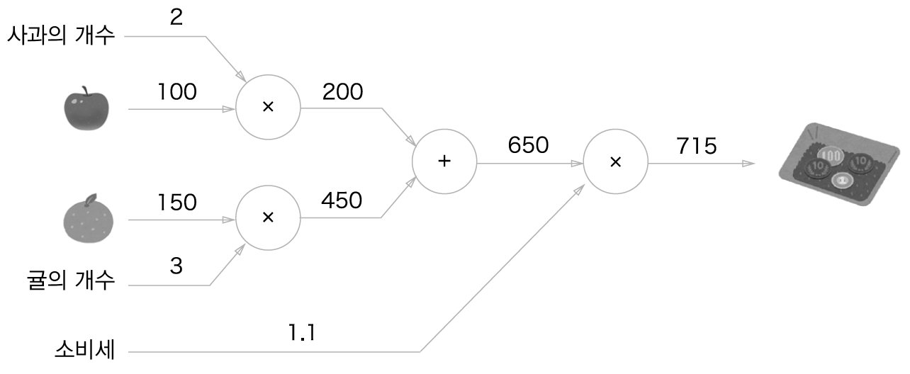

# Chapter 5 오차역전파법
앞 장에서 설명한 신경망 학습에서 신경망의 가중치 매개변수의 기울기(정확히는 가중치 매개변수에 대한 손실 함수의 기울기)는 수치 미분을 사용해 구했다. 수치 미분은 단순하고 구현하기도 쉽지만 계산 시간이 오래 걸린다는 게 단점이다. 이번 장에서는 가중치 매개변수의 기울기를 효율적으로 계산하는 **오차역전파법** *(backpropagation)* 을 배워보자.  

## 5.1 계산 그래프
**계산 그래프**는 계산 과정을 그 래프로 나타낸 것이다. 여기에서의 그래프는 우리가 잘 아는 그래프 자료구조로, 복수의 노드(node)와 에지(edge)로 표현된다(노드 사이의 직선을 '에지'라고 한다).  

### 5.1.1 계산 그래프로 풀다
간단한 문제를 계산 그래프를 사용해 풀어보자.  
```
문제 1 : 현빈 군은 슈퍼에서 1개에 100원인 사과를 2개 샀다. 이때 지불 금액을 구하라. 단, 소비세가 10% 부과된다.
```
계산 그래프는 계산 과정을 노드와 화살표로 표현한다. 노드는 원(O)으로 표기하고 원 안에 연산 내용을 적는다. 또, 계산 결과를 화살표 위에 적어 각 노드의 계산 결과가 왼쪽에서 오른쪽으로 전해지게 한다. 문제 1을 계산 그래프로 풀면 [그림 5-1]처럼 된다.  

  
[그림 5-1] 계산 그래프로 풀어본 문제 1의 답  

[그림 5-1]과 같이 처음에 사과의 100원이 'X2' 노드로 흐르고, 200원이 되어 다음 노드로 전달된다. 이제 200원이 'X1.1' 노드를 거쳐 220원이된다. 따라서 이 계산 그래프에 따르면 최종 답은 220원이 된다.  

또한, [그림 5-1]에서는 'X2'와 'X1.1'을 각각 하나의 연산으로 취급해 원 안에 표기했지만, 곱셈인 'X'만을 연산으로 생각할 수도 있다. 이렇게 하면 [그림 5-2]처럼 '2'와 '1.1'은 각각 '사과의 개수'와 '소비세' 변수가 되어 원 밖에 표기하게 된다.  

  
[그림 5-2] 계산 그래프로 풀어본 문제 1의 답 : '사과의 개수'와 '소비세'를 변수로 취급해 원 밖에 표기  

```
문제 2 : 현빈 군은 슈퍼에서 사과를 2개, 귤을 3개 샀다. 사과는 1개에 100원, 귤은 1개 150원이다. 소비세가 10%일 때 지불 금액을 구하라. 
```
문제 2도 문제 1과 같이 계산 그래프로 풀어보자.   

  
[그림 5-3] 계산 그래프로 풀어본 문제 2의 답  

이 문제에는 덧셈 노드인 '+'가 새로 등장하여 사과와 귤의 금액을 합산한다. 계산 그래프는 왼쪽에서 오른쪽으로 계산을 진행한다. 문제 2의 답은 715원이다.  

지금까지 살펴본 것처럼 계산 그래프를 이용한 문제풀이는 다음 흐름으로 진행한다.  
1. 계산 그래프를 구성한다.
2. 그래프에서 계산을 왼쪽으로 오른쪽으로 진행( **순전파** *(forward propagation)* )  

2번째 계산을 순전파라고 하는데, 순전파는 계산 그래프의 출발점부터 종착점으로의 전파다. **역전파** *(backward propagation)* 는 오른쪽에서 왼쪽으로 진행한다. 역전파는 이후에 미분을 계산할 때 중요한 역할을 한다.  


### 5.1.2 국소적 계산


