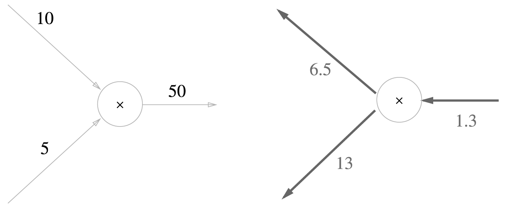
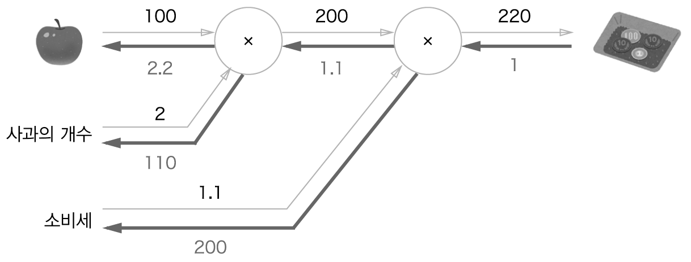
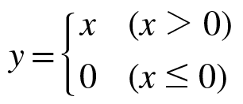
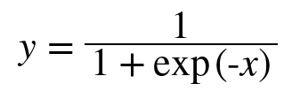
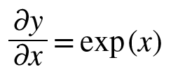
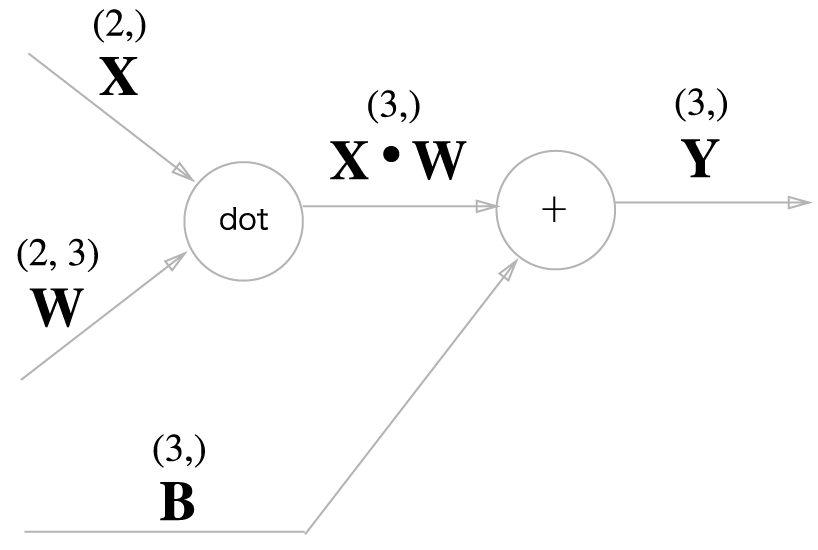

# Chapter 5 오차역전파법
앞 장에서 설명한 신경망 학습에서 신경망의 가중치 매개변수의 기울기(정확히는 가중치 매개변수에 대한 손실 함수의 기울기)는 수치 미분을 사용해 구했다. 수치 미분은 단순하고 구현하기도 쉽지만 계산 시간이 오래 걸린다는 게 단점이다. 이번 장에서는 가중치 매개변수의 기울기를 효율적으로 계산하는 **오차역전파법** *(backpropagation)* 을 배워보자.  

## 5.1 계산 그래프
**계산 그래프**는 계산 과정을 그 래프로 나타낸 것이다. 여기에서의 그래프는 우리가 잘 아는 그래프 자료구조로, 복수의 노드(node)와 에지(edge)로 표현된다(노드 사이의 직선을 '에지'라고 한다).  

### 5.1.1 계산 그래프로 풀다
간단한 문제를 계산 그래프를 사용해 풀어보자.  
```
문제 1 : 현빈 군은 슈퍼에서 1개에 100원인 사과를 2개 샀다. 이때 지불 금액을 구하라. 단, 소비세가 10% 부과된다.
```
계산 그래프는 계산 과정을 노드와 화살표로 표현한다. 노드는 원(O)으로 표기하고 원 안에 연산 내용을 적는다. 또, 계산 결과를 화살표 위에 적어 각 노드의 계산 결과가 왼쪽에서 오른쪽으로 전해지게 한다. 문제 1을 계산 그래프로 풀면 [그림 5-1]처럼 된다.  

  
[그림 5-1] 계산 그래프로 풀어본 문제 1의 답  

[그림 5-1]과 같이 처음에 사과의 100원이 'X2' 노드로 흐르고, 200원이 되어 다음 노드로 전달된다. 이제 200원이 'X1.1' 노드를 거쳐 220원이된다. 따라서 이 계산 그래프에 따르면 최종 답은 220원이 된다.  

또한, [그림 5-1]에서는 'X2'와 'X1.1'을 각각 하나의 연산으로 취급해 원 안에 표기했지만, 곱셈인 'X'만을 연산으로 생각할 수도 있다. 이렇게 하면 [그림 5-2]처럼 '2'와 '1.1'은 각각 '사과의 개수'와 '소비세' 변수가 되어 원 밖에 표기하게 된다.  

  
[그림 5-2] 계산 그래프로 풀어본 문제 1의 답 : '사과의 개수'와 '소비세'를 변수로 취급해 원 밖에 표기  

```
문제 2 : 현빈 군은 슈퍼에서 사과를 2개, 귤을 3개 샀다. 사과는 1개에 100원, 귤은 1개 150원이다. 소비세가 10%일 때 지불 금액을 구하라. 
```
문제 2도 문제 1과 같이 계산 그래프로 풀어보자.   

  
[그림 5-3] 계산 그래프로 풀어본 문제 2의 답  

이 문제에는 덧셈 노드인 '+'가 새로 등장하여 사과와 귤의 금액을 합산한다. 계산 그래프는 왼쪽에서 오른쪽으로 계산을 진행한다. 문제 2의 답은 715원이다.  

지금까지 살펴본 것처럼 계산 그래프를 이용한 문제풀이는 다음 흐름으로 진행한다.  
1. 계산 그래프를 구성한다.
2. 그래프에서 계산을 왼쪽으로 오른쪽으로 진행( **순전파** *(forward propagation)* )  

2번째 계산을 순전파라고 하는데, 순전파는 계산 그래프의 출발점부터 종착점으로의 전파다. **역전파** *(backward propagation)* 는 오른쪽에서 왼쪽으로 진행한다. 역전파는 이후에 미분을 계산할 때 중요한 역할을 한다.  


### 5.1.2 국소적 계산
계산 그래프의 특징은 '국소적 계산'을 전파함으로써 최종 결과를 얻는다는 점에 있다. 국소적이란 '자신과 직접 관계된 작은 범위'라는 뜻이다. 국소적 계산은 결국 전체에서 어떤 일이 벌어지든 상관없이 자신과 관계된 정보만으로 결과를 출력할 수 있다.  

국소적 계산을 구체적인 예를 들어 설명하자면, 슈퍼마켓에서 사과 2개를 포함한 여러 식품을 구입하는 경우를 생각해보자. [그림 5-4]와 같은 계산 그래프로 나타낼 수 있다.  

  
[그림 5-4] 사과 2개를 포함해 여러 식품을 구입하는 예  

[그림 5-4]에서는 여러 식품을 구입하여 총 금액이 4,000원이 되었다. 여기에서 핵심은 각 노드에서의 계산은 국소적 계산이라는 점이다. 가령 사과와 그 외의 물품 값을 더하는 계산(4,000 + 200 -> 4,200)은 4,000이라는 숫자가 어떻게 계산되었느냐와는 상관없이, 단지 두 숫자를 더하면 된다는 뜻이다. 각 노드는 자신과 관련한 계산(이 예에서는 입력된 두 숫자의 덧셈) 외에는 아무것도 신경 쓸 게 없다.  

이처럼 계산 그래프는 국소적 계산에 집중한다. 전체 계산이 복잡하더라도 각 단계에서 하는 일은 해당 노드의 '국소적 계산'이다. 국소적인 계산은 '국소적 계산'이다.  


### 5.1.3 왜 계산 그래프로 푸는가?
계산 그래프의 이점은 방금 설명한 `국소적 계산`과 `중간 계산 결과를 모두 보관`한다는 점이다. 예를 들어 사과 2개까지 계산했을 때의 금액은 200원, 소비세를 더하기 전의 금액은 650원인 식이다. 실제 계산 그래프를 사용하는 가장 큰 이유는 `역전파를 통해 '미분'을 효율적으로 계산할 수 있다는 점`에 있다.  

문제 1은 사과를 2개 사서 소비세를 포함한 최종 금액을 구하는 것이다. 여기서 사과 가격이 오르면 최종 금액에 어떤 영향을 끼치는지 알고 싶을 때 이는 `사과 가격에 대한 지불 금액의 미분`을 구하는 문제에 해당한다. 기호로 나타내면 사과 값을 x, 지불 금액을 L이라 했을 때 ∂L/∂x을 구하는 것이다. 이 미분 값은 사과 값이 '아주 조금' 올랐을 때 지불 금액이 얼마나 증가하느냐를 표시한 것이다.  

'사과 가격에 대한 지불 금액의 미분'같은 값은 계산 그래프에서 역전파를 하면 구할 수 있다. 먼저 결과만을 나타내면 [그림 5-5]처럼 계산 그래프 상의 역전파에 의해서 미분을 구할 수 있다.  

  
[그림 5-5] 역전파에 의한 미분 값의 전달   

[그림 5-5]와 같이 역전파는 순전파와는 반대 방향의 화살표(굵은 선)로 그린다. 이 전파는 '국소적 미분'을 전달하고 그 미분 값은 화살표의 아래에 적는다. 이 결과로부터 `사과 가격에 대한 지불 금액의 미분` 값은 2.2라 할 수 있다. 사과가 1원 오르면 최종 금액은 2.2원 오른다는 뜻(정확히는 사과 값이 아주 조금 오르면 최종 금액은 그 아주 작은 값의 2.2배만큼 오른다는 뜻)이다.  

`소비세에 대한 지불 금액의 미분`이나 `사과 개수에 대한 지불 금액의 미분`도 같은 순서로 구할 수 있다. 이처럼 계산 그래프의 이점은 순전파와 역전파를 활용해서 각 변수의 미분을 효율적으로 구할 수 있다는 것이다.  

## 5.2 연쇄법칙
`국소적 미분`을 전달하는 원리는 **연쇄법칙**에 따른 것이고, 그것은 계산 그래프 상의 역전파와 같다.  

### 5.2.1 계산 그래프의 역전파
y = f(x) 계산의 역전파는 [그림 5-6]로 그렸다.  

  
[그림 5-6] 계산 그래프의 역전파 : 순방향과는 반대 방향으로 국소적 미분을 곱한다.   

역전파의 계산 절차는 신호 D에 노드의 국소적 미분(∂y/∂x)을 곱한 후 다음 노드로 전달하는 것이다. 여기에서 말하는 국소적 미분은 순전파 때의 y=f(x) 계산의 미분을 구한다는 것이며, 이는 x에 대한 y의 미분(∂y/∂x)을 구한다는 뜻이다. 가령 y=f(x)=x^2이라면 ∂y/∂x=2x가 된다. 그리고 이 국소적인 미분을 상류에서 전달된 값(이 예에서는 E)에 곱해 앞쪽 노드로 전달하는 것이다.  

이것이 역전파의 계산 순서인데, 이러한 방식을 따르면 목표로 하는 미분 값을 효율적으로 구할 수 있다는 것이 이 전파의 핵심이다. 왜 그런 일이 가능한가는 연쇄법칙의 원리로 설명할 수 있다.  

### 5.2.2 연쇄법칙이란?
연쇄법칙을 설명하려면 우선 합성 함수 이야기부터 시작해야 한다. **합성 함수**란 여러 함수로 구성된 함수이다. 예를 들어 z=(x+y)^2이라는 식은 [식 5.1]처럼 두 개의 식으로 구성된다.  

  
[식 5.1]  

연쇄법칙은 합성 함수의 미분에 대한 성질이며, 다음과 같이 정의된다.  

```
합성 함수의 미분은 합성 함수를 구성하는 각 함수의 미분의 곱으로 나타낼 수 있다.
```
이것이 연쇄법칙의 원리이다. [식 5.1]을 예로 설명하면, ∂z/∂x(x에 대한 z의 미분)은 ∂z/∂t(t에 대한 z의 미분)과 ∂t/∂x(x에 대한 t의 미분)의 곱으로 나타낼 수 있다. 수식으로는 [식 5.2]처럼 쓸 수 있다.  

  
[식 5.2]  

[식 5.2]는 ∂t를 서로 지울 수 있다. 연쇄범칙을 써서 [식 5.2]의 미분 ∂z/∂x를 구해보자. 가장 먼저 [식 5.1]의 국소적 미분(편미분)을 구하자.  


  
[식 5.3]  

[식 5.3]과 같이 ∂z/∂t는 2t이고, ∂t/∂x는 1이다. 이는 미분 공식에서 해석적으로 구한 결과다, 그리고 최종적으로 구하고 싶은 ∂z/∂x는 [식 5.3]에서 구한 두 미분을 곱해 계산한다.  

  
[식 5.4]  


### 5.2.3 연쇄법칙과 계산 그래프
[식 5.4]의 연쇄법칙 계산을 계산 그래프로 나타내보자. 2제곱 계산을 `**2` 노드로 나타내면 [그림 5-7]처럼 그릴 수 있다.  

  
[그림 5-7] [식 5.4]의 계산 그래프 : 순전파와는 반대 방향으로 국소적 미분을 곱하여 전달  

계산 그래프의 역전파는 오른쪽에서 왼쪽으로 신호를 전파한다. 역전파의 계산 절차에서는 노드로 들어온 입력 신호에 그 노드의 국소적 미분(편미분)을 곱한 후 다음 노드로 전달한다. 예를 들어 `**2` 노드에서의 역전파를 보자. 입력은 ∂z/∂z이며, 이에 국소적 미분은 ∂z/∂t(순전파 시에는 입력이 t이고 출력이 z이므로 이 노드에서 국소적 미분은 ∂z/∂t)를 곱하고 다음 노드로 넘긴다.  

[그림 5-7]에서 주목할 것은 맨 왼쪽 역전파다. 이 게산은 연쇄 법칙에 따르면 `x에 대한 z의 미분`이 된다. 즉, 역전파가 하는 일은 연쇄법칙의 원리와 같다.  

[그림 5-7]에서 [식 5.3]의 결과를 대입하면 [그림 5-8]이 되며, ∂z/∂x는 2(x+y)임을 구할 수 있다.  

  
[그림 5-8] 계산 그래프의 역전파 결과에 따르면 ∂z/∂x는 2(x+y)가 된다.  


## 5.3 역전파
### 5.3.1 덧셈 노드의 역전파
여기에서는 z = x + y라는 식을 대상으로 그 역전파를 살펴보자. 우선 z = x + y의 미분은 다음과 같이 해석적으로 계산할 수 있다.  

  
[식 5.5]  

[식 5.5]에서와 같이 ∂z/∂x와 ∂z/∂y는 모두 1이 된다. 이를 계산 그래프로는 [그림 5-9]처럼 그릴 수 있다.  

  
[그림 5-9] 덧셈 노드의 역전파 : 왼쪽이 순전파, 오른쪽이 역전파다. 덧셈 노드의 역전파는 입력 값을 그대로 흘려보낸다.  

[그림 5-9]와 같이 역전파 때는 상류에서 전해진 미분(이 예에서는 ∂L/∂z)에 1을 곱하여 하류로 흘린다. 즉, 덧셈 노드의 역전파는 1을 곱하기만 할 뿐이므로 입력된 값을 그대로 다음 노드로 보내게 된다.  

이 예에서는 상류에서 전해진 미분 값을 ∂L/∂z이라 했는데, 이는 [그림 5-10]과 같이 최종적으로 L이라는 값을 출력하는 큰 계산 그래프를 가정하기 때문이다. z = x + y 계산은 그 큰 계산 그래프의 중간 어딘가에 존재하고, 상류로부터 ∂L/∂z 값이 전해진 것이다. 그리고 다시 하류로는 ∂L/∂x과 ∂L/∂y 값을 전달하는 것이다.  

  
[그림 5-10] 최종 출력으로 가는 계산의 중간에 덧셈 노드 존재  

구체적인 예를 살펴보자. 가령 '10 + 5 = 15'라는 계산이 있고, 상류에서 1.3이라는 값이 흘러온다. 이를 계산 그래프로 그리면 [그림 5-11]처럼 된다.  

  
[그림 5-11] 덧셈 노드 역전파의 구체적인 예  

덧셈 노드 역전파는 입력 신호를 다음 노드로 출력할 뿐이므로 [그림 5-11]처럼 1.3을 그대로 다음 노드로 전달한다.  


### 5.3.2 곱셈 노드의 역전파
z = xy라는 식을 생각해보자. 이 식의 미분은 다음과 같다.  

  
[식 5.6]  

[식 5.6]에서 계산 그래프는 다음과 같이 그릴 수 있다.  

  
[그림 5-12] 곱셈 노드의 역전파 : 왼쪽으 순전파, 오른쪽이 역전파  

곱셈 노드 역전파는 상류의 값에 순전파 때의 입력 신호들을 '서로 바꾼 값'을 곱해서 하류로 보낸다. 서로 바꾼 값이란 [그림 5-12]처럼 순전파 때 x였다면 역전파에서는 y, 순전파 때 y였다면 역전파에서는 x로 바꾼다는 의미이다.  

`10 x 5 = 50`이라는 계산이 있고, 역전파 때 상류에서 1.3 값이 흘러온다고 한다. 이를 계산 그래프로 그리면 [그림 5-13]처럼 된다.  

  
[그림 5-13] 곱셈 노드 역전파의 구체적인 예  

곱셈의 역전파에서는 입력 신호를 바꾼 값을 곱하여 하나는 1.3 x 5 = 6.5, 다른 하나는 1.3 x 10 = 13이 된다. 덧셈의 역전파는 상류의 값을 그대로 흘려보내서 순방향 입력 신호의 값은 필요하지 않았다. 하지만 곱셈의 역전파는 순방향 입력 신호의 값이 필요한다. 그래서 곱셈 노드를 구현할 때는 순전파의 입력 신호를 변수에 저장해둔다.  


### 5.3.3 사과 쇼핑의 예
이 문제에서는 사과의 가격, 사과의 개수, 소비세라는 세 변수 각각이 최종 금액에 어떻게 영향을 주느냐를 풀고자 한다. 이는 `사과 가격에 대한 지불 금액의 미분`, `사과 개수에 대한 지불 금액의 미분`, `소비세에 대한 지불 금액의 미분`을 구하는 것에 해당한다. 이를 계산 그래프의 역전파를 사용해서 풀면 [그림 5-14]처럼 된다.  

  
[그림 5-14] 사과 쇼핑의 역전파 예  

지금까지 설명한 바와 같이 곱셈 노드의 역전파에서는 입력 신호를 서로 바꿔서 하류로 흘린다. [그림 5-14]의 결과를 보면 사과 가격의 미분은 2.2, 사과 개수의 미분은 110, 소비세의 미분은 200이다. 이는 소비세와 사과 가격이 같은 양만큼 오르면 최종 금액에는 소비세가 200의 크기로, 사과 가격이 2.2 크기로 영향을 준다고 해석할 수 있다. 단, 이 예에서는 소비세와 사과 가격은 단위가 다르니 주의해야 한다(소비세 1은 100%, 사과 가격 1은 1원).  

정리할 겸, 마지막으로 '사과와 귤 쇼핑'의 역전파를 풀어보자. [그림 5-15]의 빈 상자에 적당한 숫자를 넣어 각 변수의 미분을 구하라.  

  
[그림 5-15] 사과와 귤 쇼핑의 역전파 예 : 빈 상자 안에 적절한 숫자를 넣어 역전파를 완성하라.    


## 5.4 단순한 계층 구현하기
'사과 쇼핑' 예를 파이썬으로 구현해보자. 여기에서는 계산 그래프의 곱셈 노드를 'MulLayer', 덧셈 노드를 'AddLayer'라는 이름으로 구현한다.  
```
다음 절에서는 신경망을 구성하는 '계층' 각각을 하나의 클래스로 구현한다. 여기에서 말하는 '계층'이란 신경망의 기능 단위이다. 예를 들어 시그모이드 함수를 위한 Sigmoid, 행렬 내적을 위한 Affine 등의 기능을 계층 단위로 구현한다. 그래서 이번 절에서도 곱셈 노드와 덧셈 노드를 '계층' 단위로 구현한다. 
```

### 5.4.1 곱셈 계층
모든 계층은 forward()와 backward()라는 공통의 메소드(인터페이스)를 갖도록 구현할 것이다. forward()는 순전파, backward()은 역전파를 처리한다. 곱셈 계층은 MulLayer라는 이름의 클래스로 다음과 같이 구현할 수 있다.  

```python
class MulLayer :
    def __init__(self) :
        self.x = None
        self.y = None
    
    def forward(self, x, y) :
        self.x = x
        self.y = y
        out = x * y

        return out
    
    def backward(self, dout) :
        dx = dout * self.y  # x와 y를 바꾼다.
        dy = dout * self.x

        return dx, dy
```
__init__()에서는 인스턴스 변수인 x, y를 초기화한다. 이 두 변수는 순전파 시의 입력 값을 유지하기 위해 사용한다. forward()에서는 x와 y를 인수로 받고 두 값을 곱해서 반환한다. 반면 backward()에서는 상류에서 넘어온 미분(dout)에 순전파 때의 값을 '서로 바꿔' 곱한 후 하류로 흘린다.  

이 MulLayer를 사용해서 앞으로 본 '사과 쇼핑'을 구현해보자. 앞 절에서는 계산 그래프의 순전파와 역전파를 써서 [그림 5-16]과 같이 계산할 수 있었다.  

  
[그림 5-16] 사과 2개 구입  

MulLayer를 사용하여 [그림 5-16]의 순전파를 다음과 같이 구현할 수 있다.  

```python
apple = 100
apple_num = 2
tax = 1.1

# 계층들
mul_apple_layer = MulLayer()
mul_tax_layer = MulLayer()

# 순전파
apple_price = mul_apple_layer.forward(apple, apple_num)
price = mul_tax_layer.forward(apple_price, tax)

print(price)    # 220.00000000000003
```

각 변수에 대한 미분은 backward()에서 구할 수 있다.  

```python 
# 역전파
dprice = 1
dapple_price, dtax = mul_tax_layer.backward(dprice)
dapple, dapple_num = mul_apple_layer.backward(dapple_price)

print(dapple, dapple_num, dtax)   # 2.2 110.00000000000001 200
```
backward() 호출 순서는 forward() 때와는 반대다. 또, backward()가 받는 인수는 '순전파의 출력에 대한 미분'임에 주의해야 한다. 가령 mul_apple_layer라는 곱셈 계층은 순전파 때는 apple_price를 출력하지만, 역전파 때는 apple_price의 미분 값인 dprice_price를 인수로 받는다. 마지막으로, 이 코드를 실행한 결과는 [그림 5-16]의 결과와 일치한다.  


### 5.4.2 덧셈 계층
```python 
class AddLayer :
    def __init__(self) :
        pass

    def forward(self, x, y) :
        out = x + y
        return out

    def backward(self, dout) :
        dx = dout * 1
        dy = dout * 1
        return dx, dy
```
덧셈 계층에서는 초기화가 필요 없으니 __init__()에서는 아무 일도 하지 않는다. 덧셈 계층의 forward()에서는 입력받은 두 인수 x, y를 더해서 반환한다. backward()에서는 상류에서 내려온 미분(dout)을 그대로 하류로 흘릴 뿐이다.  

이 덧셈 계층과 곱셈 계층을 사용하여 사과 2개와 귤 3개를 사는 [그림 5-17]의 상황을 구현해보자.  

  
[그림 5-17] 사과 2개와 귤 3개 구입  

```python 
apple = 100
apple_num = 2
orange = 150
orange_num = 3
tax = 1.1

# layer
mul_apple_layer = MulLayer()
mul_orange_layer = MulLayer()
add_apple_orange_layer = AddLayer()
mul_tax_layer = MulLayer()

# forward
apple_price = mul_apple_layer.forward(apple, apple_num)  # (1)
orange_price = mul_orange_layer.forward(orange, orange_num)  # (2)
all_price = add_apple_orange_layer.forward(apple_price, orange_price)  # (3)
price = mul_tax_layer.forward(all_price, tax)  # (4)

# backward
dprice = 1
dall_price, dtax = mul_tax_layer.backward(dprice)  # (4)
dapple_price, dorange_price = add_apple_orange_layer.backward(dall_price)  # (3)
dorange, dorange_num = mul_orange_layer.backward(dorange_price)  # (2)
dapple, dapple_num = mul_apple_layer.backward(dapple_price)  # (1)

print(price)  # 715
print(dapple_num, dapple, dorange, dorange_num, dtax)   # 110 2.2 3.3 165 650
```


## 5.5 활성화 함수 계층 구현하기
계산 그래프를 신경망에 적용하는데 여기에서는 신경망을 구성하는 층(계층) 각각을 클래스 하나로 구현한다. 우선은 활성화 함수인 ReLU와 Sigmoid 계층을 구현해보자.  

### 5.5.1 ReLU 계층
활성화 함수로 사용되는 ReLU의 수식은 다음과 같다.  

  
[식 5.7]  

[식 5.7]에서 x에 대한 y의 미분은 [식 5.8]처럼 구한다.  

  
[식 5.8]  

[식 5.8]에서와 같이 순전파 때의 입력인 x가 0보다 크면 역전파는 상류의 값을 그대로 하류로 흘린다. 반면, 순전파 때 x가 0 이하면 역전파 때는 하류로 신호를 보내지 않는다(0 보냄). 계산 그래프로는 [그림 5-18]처럼 그릴 수 있다.  

  
[그림 5-18] ReLU 계층의 계산 그래프  

신경망 계층의 forward()와 backward() 함수는 넘파이 배열을 인수로 받는다고 가정하고 ReLU 계층을 구현해보자.  

```python
class Relu:
    def __init__(self):
        self.mask = None

    def forward(self, x):
        self.mask = (x <= 0)
        out = x.copy()
        out[self.mask] = 0

        return out

    def backward(self, dout):
        dout[self.mask] = 0
        dx = dout

        return dx
```
Relu 클래스는 mask라는 인스턴스 변수를 가진다. mask는 True/False로 구성된 넘파이 배열로, 순전파의 입력인 x의 원소 값이 0 이하인 인덱스는 True, 그 외(0보다 큰 원소)는 False로 유지한다.  

[그림 5-18]과 같이 순전파 때의 입력 값이 0 이하면 역전파 떄의 값은 0이 돼야 한다. 그래서 역전파 때는 순전파 때의 입력 값이 0 이하면 역전파 때의 값은 0이 돼야 한다. 그래서 역전파 때는 순전파 때 만들어둔 mask를 써서 mask의 원소가 True인 곳에는 상류에서 전파된 dout을 0으로 설정한다.  
```
ReLU 계층은 전기 회로의 '스위치'에 비유할 수 있다. 순전파 때 전류가 흐르고 있으면 스위치를 ON으로 하고, 흐르지 않으면 OFF로 한다. 역전파 때는 스위치가 ON이라면 전류가 그대로 흐르고, OFF면 더 이상 흐르지 않는다. 
```

### 5.5.2 Sigmoid 계층 
시그모이드 함수는 다음 식을 의미하는 함수다.  

  
[식 5.9]  

[식 5.9]를 계산 그래프로 그리면 [그림 5-19]처럼 된다.  

  
[그림 5-19] Sigmoid 계층의 계산 그래프(순전파)  

[그림 5-19]에는 'X'와 '+' 노드 말고도 'exp'와 '/' 노드가 새롭게 등장했다. 'exp' 노드는 y=exp(x) 계산을 수행하고 '/' 노드는 y = 1/x 계산을 수행한다.  

[그림 5-19] 역전파의 흐름을 오른쪽에서 왼쪽으로 한 단계씩 짚어보자.  

### 1단계
'/' 노드, 즉 y = 1/x을 미분하면 다음 식이 된다.  

  
[식 5.10]  

[식 5.10]에 따르면 역전파 때는 상류에서 흘러온 값에 -y^2(순전파의 출력을 제곱한 후 마이너스를 붙인 값)을 곱해서 하류로 전달한다. 계산 그래프에서는 다음과 같다.  

.png)  
  
### 2단계
'+' 노드는 사율의 값을 여과 없이 하류로 보낸다. 계산 그래프에서는 다음과 같다.  

.png)  
  

### 3단계
'exp' 노드는 y = exp(x) 연산을 수행하며, 그 미분은 다음과 같다.  

  
[식 5.11]  

계산 그래프에서는 상류의 값에 순전파 때의 출력(이 예에서는 exp(-x))을 곱해 하류로 전파한다.  

.png)  

### 4단계
'X' 노드는 순전파 때의 값을 '서로 바꿔' 곱한다. 이 예에서는 -1을 곱하면 된다.  

  
[그림 5-20] Sigmoid 계층의 계산 그래프  

역전파의 최종 출력 값은 순전파의 입력 x와 출력 y만으로 계산할 수 있다. [그림 5-20]의 계산 그래프의 중간 과정을 모두 묶어 [그림 5-21]처럼 단순한 `sigmoid` 노드 하나로 대체할 수 있다.  

  
[그림 5-21] Sigmoid 계층의 계산 그래프(간소화 버전)  

출력값을 다음과 같이 정리해서 쓸 수 있다.  

  
[식 5.12]  

이처럼 Sigmoid 계층의 역전파는 순전파의 출력(y)만으로 계산할 수 있다.  

  
[그림 5-22] Sigmoid 계층의 계산 그래프 : 순전파의 출력 y만으로 역전파 계산 가능  

파이썬으로 Sigmoid 계층을 구현해보자.  

```python 
class Sigmoid:
    def __init__(self):
        self.out = None

    def forward(self, x):
        out = 1 / (1 + np.exp(-x))
        self.out = out

        return out

    def backward(self, dout):
        dx = dout * (1.0 - self.out) * self.out

        return dx
```
순전파의 출력을 인스턴스 변수 out에 보관했다가, 역전파 계산 때 그 값을 사용한다.  


## 5.6 Affine/Softmax 계층 구현하기
### 5.6.1 Affine 계층
신경망의 순전파에서는 가중치 신호의 총합을 계산하기 때문에 행렬의 내적(넘파이에서는 np.dot())을 사용했다.  

  
[그림 5-23] 행렬의 내적에서는 대응하는 차원의 원소 수를 일치시킨다.  

```
신경망의 순전파 때 수행하는 동안 행렬의 내적은 기하학에서는 어파인 변환(Affine transformation)이라고 한다. 그래서 이 책에서는 어파인 변환을 수행하는 처리를 'Affine 계층'이라는 이름으로 구현한다.   
```

행렬의 내적과 편향의 합을 계산 그래프로 그려보자. 내적을 계산하는 노드를 'dot'이라 하면 np.dot(X, W) + B 계산은 [그림 5-24]처럼 그려진다. 또한, 각 변수의 이름 위에 그 변수의 형상도 표기한다.  

  
[그림 5-24] Affine 계층의 계산 그래프 : 변수가 행렬임에 주의. 각 변수의 형상을 변수명 위에 표기  

[그림 5-24]는 비교적 단순한 계산 그래프다. 단, X, W, B가 행렬(다차원 배열)이라는 점에 주의해야 한다. 지금까지의 계산 그래프는 노드 사이에 `스칼라값`이 흘렀는 데 반해, 이 예에서는 `행렬`이 흐르고 있다.  

행렬을 사용한 역전파도 행렬의 원소마다 전개해보면 스칼라값을 사용한 지금까지의 계산 그래프와 같은 순서로 생각할 수 있다. 실제로 전개해보면 다음 식이 도출된다.  

  
[식 5.13]  

  
[식 5.14]  

[식 5.14]와 같이 W의 형상이 (2, 3)이었다면 W의 전치행렬의 형상은 (3, 2)가 된다. [식 5.13]을 바탕으로 계산 그래프의 역전파를 구해보자. 결과는 [그림 5-25]처럼 된다.  

  
[그림 5-25] Affine 계층의 역전파 : 변수가 다차원 배열. 역전파에서의 변수 형상은 해당 변수명 아래에 표기  

각 변수의 형상에 주의해서 살펴봐야 한다. 특히 X와 ∂L/∂X은 같은 형상이고, W와 ∂L/∂W도 같은 형상이다. X와 ∂L/∂X의 형상이 같다는 것은 다음 식을 보면 명확해진다.  

  
[식 5.15]  

행렬의 내적에서는 대응하는 차원의 원소 수를 일치시켜야 한다. 예를 들어 ∂L/∂Y의 형상이 (3,)이고 W의 형상이 (2, 3)일 떄 ∂L/∂X의 형상이 (2,)가 되는 ∂L/∂Y과 W의 내적을 생각해보자. 그러면 자연히 [식 5.13]이 유도된다.  

  
[그림 5-26] 행렬 내적(`dot` 노드)의 역전파는 행렬의 대응하는 차원의 원소 수가 일치하도록 내적을 조립하여 구할 수 있다.  

### 5.6.2 배치용 Affine 계층
지금까지 설명한 Affine 계층은 입력 데이터로 X 하나만을 고려한 것이었다. 이번 절에서는 데이터 N개를 묶어 순전파하는 경우, 즉 배치용 Affine 계층을 생각해보자(묶은 데이터를 `배치`라고 부른다). 계산 그래프로 그려보면 다음과 같다.  

  
[그림 5-27] 배치용 Affine 계층의 계산 그래프  

기존과 다른 부분은 입력인 X의 형상이 (N, 2)가 된 것 뿐이다. 그 뒤로는 지금까지와 같이 계산 그래프의 순서를 따라 순순히 행렬 계산을 하게 된다. 또, 역전파 때는 행렬의 형상에 주의하면 ∂L/∂X과 ∂L/∂W은 이전과 같이 도출할 수 있다.  

편향을 더할 때도 주의해야 한다. 순전파 때의 편향 덧셈은 X · W에 대한 편향이 각 데이터에 더해진다. 예를 들어 N = 2(데이터가 2개)로 한 경우, 편향은 그 두 데이터 각각의 계산 결과에 더해진다. 구체적인 예를 살펴보자.  

```python 
>>> X_dot_W = np.array([[0,0,0], [10,10,10]])
>>> B = np.array([1, 2, 3])
>>> 
>>> X_dot_W
array([[ 0,  0,  0],
       [10, 10, 10]])
>>> X_dot_W + B
array([[ 1,  2,  3],
       [11, 12, 13]])
```

순전파의 편향 덧셈은 각각의 데이터에 더해진다. 그래서 역전파 때는 각 데이터의 역전파 값이 편향의 원소에 모여야 한다. 코드로는 다음과 같다.  

```python
>>> dY = np.array([[1, 2, 3], [4, 5, 6]])
>>> dY
array([[1, 2, 3],
       [4, 5, 6]])
>>>
>>> dB = np.sum(dY, axis=0)
>>> dB
array([5, 7, 9])
```
이 예에서는 데이터가 2개(N = 2)라고 가정하자. 편향의 역전파는 그 두 데이터에 대한 미분을 데이터마다 더해서 구한다. 그래서 np.sum()에서 0번째 축(데이터를 단위로 한 축)에 대해서 (axis=0)의 총합을 구하는 것이다.  

Affine 구현은 다음과 같다.  

```python
class Affine:
    def __init__(self, W, b):
        self.W = W
        self.b = b
        self.x = None
        self.dW = None
        self.db = None

    def forward(self, x):
        self.x = x
        out = np.dot(self.x, self.W) + self.b

        return out

    def backward(self, dout):
        dx = np.dot(dout, self.W.T)     # self.W.T는 W의 전치행렬
        self.dW = np.dot(self.x.T, dout)
        self.db = np.sum(dout, axis=0)
        
        return dx
```


### 5.6.3 Softmax-with-Loss 계층
출력층에서 사용하는 소프트맥스 함수는 입력 값을 정규화하여 출력한다. 예를 들어 손글씨 숫자 인식에서의 Softmax 계층의 출력은 [그림 5-28]처럼 된다.  

  
[그림 5-28] 입력 이미지가 Affine 계층과 ReLU 계층을 통과하여 변환되고, 마지막 Softmax 계층에 의해서 10개의 입력이 정규화된다. 이 그림에서는 숫자 '0'의 점수는 5.3이며, 이것이 Softmax 계층에 의해서 0.008(0.8%)로 변환된다. 또 '2'의 점수는 10.1에서 0.991(99.1%)로 변환된다.   

[그림 5-28]과 같이 Softmax 계층은 입력 값을 정규화(출력의 합이 1이 되도록 변형)하여 출력한다. 또한, 손글씨 숫자는 가짓수가 10개(10클래스 분류)이므로 Softmax 계층의 입력은 10개가 된다.  

```
신경망에서 수행하는 작업은 학습과 추론 두 가지이다. 추론할 때는 일반적으로 Softmax 계층을 사용하지 않는다. [그림 5-28]의 신경망은 추론할 때 마지막 Affine 계층의 출력을 인식 결과로 이용한다. 또한, 신경망에서 정규화하지 않는 출력 결과([그림 5-28]에서는 Softmax 앞의 Affine 계층의 출력)를 점수라 한다. 즉, 신경망 추론에서 답을 하나만 내는 경우에는 가장 높은 점수만 알면 되니 Softmax 계층은 필요 없다는 것이다. 반면, 신경망을 학습할 때는 Softmax 계층이 필요하다. 
```

이제 소프트맥스 계층을 구현할 텐데, 손실 함수인 교차 엔트로피 오차도 포함하여 'Softmax-with-Loss 계층'이라는 이름으로 구현한다. 먼저 Softmax-with-Loss 계층의 계산 그래프를 살펴보자.  

  
[그림 5-29] Softmax-with-Loss 계층의 계산 그래프   

계산 그래프를 [그림 5-30]처럼 간소화할 수 있다. 

  
[그림 5-30] 간소화한 Softmax-with-Loss 계층의 계산 그래프   

[그림 5-30]의 계산 그래프에서 소프트맥스 함수는 'Softmax' 계층으로, 교차 엔트로피 오차는 'Cross Entropy Error' 계층으로 표기했다. 여기에서는 3클래스 분류를 가정하고 이전 계층에서 3개의 입력(점수)을 받는다. 그림과 같이 Softmax 계층은 입력(a1, a2, a3)를 정규화하여 (y1, y2, y3)를 출력한다. Cross Entropy Error 계층은 Softmax의 출력(y1, y2, y3)와 정답 레이블(t1, t2, t3)를 받고, 이들 데이터로부터 손실 L을 출력한다.  

[그림 5-30]에서 Softmax 계층의 역전파는 (y1-t1, y2-t2, y3-t3)이다. (y1, y2, y3)는 Softmax 계층의 출력이고 (t1, t2, t3)는 정답 레이블이므로 (y1-t1, y2-t2, y3-t3)는 Softmax 계층의 출력과 정답 레이블의 차분인 것이다. 신경망의 역전파에서는 이 차이인 오차가 앞 계층에 전해지는 것이다. 이는 신경망 학습의 중요한 성질이다.  

그런데 신경망 학습의 목적은 신경망의 출력(Softmax의 출력)이 정답 레이블과 가까워지도록 가중치 매개변수의 값을 조정하는 것이었다. 그래서 신경망의 출력과 정답 레이블의 오차를 효율적으로 앞 계층에 전달해야 한다. 앞의 (y1-t1, y2-t2, y3-t3)라는 결과는 바로 Softmax 계층의 출력과 정답 레이블의 차이로, 신경망의 현재 출력과 정답 레이블의 오차를 있는 그대로 드러내는 것이다.  

```
'소프트맥스 함수'의 손실 함수로 '교차 엔트로피 오차'를 사용하니 역전파가 (y1-t1, y2-t2, y3-t3)로 말끔히 떨어진다. 사실 이런 말끔함은 우연이 아니라 교차 엔트로피 오차라는 함수가 그렇게 설계되었기 때문이다. 또, 회귀의 출력층에서 사용하는 '항등 함수'의 손실 하뭇로 '평균 제곱 오차'를 이용하는 이유도 이와 같다. 즉, '항등 함수'의 손실 함수로 '평균 제곱 오차'를 사용하면 역전파의 결과가 (y1-t1, y2-t2, y3-t3)로 말끔히 떨어진다.  
```

구체적인 예를 하나 확인해보자. 가령 정답 레이블이 (0, 1, 0)일 때 Softmax 계층이 (0.3, 0.2, 0.5)를 출력했다고 해보자. 정답 레이블을 보면 정답의 인덱스는 1이다. 그런데 출력에서는 이때의 확률이 겨우 0.2(20%)라서, 이 시점의 신경망은 제대로 인식하지 못하고 있다. 이 경우 Softmax 계층의 역전파는 (0.3, -0.8, 0.5)라는 커다란 오차를 전파한다. 결과적으로 Softmax 계층의 앞 계층들은 그 큰 오차로부터 큰 깨달음을 얻게 된다.  

이번에 살펴볼 예는 정답 레이블이 똑같이 (0, 1, 0)일 때 Softmax 계층이 (0.01, 0.99, 0)을 출력한 경우이다. 이 경우 Softmax 계층의 역전파가 보내는 오차는 비교적 작은 (0.01, -0.01, 0)이다. 이번에는 앞 계층으로 전달된 오차가 작으므로 학습하는 정도도 작아진다.  

Softmax-with-Loss 계층을 구현한 코드를 보자.  

```python
class SoftmaxWithLoss:
    def __init__(self):
        self.loss = None # 손실함수
        self.y = None    # softmax의 출력
        self.t = None    # 정답 레이블(원-핫 인코딩 형태)
        
    def forward(self, x, t):
        self.t = t
        self.y = softmax(x)
        self.loss = cross_entropy_error(self.y, self.t)
        
        return self.loss

    def backward(self, dout=1):
        batch_size = self.t.shape[0]
        dx = (self.y - self.t) / batch_size

        return dx
```
softmax()와 cross_entropy_error() 함수를 이용했다. 역전파 때는 전파하는 값을 배치의 수(batch_size)로 나눠서 데이터 1개당 오차를 앞 계층으로 전파하는 점에 주의해야 한다.  


## 5.7 오차역전파법 구현하기
지금까지 구현한 계층을 조합해서 신경망을 구축해보자.  

### 5.7.1 신경망 학습의 전체 그림
구체적인 구현에 들어가기 전에 신경망 학습의 전체 그림을 복습해보자. 다음은 신경망 학습의 순서이다.  

**전제**  
- 신경망에는 적응 가능한 가중치와 편향이 있고, 이 가중치와 편향을 훈련 데이터에 적응하도록 조정하는 과정을 '학습'이라 한다. 신경망 학습은 다음과 같이 4단계로 수행한다.  

**1단계 - 미니배치**
- 훈련 데이터 중 일부를 무작위로 가져온다. 이렇게 선별한 데이터를 미니배치라 하며, 그 미니배치의 손실 함수 값을 줄이는 것이 목표다.  

**2단계 - 기울기 산출**
- 미니배치의 손실 함수 값을 줄이기 위해 각 가중치 매개변수의 기울기를 구한다. 기울기는 손실 함수의 값을 가장 작게 하는 방향을 제시한다.  

**3단계 - 매개변수 갱신**
- 가중치 매개변수를 기울기 방향으로 아주 조금 갱신한다.

**4단계 - 반복**
- 1~3단계를 반복한다. 

지금까지 설명한 오차역전파법이 등장하는 단계는 두 번째인 '기울기 산출'이다. 앞 장에서는 이 기울기를 구하기 위해서 수치 미분을 사용했다. 그런데 수치 미분은 구현하기는 쉽지만 계산이 오래 걸렸다. 오차역전파법을 이용하면 느린 수치 미분과 달리 기울기를 효율적이고 빠르게 구현할 수 있다.  


### 5.7.2 오차역전파법을 적용한 신경망 구현하기
여기에서는 2층 신경망을 TwoLayerNet 클래스로 구현한다.  

```python
import sys, os
sys.path.append(os.pardir)  # 부모 디렉터리의 파일을 가져올 수 있도록 설정
import numpy as np
from common.layers import *
from common.gradient import numerical_gradient
from collections import OrderedDict

class TwoLayerNet:
    
    def __init__(self, input_size, hidden_size, output_size, weight_init_std = 0.01):
        # 가중치 초기화
        self.params = {}    # 딕셔너리 변수, 신경망의 매개변수 보관.
        self.params['W1'] = weight_init_std * np.random.randn(input_size, hidden_size)  # 가중치
        self.params['b1'] = np.zeros(hidden_size)   # 편향
        self.params['W2'] = weight_init_std * np.random.randn(hidden_size, output_size) 
        self.params['b2'] = np.zeros(output_size)

        # 계층 생성
        self.layers = OrderedDict() # 딕셔너리 변수, 신경망의 계층 보관.
        self.layers['Affine1'] = Affine(self.params['W1'], self.params['b1'])
        self.layers['Relu1'] = Relu()
        self.layers['Affine2'] = Affine(self.params['W2'], self.params['b2'])

        self.lastLayer = SoftmaxWithLoss()  # 신경망의 마지막 계층
        
    def predict(self, x):
        # 예측(추론) 수행, 인수 x는 이미지 데이터
        for layer in self.layers.values():
            x = layer.forward(x)
        
        return x
        
    # x : 입력 데이터, t : 정답 레이블
    def loss(self, x, t):
        # 손실 함수의 값
        y = self.predict(x)
        return self.lastLayer.forward(y, t)
    
    def accuracy(self, x, t):
        # 정확도 구함
        y = self.predict(x)
        y = np.argmax(y, axis=1)
        if t.ndim != 1 : t = np.argmax(t, axis=1)
        
        accuracy = np.sum(y == t) / float(x.shape[0])
        return accuracy
        
    # x : 입력 데이터, t : 정답 레이블
    def numerical_gradient(self, x, t):
        # 가중치 매개변수의 기울기를 수치 미분 방식으로 구함
        loss_W = lambda W: self.loss(x, t)
        
        grads = {}
        grads['W1'] = numerical_gradient(loss_W, self.params['W1'])
        grads['b1'] = numerical_gradient(loss_W, self.params['b1'])
        grads['W2'] = numerical_gradient(loss_W, self.params['W2'])
        grads['b2'] = numerical_gradient(loss_W, self.params['b2'])
        
        return grads
        
    def gradient(self, x, t):
        # 가중치 매개변수의 기울기를 오차역전파법으로 구함
        # forward
        self.loss(x, t)

        # backward
        dout = 1
        dout = self.lastLayer.backward(dout)
        
        layers = list(self.layers.values())
        layers.reverse()
        for layer in layers:
            dout = layer.backward(dout)

        # 결과 저장
        grads = {}
        grads['W1'], grads['b1'] = self.layers['Affine1'].dW, self.layers['Affine1'].db
        grads['W2'], grads['b2'] = self.layers['Affine2'].dW, self.layers['Affine2'].db

        return grads
```
클래스의 구현은 길지만, 4.5 학습 알고리즘 구현하기와 공통되는 부분이 많다. 앞 장과 크게 다른 부분은 계층을 사용한다는 점이다. 계층을 사용함으로써 인식 결과를 얻는 처리(predict())와 기울기를 구하는 처리(gradient()) 계층의 전파만으로 동작이 이루어지는 것이다.  

신경망의 계층을 순서가 있는 딕셔너리인 OrderedDict에 보관한다. `순서가 있는`이란 딕셔너리에 추가한 순서를 기억한다는 것이다. 그래서 순전파 때는 추가한 순서대로 각 계층의 forward() 메소드를 호출하기만 하면 처리가 완료된다. 마찬가지로 역전파 때는 계층을 반대 순서로 호출하기만 하면 된다. Affine 계층과 ReLU 계층이 각자의 내부에서 순전파와 역전파를 제대로 처리하고 있으니 여기에서는 그냥 계층을 올바른 순서로 연결한 다음 순서대로(혹은 역순으로) 호출해주면 끝이다.  

이처럼 신경망의 구성 요소를 `계층`으로 구현한 덕분에 신경망을 쉽게 구축할 수 있었다. `계층`으로 모듈화해서 구현한 효과는 아주 크다. 예건대 5층, 10층, 20층, ...과 같이 깊은 신경망을 만들고 싶다면, 단순히 필요한 만큼 계층을 더 추가하면 되기 때문이다.  

### 5.7.3 오차역전파법으로 구한 기울기 검증하기
각 계층 내부에 구현된 순전파와 역전파를 활용해 인식 처리와 학습에 필요한 기울기를 정확하게 구해보자. 지금까지 기울기를 구하는 방법을 두 가지 설명했다. 하나는 수치 미분을 써서 구하는 방법, 또 하나는 해석적으로 수식을 풀어 구하는 방법이다. 후자인 해석적 방법은 오차역전파법을 이용하여 매개변수가 많아도 효율적으로 계산할 수 있었다. 그러니 이제부터는 느린 수치 미분 대신 오차역전파법을 사용하기로 하자. 수치 미분은 오차역전파법을 정확히 구현했는지 확인하기 위해 필요하다.  

수치 미분의 이점은 구현하기 쉽다. 그래서 수치 미분의 구현에는 버그가 숨어 있기 어려운 반면, 오차역전파법은 구현하기 복잡해서 종종 실수를 하곤 한다. 그래서 수치 미분의 결과와 오차역전파법의 결과를 비교하여 오차역전파법을 제대로 구현했는지 검증하곤 한다. 이처럼 두 방식으로 구한 기울기가 일치함(엄밀히 말하면 거의 같음)을 확인하는 작업을 **기울기 확인**이라고 한다. 기울기 확인은 다음과 같이 구현한다.  

```python 
import sys, os
sys.path.append(os.pardir)  # 부모 디렉터리의 파일을 가져올 수 있도록 설정
import numpy as np
from dataset.mnist import load_mnist
from two_layer_net import TwoLayerNet

# 데이터 읽기
(x_train, t_train), (x_test, t_test) = load_mnist(normalize=True, one_hot_label=True)

network = TwoLayerNet(input_size=784, hidden_size=50, output_size=10)

x_batch = x_train[:3]
t_batch = t_train[:3]

grad_numerical = network.numerical_gradient(x_batch, t_batch)   # 수치 미분 
grad_backprop = network.gradient(x_batch, t_batch)              # 오차역전파법

# 각 가중치의 절대 오차의 평균을 구한다.
for key in grad_numerical.keys():
    diff = np.average( np.abs(grad_backprop[key] - grad_numerical[key]) )
    print(key + ":" + str(diff))
```

가장 먼저 MNIST 데이터셋을 읽는다. 그리고 훈련 데이터 일부를 수치 미분으로 구한 기울기와 오차역전파법으로 구한 기울기의 오차를 확인한다. 여기에서는 각 가중치 매개변수의 차이의 절댓값을 구하고, 이를 평균한 값이 오차가 된다. 이 코드의 실행 결과는 다음과 같다.  

```python 
W1:3.6215552277306026e-10
b1:2.2017655835166005e-09
W2:4.49198005447526e-09
b2:1.405077107732855e-07
```

이 결과는 수치 미분과 오차역전파법으로 구한 기울기의 차이가 매우 작다고 말해준다. 가령 1번째 층의 편향 오차는 0.00000000000097이다. 이로써 오차역전파법으로 구한 기울기도 올바름이 드러나면서 실수 없이 구현했다는 믿음이 커지는 것이다.  

```
수치 미분과 오차역전파법의 결과 오차가 0이 되는 일은 드물다. 이는 컴퓨터가 할 수 있는 계산의 정밀도가 유한(가령 32비트 부동소수점)하기 때문이다. 이 정밀도의 한계 때문에 오차는 대부분 0이 되지는 않지만, 올바르게 구현했다면 0에 아주 가까운 작은 값이 된다. 만약 그 값이 크면 오차역전파법을 잘못 구현했다고 의심해봐야 한다. 
```


### 5.7.4 오차역 전파법을 사용한 학습 구현하기
마지막으로 오차역전파법을 사용한 신경망 학습을 구현해보자. 지금까지와 다른 부분은 기울기를 오차역전파법으로 구한다는 점뿐이다.  

```python
import sys, os
sys.path.append(os.pardir)
import numpy as np
from dataset.mnist import load_mnist
from two_layer_net import TwoLayerNet

# 데이터 읽기
(x_train, t_train), (x_test, t_test) = load_mnist(normalize=True, one_hot_label=True)

network = TwoLayerNet(input_size=784, hidden_size=50, output_size=10)

iters_num = 10000
train_size = x_train.shape[0]
batch_size = 100
learning_rate = 0.1

train_loss_list = []
train_acc_list = []
test_acc_list = []

iter_per_epoch = max(train_size / batch_size, 1)

for i in range(iters_num):
    batch_mask = np.random.choice(train_size, batch_size)
    x_batch = x_train[batch_mask]
    t_batch = t_train[batch_mask]
    
    # 기울기 계산
    grad = network.gradient(x_batch, t_batch) # 오차역전파법 방식(훨씬 빠르다)
    
    # 갱신
    for key in ('W1', 'b1', 'W2', 'b2'):
        network.params[key] -= learning_rate * grad[key]
    
    loss = network.loss(x_batch, t_batch)
    train_loss_list.append(loss)
    
    if i % iter_per_epoch == 0:
        train_acc = network.accuracy(x_train, t_train)
        test_acc = network.accuracy(x_test, t_test)
        train_acc_list.append(train_acc)
        test_acc_list.append(test_acc)
        print(train_acc, test_acc)
```