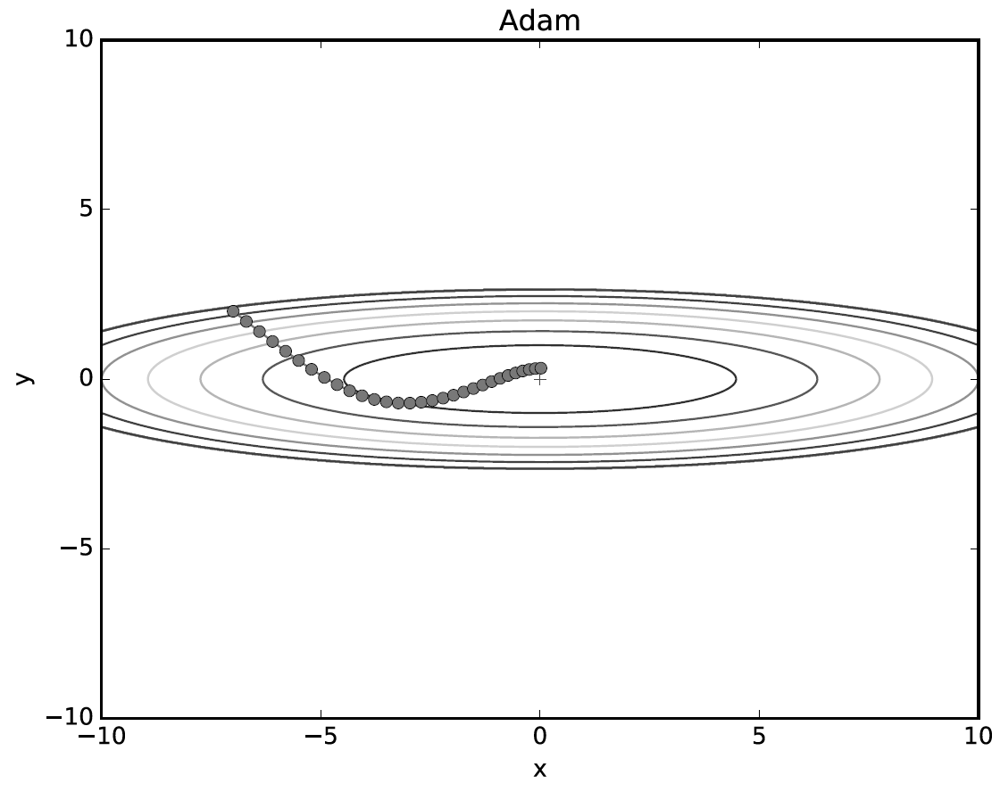
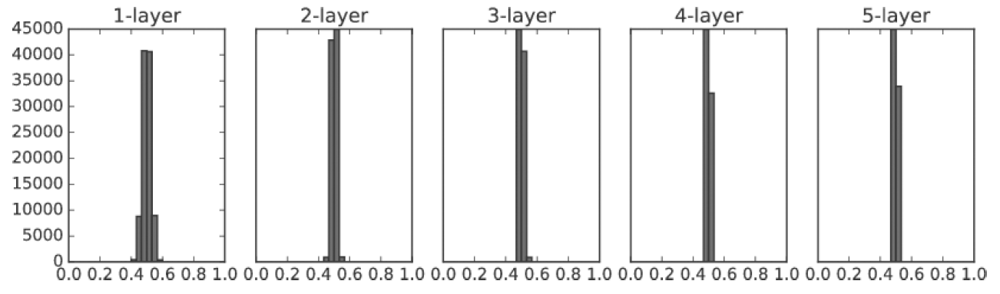

# Chapter 6 학습 관련 기술들

이번 장에서 다룰 주제는 가중치 매개변수의 최적값을 탐색하는 최적화 방법, 가중치 매개변수 초깃값, 하이퍼파라미터 설정 방법 등 신경망 학습에서 중요한 주제이다. 오버피팅의 대응책인 가중치 감소와 드롭아웃 등의 정규화 방법도 간략히 설명하고 구현해보자. 마지막으로 최근 많은 연구에서 사용하는 배치 정규화도 짧게 알아보자. 이번 장에서 설명하는 기법을 이용하면 신경망(딥러닝) 학습의 효율과 정확도를 높일 수 있다.  

## 6.1 매개변수 갱신
신경망 학습의 목적은 손실 함수의 값을 가능한 한 낮추는 매개변수를 찾는 것이다. 이는 곧 매개변수의 최적값을 찾는 문제이며, 이러한 문제를 푸는 것을 **최적화(potimization)**라 한다. 매개변수 공간은 매우 넓고 복잡해서 신경망 최적화는 굉장히 어려운 문제다. 수식을 풀어 순식간에 최솟값을 구하는 방법 같은 것은 없다. 게다가 심층 신경망에서는 매개변수의 수가 엄청나게 많아져서 사태는 더욱 심각해진다.  

우리는 지금까지 최적의 매개변수 값을 찾는 단서로 매개변수의 기울기(미분)를 이용했다. 매개변수의 기울기를 구해, 기울어진 방향으로 매개변수 값을 갱신하는 일을 몇 번이고 반복해서 점점 최적의 값에 다가갔다. 이것이 **확률적 경사 하강법(SGD)**이란 단순한 방법인데, 매개변수 공간을 무작정 찾는 것보다 똑똑한 방법이다. SGD는 단순하지만, 문제에 따라 SGD보다 똑똑한 방법도 있다. SGD의 단점을 알아본 후 SGD와는 다른 최적화 기법을 알아보자.  

### 6.1.2 확률적 경사 하강법(SGD)
SGD는 수식으로 다음과 같이 쓸 수 있다.  

  
[식 6.1]  

여기에서 W는 갱신할 가중치 매개변수고 ∂L/∂W은 W에 대한 손실 함수의 기울기다. η는 학습률(learning_rate)을 의미하는데, 실제로는 0.01이나 0.001과 같은 값을 미리 정해서 사용한다. 또, <-는 우변의 값으로 좌변의 값을 갱신한다는 뜻이다. [식 6.1]에서 보듯 SGD는 기울어진 방향으로 일정 거리만 가겠다는 단순한 방법이다. 이 SGD를 파이썬 클래스로 구현해보자.  

```python
class SGD:
    def __init__(self, lr=0.01):
        self.lr = lr
        
    def update(self, params, grads):
        for key in params.keys():
            params[key] -= self.lr * grads[key] 
```
초기화 때 받는 인수인 lr은 learning rate(학습률)를 뜻한다. 이 학습률을 인스턴스 변수로 유지한다. update(params, grads) 메소드는 SGD 과정에서 반복해서 불린다. 인수인 params와 grads는 딕셔너리 변수고, 각가 가중치 매개변수와 기울기를 저장하고 있다.  

SGD 클래스를 사용하면 신경망 매개변수의 진행을 다음과 같이 수행할 수 있다(다음 코드는 실제로는 동작하지 않는 의사 코드).  

```python
network = TwoLayerNet(...)
optimizer = SGD()

for i in range(10000) :
    ...
    x_batch, t_batch = get_mini_batch(...)  # 미니배치
    grads = network.gradient(x_batch, t_batch)
    params = network.params
    optimizer.update(params, grads)
    ...
```

optimizer는 `최적화를 행하는 자`라는 뜻의 단어다. 이 코드에서는 SGD가 그 역할을 한다. 매개변수 갱신은 optimizer가 책임지고 수행하니 우리는 optimizer에 매개변수와 기울기 정보만 넘겨주면 된다.  

이처럼 최적화를 담당하는 클래스를 분리해 구현하면 기능을 모듈화하기 좋다. 예를 들어 곧 배울 모멘텀이라는 최적화 기법 역시 update(params, grads)라는 공통의 메소드를 갖도록 구현한다. 그때 optimizer = SGD() 문장을 optimizer = Momentum()으로만 변경하면 SGD가 모멘텀으로 바뀌는 것이다.  


### 6.1.3 SGD의 단점
SGD는 단순하고 구현도 쉽지만, 문제에 따라서는 비효율적일 때가 있다. 이번 절에서는 SGD의 단점을 알아보고자 다음 함수의 최솟값을 구하는 문제를 생각해보자.  

  
[식 6.2]  

이 함수는 [그림 6-1]의 왼쪽과 같이 '밥그릇'을 x축 방향으로 늘인 듯한 모습이고, 실제로 그 등고선은 오른쪽과 같이 x축 방향으로 늘인 타원으로 되어 있다.  

  
[그림 6-1] [식 6.2]의 그래프(왼쪽)와 그 등고선(오른쪽)  

[식 6.2] 함수의 기울기를 그려보면 [그림 6-2]처럼 된다. 이 기울기는 y축 방향은 크고 x축 방향은 작다는 것이 특징이다. 말하자면 y축 방향은 가파른데 x축 방향은 완만한 것이다. 또, 여기에서 주의할 점으로는 [식 6.2]가 최솟값이 되는 장소 (x,y) = (0,0)이지만, [그림 6-2]가 보여주는 기울기 대부분은 (0,0) 방향을 가리키지 않는다는 것이다.  

  
[그림 6-2] [식 6.2]의 기울기  

탐색을 시작하는 장소(초깃값)는 (x,y) = (-7.0, 2.0)으로 하고, [그림 6-1]의 함수에 SGD를 적용해보자. 결과는 [그림 6-3]처럼 된다.  

  
[그림 6-3] SGD에 의한 최적화 갱신 경로 : 최솟값인 (0, 0)까지 지그재그로 이동하니 비효율적이다.  

SGD는 [그림 6-3]과 같은 심하게 굽이진 움직임(비효율적)을 보인다. SGD의 단점은 비등방성(anisotropy) 함수(방향에 따라 성질(여기에서는 기울기)이 달라지는 함수)에서는 탐색 경로가 비효율적이다. 이럴 때는 SGD 같이 무작정 기울어진 방향으로 진행하는 단순한 방식보다 더 영리한 묘안이 필요하다. 또한, SGD가 지그재그로 탐색하는 근본 원인은 기울어진 방향이 본래의 최솟값과 다른 방향을 가리켜서라는 점도 생각해볼 필요가 있다.  

SGD의 이러한 단점을 개선해주는 모멘텀, AdaGrad, Adam이라는 세 방법을 배울 것이다. 이들은 모두 SGD를 대체하는 기법이다.  


### 6.1.4 모멘텀
**모멘텀(Momentum)**은 `운동량`을 뜻하는 단어로, 물리와 관계가 있다. 모멘텀 기법은 수식으로는 다음과 같이 쓸 수 있다.  

  
[식 6.3]  

  
[식 6.4]  

[식 6.1]의 SGD처럼 여기에서도 W는 갱신할 가중치 매개변수, ∂L/∂W은 W에 대한 손실 함수의 기울기, η는 학습률이다. v라는 변수가 새로 나오는데, 이는 물리에서 말하는 속도(velocity)에 해당한다. [식 6.3]은 기울기 방향으로 힘을 받아 물체가 가속된다는 물리 법칙을 나타낸다. 모멘텀은 [그림 6-4]와 같이 공이 그릇의 바닥을 구르는 듯한 움직임을 보여준다.  

  
[그림 6-4] 모멘텀의 이미지 : 공이 그릇의 곡면(기울기)을 따라 구르듯 움직인다.    

또, [식 6.3]의 αv 항은 물체가 아무런 힘을 받지 않을 때 서서히 하강시키는 역할을 한다(α는 0.9 등의 값으로 설정). 물레이서의 지면 마찰이나 공기 저항에 해당하낟. 다음은 모멘텀의 구현이다.  

```python
class Momentum:
    def __init__(self, lr=0.01, momentum=0.9):
        self.lr = lr
        self.momentum = momentum
        self.v = None
        
    def update(self, params, grads):
        if self.v is None:
            self.v = {}
            for key, val in params.items():                                
                self.v[key] = np.zeros_like(val)
                
        for key in params.keys():
            self.v[key] = self.momentum*self.v[key] - self.lr*grads[key] 
            params[key] += self.v[key]
```
인스턴스 변수 v가 물체의 속도다. v는 초기화 때 아무 값도 담지 않고, 대신 update()가 처음 호출될 때 매개변수와 같은 구조의 데이터를 딕셔너리 변수로 저장한다. 나머지 부분은 [식 6.3]과 [식 6.4]를 간단히 코드로 옮긴 것이다.  

  
[그림 6-5] 모멘텀에 의한 최적화 갱신 경로   

모멘텀을 사용해서 [식 6.2]의 최적화 문제를 풀어본 결과이다. 그림에서 보듯 모멘텀의 갱신 경로는 공이 그릇 바닥을 구르듯 움직인다. SGD와 비교하면 지그재그 정도가 덜한 것을 알 수 있다. 이는 x축의 힘은 아주 작지만 방향은 변하지 않아서 한 방향으로 일정하게 가속하기 때문이다. 거꾸로 y축의 힘은 크지만 위아래로 번갈아 받아서 상충하여 y축 방향의 속도는 안정적이지 않다. 전체적으로 SGD보다 x축 방향으로 빠르게 다가가 지그재그 움직임이 줄어든다. 


### 6.1.5 AdaGrad
신경망 학습에서는 학습률(수식에서는 η로 표기) 값이 중요하다. 이 값이 너무 작으면 학습 시간이 너무 길어지고, 반대로 너무 크면 발산하여 학습이 제대로 이뤄지지 않는다.  

이 학습률을 정하는 효과적 기술로 **학습률 감소(learning rate decay)**가 있다. 이는 학습을 진행하면서 학습률을 점차 줄여가는 방법이다. 처음에는 크게 학습하다가 조금씩 작게 학습한다는 얘기로, 실제 신경망 학습에 자주 쓰인다.  

학습률을 서서히 낮추는 가장 간단한 방법은 매개변수 전체의 학습률 값을 일괄적으로 낮추는 것이다. 이를 더욱 발전시킨 것이 AdaGrad이다. AdaGrad는 `각각의` 매개변수에 `맞춤형` 값을 만들어준다.  

AdaGrad는 개별 매개변수에 적응적으로 학습률을 조정하면서 학습을 진행한다. AdGrad의 갱신 방법은 수식으로는 다음과 같다.  

  
[식 6.4]  

  
[식 6.5]  
 
마찬가지로 W는 갱신할 가중치 매개변수, ∂L/∂W은 W에 대한 손실 함수의 기울기, η는 학습률을 뜻한다. 여기에서는 새로운 변수 h가 등장한다. h는 [식 6.5]에서 보듯 기존 기울기 값을 제곱하여 계속 더해준다. 그리고 매개변수를 갱신할 때 1/(루트 h)을 곱해 학습률을 조정한다. 매개변수의 원소 중에서 많이 움직인(크게 갱신) 원소는 학습률이 낮아진다는 뜻인데, 다시 말해 학습률 감소가 매개변수의 원소마다 다르게 적용됨을 뜻한다.  

```
AdaGrad는 과거의 기울기를 제곱하여 계속 더한다. 그래서 학습을 진행할수록 갱신 강도가 약해진다. 실제로 무한히 계속 한다면 어느 순간 갱신량이 0이 되어 전혀 갱신되지 않게 된다. 이 문제를 개선한 기법으로 RMSProp이라는 방법이있다. RMSProp은 과거의 모든 기울기를 균일하게 더해가는 것이 아니라, 먼 과거의 기울기는 서서히 잊고 새로운 기울기 정보를 크게 반영한다. 이를 지수이동평균(EMA)이라 하여, 과거 기울기의 반영 규모를 기하급수적으로 감소시킨다. 
```

파이썬으로 AdaGrad을 구현해보자.  

```python 
class AdaGrad:
    def __init__(self, lr=0.01):
        self.lr = lr
        self.h = None
        
    def update(self, params, grads):
        if self.h is None:
            self.h = {}
            for key, val in params.items():
                self.h[key] = np.zeros_like(val)
            
        for key in params.keys():
            self.h[key] += grads[key] * grads[key]
            params[key] -= self.lr * grads[key] / (np.sqrt(self.h[key]) + 1e-7)
```

여기서 주의할 것은 마지막 줄에서 `1e-7`이라는 작은 값을 더하는 부분이다. 이 작은 값은 self.h[key]에 0이 담겨 있다 해도 0으로 나누는 사태를 막아준다. 대부분의 딥러닝 프레임워크에서는 이 값도 인수로 설정할 수 있다.  

그럼 AdaGrad를 사용해서 [식 6.2]의 최적화 문제를 풀어보자. 결과는 [그림 6-6]처럼 된다.  

  
[그림 6-6] AdaGrad에 의한 최적화 갱신 경로   

[그림 6-6]을 보면 최솟값을 향해 효율적으로 움직이는 것을 알 수 있다. y축 방향은 기울기가 커서 처음에는 크게 움직이지만, 그 큰 움직임에 비례해 갱신 정도도 큰 폭으로 작아지도록 조정된다. 그래서 y축 방향으로 갱신 강도가 빠르게 약해지고, 지그재그 움직임이 줄어든다.  


### 6.1.6 Adam
모멘텀은 공이 그릇 바닥을 구르는 듯한 움직임을 보였다. AdaGrad는 매개변수의 원소마다 적응적으로 갱신 정도를 조정했다. Adam은 이 두 기법을 융합하는 것에서 제안된 기법이다. Adam은 두 방법의 이점을 조합해 매개변수 공간을 효율적으로 탐색하고, 하이퍼파라미터의 `편향 보정`이 진행된다는 점이 특징이다.  

Adam을 사용하여 [식 6.2]의 최적화 문제를 풀어보자. 결과는 [그림 6-7]과 같다(Adam 클래스는 common/optimizer.py에 있다).  

  
[그림 6-7] Adam에 의한 최적화 갱신 경로   

[그림 6-7]과 같이 Adam 갱신 과정도 그릇 바닥을 구르듯 움직인다. 모멘텀과 비슷한 패턴인데, 모멘텀 때보다 공의 좌우 흔들림이 적다. 이는 학습의 갱신 강도를 적응적으로 조정해서 얻는 혜택이다.  

```
Adam은 하이퍼파라미터를 3개 설정한다. 하나는 지금까지의 학습률(α), 나머지 두 개는 일차 모멘텀용 계수 β1과 이차 모멘텀용 계수 β2이다. 논문에 따르면 기본 설정값은 β1은 0.9, β2는 0.999이며, 이 값이면 많은 경우에 좋은 결과를 얻을 수 있다.  
```

### 6.1.7 어느 갱신 방법을 이용할 것인가?
지금까지 매개변수의 갱신 방법을 4개 살펴봤다. 이번 절에서는 이들 네 기법의 결과를 비교해보자(소스코드는 optimizer_compare_naive.py에 있다).  

  
[그림 6-8] 최적화 기법 비교 : SGD, 모멘텀, AdaGrad, Adam   

[그림 6-8]과 같이 사용한 기법에 따라 갱신 경로가 다르다. 이 그림만 보면 AdaGrad가 가장 나은 것 같은데, 사실 그 결과는 풀어야 할 문제가 무엇이냐에 따라 달라지므로 주의해야 한다.  

모든 문제에서 항상 뛰어난 기법이라는 것은 (아직까진) 없다. 지금도 많은 연구에서 SGD를 사용하고 있다. 모멘텀과 AdaGrad도 시도해볼 만한 가치가 충분하고, 요즘에는 많은 분이 Adam에 만족해하며 쓰는 것 같다. 이 책에서는 주로 SGD와 Adam을 사용하지만, 각자 상황을 고려해 여러 가지로 시도해보는 것도 좋다.  

### 6.1.8 MNIST 데이터셋으로 본 갱신 방법 비교
손글씨 숫자 인식을 대상으로 지금까지 설명한 네 기법을 비교해봤다. 각 방법의 학습 진도가 얼마나 다른지 [그림 6-9]에 그려봤다(소스코드는 optimizer_compare_mnist.py에 있다).  

  
[그림 6-9] MNIST 데이터셋에 대한 학습 진도 비교   

이 실험은 각 층이 100개의 뉴런으로 구성된 5층 신경망에서 ReLU를 활성화 함수로 사용해 측정했다.  

[그림 6-9]의 결과를 보면 SGD의 학습 진도가 가장 느리고, 나머지 세 기법의 진도는 비슷한데, AdaGrad가 조금 더 빠르다. 이 실험에서 주의할 점은 하이퍼파라미터인 학습률과 신경망의 구조(층 깊이 등)에 따라 결과가 달라진다는 것이다. 다만 일반적으로 SGD보다 다른 세 기법이 빠르게 학습하고, 때론 최종 정확도도 높게 나타난다.   


## 6.2 가중치의 초깃값

신경망 학습에서 특히 중요한 것이 가중치 초깃값이다. 권장 초깃값에 대해 설명하고 실험을 통해 실제로 신경망 학습이 신속하게 이뤄지는 모습을 확인해보자.  

### 6.2.1 초깃값을 0으로 하면?
**가중치 감소(weight decay)** 기법은 가중치 매개변수의 값이 작아지도록 학습하여 오버피팅이 일어나지 않게 한다.  

가중치를 작게 만들고 싶으면 초깃값도 최대한 작은 값에서 시작하는 것이 정공법이다. 사실 지금까지 가중치의 초깃값은 `0.01 * np.random.randn(10, 100)`처럼 정규분포에서 생성되는 값을 0.01배 한 작은 값(표준편차가 0.01인 정규분포)을 사용했다.  

그렇다면 가중치의 초깃값을 모두 0으로 설정(가중치를 균일한 값으로 설정)하면 어떨까? 학습이 올바로 이뤄지지 않는다. 그 이유는 바로 오차역전파법에서 모든 가중치의 값이 똑같이 갱신되기 때문이다. 예를 들어 2층 신경망에서 첫 번째와 두 번째 층의 가중치가 0이라고 가정하자. 그럼 순전파 때는 입력층의 가중치가 0이기 때문에 두 번째 층의 뉴런에 모두 같은 값이 전달된다. 두 번째 층의 모든 뉴런에 같은 값이 입력된다는 것은 역전파 때 두 번째 층의 가중치가 모두 똑같이 갱신된다(곱셈 노드의 역전파)는 말이 된다. 그래서 가중치들은 같은 초깃값에서 시작하고 갱신을 거쳐도 여전히 같은 값을 유지하고 있는 것이다. 이는 가중치를 여러 개 갖는 의미를 사라지게 한다. 가중치의 대칭적인 구조를 무너뜨리려면 초깃값을 무작위로 설정해야 한다.  


### 6.2.2 은닉층의 활성화값 분포
은닉층의 활성화값(활성화 함수의 출력 데이터)의 분포를 관찰하면 중요한 정보를 얻을 수 있다. 이번 절에서는 가중치의 초깃값에 따라 은닉층 활성화값들이 어떻게 변화하는지 간단한 실험을 해보려 한다. 구체적으로는 활성화 함수로 시그모이드 함수를 사용하는 5층 신경망에 무작위로 생성한 입력 데이터를 흘리며 각 층의 활성화값 분포를 히스토그램으로 그려보자.  

```python
import numpy as np
import matplotlib.pyplot as plt

def sigmoid(x):
    return 1 / (1 + np.exp(-x))

def ReLU(x):
    return np.maximum(0, x)

def tanh(x):
    return np.tanh(x)
    

input_data = np.random.randn(1000, 100)  # 1000개의 데이터
node_num = 100  # 각 은닉층의 노드(뉴런) 수
hidden_layer_size = 5  # 은닉층이 5개
activations = {}  # 이곳에 활성화 결과를 저장

x = input_data

for i in range(hidden_layer_size):
    if i != 0:
        x = activations[i-1]

    w = np.random.randn(node_num, node_num) * 1

    a = np.dot(x, w)！
    z = sigmoid(a)
    activations[i] = z
```

층이 5개가 있으며, 각 층의 뉴런은 100개씩이다. 입력 데이터로서 1,000개의 데이터를 정규분포로 무작위로 생성하여 이 5층 신경망에 흘립니다. 활성화 함수로는 시그모이드 함수를 이용했고, 각 층의 활성화 결과를 activations 변수에 저장한다. 이 코드에서는 가중치의 분포에 주의해야 한다. 이번에는 표준편차가 1인 정규분포를 이용했는데, 이 분포된 정도(표준편차)를 바꿔가며 활성화값들의 분포가 어떻게 변화하는지 관찰하는 것이 이 실험의 목적이다. activations에 저장된 각 층의 활성화값 데이터를 히스토그램으로 그려보자.  

```python
# 히스토그램 그리기
for i, a in activations.items():
    plt.subplot(1, len(activations), i+1)
    plt.title(str(i+1) + "-layer")
    plt.hist(a.flatten(), 30, range=(0,1))
plt.show()
```

이 코드를 실행하면 [그림 6-10]의 히스토그램을 얻을 수 있다.  

  
[그림 6-10] 가중치를 표준편차가 1인 정규분포로 초기화할 때의 각 층의 활성화값 분포   

각 층의 활성화값들이 0과 1에 치우쳐 분포되어 있다. 여기에서 사용한 시그모이드 함수는 그 출력이 0에 가까워지자(또는 1에 가까워지자) 그 미분은 0에 다가간다. 그래서 데이터가 0과 1에 치우쳐 분포하게 되면 역전파의 기울기 값이 점점 작아지다가 사라진다. 이것이 **기울기 소실(gradient vanishing)**이라 알려진 문제다. 층을 깊게 하는 딥러닝에서는 기울기 소실은 더 심각한 문제가 될 수 있다.  

이번에는 가중치의 표준편차를 0.01로 바꿔 같은 실험을 반복해보자. 앞의 코드에서 가중치 초깃값 설정 부분을 다음과 같이 바꾸면 된다.  

```python
# w = np.random.randn(node_num, node_num) * 1
w = np.random.randn(node_num, node_num) * 0.01
```
표준편차를 0.01로 한 정규분포의 경우 각 층의 활성화값 분포는 [그림 6-11]처럼 된다.  

  
[그림 6-11] 가중치를 표준편차가 0.01인 정규분포로 초기화할 때의 각 층의 활성화값 분포  

이번에는 0.5 부근에 집중되었다. 앞의 예처럼 0과 1로 치우치진 않았으니 기울기 소실 문제는 일어나지 않았지만, 활성화값들이 치우쳤다는 것은 표현력 관점에서는 큰 문제가 있는 것이다. 이 상황에서는 다수의 뉴런이 거의 같은 값을 출력하고 있으니 뉴런을 여러 개 둔 의미가 없어진다는 뜻이다. 예를 들어 뉴런 100개가 거의 같은 값을 추력한다면 뉴런 1개짜리와 별반 다를 게 없는 것이다. 그래서 활성화값들이 치우치면 **표현력을 제한**한다는 관점에서 문제가 된다.  

```
각 층의 활성화값은 적당히 고루 분포되어야 한다. 층과 층 사이에 적당하게 다양한 데이터가 흐르게 해야 신경망 학습이 효율적으로 이뤄지기 때문이다. 반대로 치우친 데이터가 흐르면 기울기 소실이나 표현력 제한에 문제에 빠져서 학습이 잘 이뤄지지 않는 경우가 생긴다.  
```

이어서 사비에르 글로로트와 요슈아 벤지오의 논문에서 권장하는 가중치 초깃값인, 일명 **Xavier 초깃값**을 써보자. 현재 Xavier 초깃값은 일반적인 딥러닝 프레임워크들이 표준적으로 이용하고 있다. 예를 들어 카페(caffe) 프레임워크는 가중치 초깃값을 설정할 때 인수로 xavier를 지정할 수 있다.  

이 논문은 각 층의 활성화값들을 광범위하게 분포시킬 목적으로 가중치의 적절한 분포를 찾고자 했다. 그리고 앞 계층의 노드가 n개라면 표준편차가 1/(루트 n)인 분포를 사용하면 된다는 결론을 이끌었다.  

  
[그림 6-12] Xavier 초깃값 : 초깃값의 표준편차가 1/(루트 n)이 되도록 설정(n은 앞 층의 노드 수)   

Xavier 초깃값을 사용하면 앞 층에 노드가 많을수록 대상 노드의 초깃값으로 설정하는 가중치가 좁게 퍼진다. 이제 Xavier 초깃값을 써서 실험해보자. 코드에서는 가중치 초깃값 설정 부분을 다음과 같이 고쳐주기만 하면 된다(모든 층의 노드 수가 100개라고 단순화했다).  

```python
node_num = 100  # 앞 층의 노드 수
w = np.random.randn(node_num, node_num) / np.sqrt(node_num)
```

  
[그림 6-13] 가중치의 초깃값으로 'Xavier 초깃값'을 이용할 때의 각 층의 활성화값 분포   

Xavier 초깃값을 사용한 결과는 [그림 6-13]처럼 된다. 이 결과를 보면 층이 깊어지면서 형태가 다소 일그러지지만, 앞에서 본 방식보다는 확실히 넓게 분포됨을 알 수 있다. 각 층에 흐르는 데이터는 적당히 퍼져 있으므로, 시그모이드 함수의 표현력도 제한받지 않고 학습이 효율적으로 이뤄질 것으로 기대된다.  

```
[그림 6-13]은 오른쪽으로 갈수록 약간씩 일그러지고 있다. 이 일그러짐은 sigmoid 함수 대신 tanh 함수(쌍곡선 함수)를 이용하면 개선된다. 실제로 tanh 함수를 이용하면 말끔한 종 모양으로 분포된다. tanh 함수도 sigmoid 함수와 같은 'S'자 모양 곡선 함수다. 다만 tanh 함수가 원점(0,0)에서 대칭인 S 곡선인 반면, sigmoid 함수는 (x,y)=(0.05)에서 대칭인 S 곡선이다. 활성화 함수용으로는 원점에서 대칭인 함수가 바람직하다고 알려져있다. 
```

### 6.2.3 ReLU를 사용할 때의 가중치 초깃값
Xavier 초깃값은 활성화 함수가 선형인 것을 전제로 이끈 결과다. sigmoid 함수와 tanh 함수는 좌우 대칭이라 중앙 부근이 선형인 함수로 볼 수 있다. 그래서 Xavier 초깃값이 적당하다. 반면 ReLU를 이용할 때는 ReLU에 특화된 초깃값을 이용하라고 권장한다. 이 특화된 초깃값을 찾아낸 카이밍 히의 이름을 따 **He 초깃값**이라 한다. He 초깃값은 앞 계층의 노드가 n개일 때, 표준편차가 (2/n)^1/2인 정규분포를 사용한다. Xavier 초깃값이 (1/n)^1/2이었다. ReLU는 음의 영역이 0이라서 더 넓게 분포시키기 위해 2배의 계수가 필요하다고 해석할 수 있다.  

[그림 6-14]는 표준편차가 0.01인 정규분포(std = 0.01), Xavier 초깃값, ReLU 전용 He 초깃값일 때의 실험 결과를 차례로 보여준다.  

  
[그림 6-14] 활성화 함수로 ReLU를 사용한 경우의 가중치 초깃값에 따른 활성화값 분포 변화   

결과를 보면 std = 0.01일 떄의 각 층의 활성화값들은 아주 작은 값들이다. 신경망에 아주 작은 데이터가 흐른다는 것은 역전파 때 가중치의 기울기 역시 작아진다는 뜻이다. 이는 중대한 문제이며, 실제로도 학습이 거의 이뤄지지 않을 것이다.  

이어서 Xavier 초깃값 결과를 보면 이쪽은 층이 깊어지면서 치우침이 조금씩 커진다. 실제로 층이 깊어지면 활성화값들의 치우침도 커지고, 학습할 때 '기울기 소실' 문제를 일으킨다.  

마지막으로 He 초깃값은 모든 층에서 균일하게 분포되었다. 층이 깊어져도 분포가 균일하게 유지되기에 역전파 때도 적절한 값이 나올 것으로 기대할 수 있다.  

이상의 실험 결과를 바탕으로, 상황에 따라 다르지만 우선적으로 활성화 함수로 ReLU를 사용할 때는 He 초깃값을, sigmoid나 tanh 등의 S자 모양 곡선일 때는 Xavier 초깃값을 사용하자. 


### 6.2.4 MNIST 데이터셋으로 본 가중치 초깃값 비교
이번에는 실제 데이터를 가지고 가중치의초깃값을 주는 방법이 신경망 학습에 얼마나 영향을 주는지 보자. 지금까지 살펴본 세 경우(std = 0.01, Xavier 초깃값, He 초깃값) 모두 실험해보자(소스코드는 weight_init_compare.py).  

  
[그림 6-15] MNIST 데이터셋으로 살펴본 `가중치의 초깃값`에 따른 비교   

이 실험은 층별 뉴런 수가 100개인 5층 신경망에서 활성화 함수로 ReLU를 사용했다. [그림 6-15]에서 보듯 std=0.01일 때는 학습이 전혀 이뤄지지 않았다. 앞서 활성화값의 분포에서 본 것처럼 순전파 때 너무 작은 값(0 근처로 밀집한 데이터)이 흐르기 때문이다. 그로 인해 역전파 때의 기울기도 작아져 가중치가 거의 갱신되지 않는 것이다. 반대로 Xavier와 He 초깃값의 경우는 학습이 순조롭게 이뤄지고 있다. 다만 학습 진도는 He 초깃값 쪽이 더 빠르다.   

지금까지 살펴보았듯 가중치의 초깃값은 신경망 학습에 아주 중요한 포인트이다.  


## 6.3 배치 정규화
가중치의 초깃값을 적절히 설정하면 각 층의 활성화값 분포가 적당히 퍼지면서 학습이 원활하게 수행됨을 배웠다. 각 층이 활성화를 적당히 퍼뜨리도록 '강제'해보면 어떨까? **배치 정규화(Batch Normalization)**가 그런 아이디어에서 출발한 방법이다.  


### 6.3.1 배치 정규화 알고리즘
배치 정규화가 주목받는 이유는 다음과 같다.  
* 학습을 빨리 진행할 수 있다(학습 속도 개선).
* 초깃값에 크게 의존하지 않는다.
* 오버피팅을 억제한다(드롭아웃 등의 필요성 감소).

배치 정규화의 기본 아이디어는 각 층에서의 활성화값이 적당히 분포되도록 조정하는 것이다. 그래서 [그림 6-16]과 같이 데이터 분포를 정규화하는 `배치 정규화(Batch Norm) 계층`을 신경망에 삽입한다.  

  
[그림 6-16] 배치 정규화를 사용한 신경망의 예   

배치 정규화는 그 이름과 같이 학습 시 미니배치를 단위로 정규화한다. 구체적으로는 데이터 분포가 평균이 0, 분산이 1이 되도록 정규화한다. 수식으로는 다음과 같다.  

  
[식 6.7]  
 
여기에는 미니배치 B = {x1, x2, ..., xm}이라는 m개의 입력 데이터의 집합에 대한 평균 μB와 분산 (σB)^2을 구한다. 그리고 입력 데이터를 평균이 0, 분산이 1이 되게(적절한 분포가 되게) 정규화한다. 그리고 [식 6.7]에서 ε 기호(epsilon, 엡실론)는 작은 값(예컨대 10e-7 등)으로, 0으로 나누는 사태를 예방하는 역할이다.  

[식 6.7]은 단순히 미니배치 입력 데이터를 평균 0, 분산 1인 데이터로 변환하는 일을 한다. 이 처리를 활성화 함수의 앞(혹은 뒤)에 삽입함으로써 데이터 분포가 덜 치우치게 할 수 있다.  

또, 배치 정규화 계층마다 이 정규화된 데이터에 고유한 확대(scale)와 이동(shift) 변환을 수행한다. 수식으로는 다음과 같다.  

  
[식 6.8]  
 
이 식에서 γ가 확대를, β가 이동을 담당한다. 두 값은 처음에는 γ=1 *(1배 확대)*, β=0 *(이동하지 않음)* 부터 시작 *(원본 그대로에서 시작)* 하고, 학습하면서 적합한 값으로 조정해간다.  

이상이 배치 정규화의 알고리즘이다. 이 알고리즘이 신경망에서 순전파 때 적용된다. 이를 5장에서 설명한 계산 그래프로는 [그림 6-17]처럼 그릴 수 있다.  

  
[그림 6-17] 배치 정규화의 계산 그래프   

배치 정규화의 역전파 유도는 프레드릭 크래저트의 블로그에서 찾을 수 있다.  


### 6.3.2 배치 정규화의 효과
우선 MNIST 데이터셋을 사용하여 배치 정규화 계층을 사용할 때와 사용하지 않을 때의 학습 진돡 어떻게 달라지는지를 보자(소스코드는 batch_norm_test.py).  

  
[그림 6-17] 배치 정규화의 계산 그래프   

[그림 6-18]과 같이 배치 정규화가 학습을 빨리 진전시키고 있다. [그림 6-19]는 가중치 초깃값의 표준편차를 다양하게 바꿔가며 학습 경과를 관찰한 그래프다.  

  
[그림 6-19] 실선이 배치 정규화를 사용한 경우, 점선이 사용하지 않은 경우 : 가중치 초깃값의 표준편차는 각 그래프 위에 표기  

거의 모든 경우에서 배치 정규화를 사용할 때의 학습 진도가 빠른 것으로 나타난다. 실제로 배치 정규화를 이용하지 않은 경우엔 초깃값이 잘 분포되어 있지 않으면 학습이 전혀 진행되지 않는 모습도 확인할 수 있다.  

지금까지 살펴본 것처럼 배치 정규화를 사용하면 학습이 빨라지며, 가중치 초깃값에 크게 의존하지 않아도 된다.  


## 6.4 바른 학습을 위해
기계학습에서는 **오버피팅**이 문제가 되는 일이 많다. 오버피팅이란 신경망이 훈련 데이터에만 지나치게 적응되어 그 외의 데이터에는 제대로 대응하지 못하는 상태를 말한다. 기계학습은 범용 성능을 지향한다. 훈련 데이터에는 포함되지 않는, 아직 보지 못한 데이터가 주어져도 바르게 식별해내는 모델이 바람직하다. 복잡하고 표현력이 높은 모델을 만들 수는 있지만, 그만큼 오버피팅을 억제하는 기술이 중요해지는 것이다.  

### 6.4.1 오버피팅
오버피팅은 주로 다음의 두 경우에 일어난다.  
* 매개변수가 많고 표현력이 높은 모델
* 훈련 데이터가 적음

이번 절에서는 이 두 요건을 일부러 충족하여 오버피팅을 일으켜볼 것이다. 그러기 위해서 본래 60,000개인 MNIST 데이터셋의 훈련 데이터 중 300개만 사용하고, 7층 네트워크를 사용해 네트워크의 복잡성을 높인다. 각 층의 뉴런은 100개, 활성화 함수는 ReLU를 사용한다.  

실험에 필요한 코드를 발췌해 살펴보자. 전체 소스코드는 overfit_weight_decay.py에 있다. 아래는 데이터를 읽는 코드이다.   

```python
(x_train, t_train), (x_test, t_test) = load_mnist(normalize=True)
# 오버피팅을 재현하기 위해 학습 데이터 수를 줄임
x_train = x_train[:300]
t_train = t_train[:300]
```

이어서 훈련을 수행하는 코드이다. 지금까지의 코드와 같지만 에폭마다 모든 훈련 데이터와 모든 시험 데이터에 각각에서 정확도를 산출한다. 

```python
network = MultiLayerNet(input_size=784, hidden_size_list=[100, 100, 100, 100, 100, 100], output_size=10)
optimizer = SGD(lr=0.01) # 학습률이 0.01인 SGD로 매개변수 갱신

max_epochs = 201
train_size = x_train.shape[0]
batch_size = 100

train_loss_list = []
train_acc_list = []
test_acc_list = []

iter_per_epoch = max(train_size / batch_size, 1)
epoch_cnt = 0

for i in range(1000000000):
    batch_mask = np.random.choice(train_size, batch_size)
    x_batch = x_train[batch_mask]
    t_batch = t_train[batch_mask]

    grads = network.gradient(x_batch, t_batch)
    optimizer.update(network.params, grads)

    if i % iter_per_epoch == 0:
        train_acc = network.accuracy(x_train, t_train)
        test_acc = network.accuracy(x_test, t_test)
        train_acc_list.append(train_acc)
        test_acc_list.append(test_acc)

        epoch_cnt += 1
        if epoch_cnt >= max_epochs:
            break
```
train_acc_list와 test_acc_list에는 에폭 단위(모든 훈련 데이터를 한 번씩 본 단위)의 정확도를 저장한다. 이 두 리스트를 그래프로 그리면 [그림 6-20]처럼 된다.  

  
[그림 6-20] 훈련 데이터(train)와 시험 데이터(test)의 에폭별 정확도 추이  

훈련 데이터를 사용하여 측정한 정확도는 100 에폭을 지나는 무렵부터 거의 100%이다. 그러나 시험 데이터에 대해서는 큰 차이를 보인다. 이처럼 정확도가 크게 벌어지는 것은 훈련 데이터에만 적응해버린 결과다. 훈련 때 사용하지 않은 범용 데이터(시험 데이터)에는 제대로 대응하지 못하는 것을 이 그래프에서 확인할 수 있다.  


### 6.4.2 가중치 감소
오버피팅 억제용으로 예로부터 많이 이용해온 방법 중 **가중치 감소(weight decay)**라는 것이 있다. 이는 학습 과정에서 큰 가중치에 대해서는 그에 상응하는 큰 패널티를 부과하여 오버피팅을 억제하는 방법이다. 원래 오버피팅은 가중치 매개변수의 값이 커서 발생하는 경우가 많기 때문이다.  

신경망 학습의 목적은 손실 함수의 값을 줄이는 것이다. 이때, 예를 들어 가중치의 제곱 법칙(L2 법칙)을 손실 함수에 더한다. 그러면 가중치가 커지는 것을 억제할 수 있다. 가중치를 W라 하면 L2 법칙에 따른 가중치 감소는 (λW^2)/2이 되고, 이 (λW^2)/2을 손실 함수에 더한다. 여기에서 λ(람다)는 정규화이 세기를 조절하는 하이퍼파라미터다. λ를 크게 설정할수록 큰 가중치에 대한 패널티가 커진다. 또 (λW^2)/2의 앞쪽 1/2은 (λW^2)/2의 미분 결과인 λW를 조정하는 역할의 상수다.  

가중치 감소는 모든 가중치 각각의 손실 함수에 (λW^2)/2을 더한다. 따라서 가중치의 기울기를 구하는 계산에서는 그동안의 오차역전파법에 따른 결과에 정규화 항을 미분한 λW를 더한다.  

```
L2 법칙은 각 원소의 제곱들을 더한 것에 해당한다. L2 법칙 외에 L1 법칙과 L∞법칙도 있다. L1 법칙은 절댓값의 합, L∞법칙은 Max 법칙이라고도 하며, 각 원소의 절댓값 중 가장 큰 것에 해당한다.  
```

방금 수행한 실험에서 λ=0.1로 가중치 감소를 적용하여 실험을 해보자. 결과는 [그림 6-21]과 같다(가중치 감소를 적용한 네트워크는 common/multi_layer_net.py에 있다).  

  
[그림 6-21] 가중치 감소를 이용한 훈련 데이터(train)와 시험 데이터(test)에 대한 정확도 추이  

[그림 6-21]과 같이 훈련 데이터에 대한 정확도와 시험 데이터에 대한 정확도에는 여전히 차이가 있지만, 가중치 감소를 이용하지 않은 [그림 6-20]과 비교하면 그 차이가 줄었다. 다시 말해 오버피팅이 억제됐다는 소리다. 그리고 앞서와 달리 훈련 데이터에 대한 정확도가 100%(1.0)에 도달하지 못한 점도 주목해야 한다.  


### 6.4.3 드롭아웃


