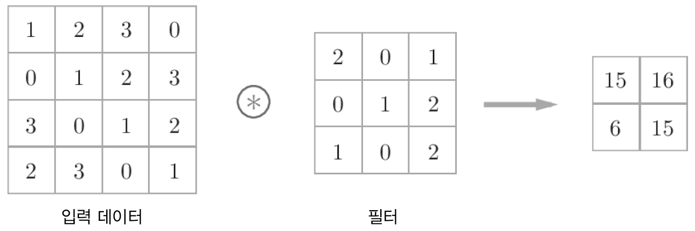
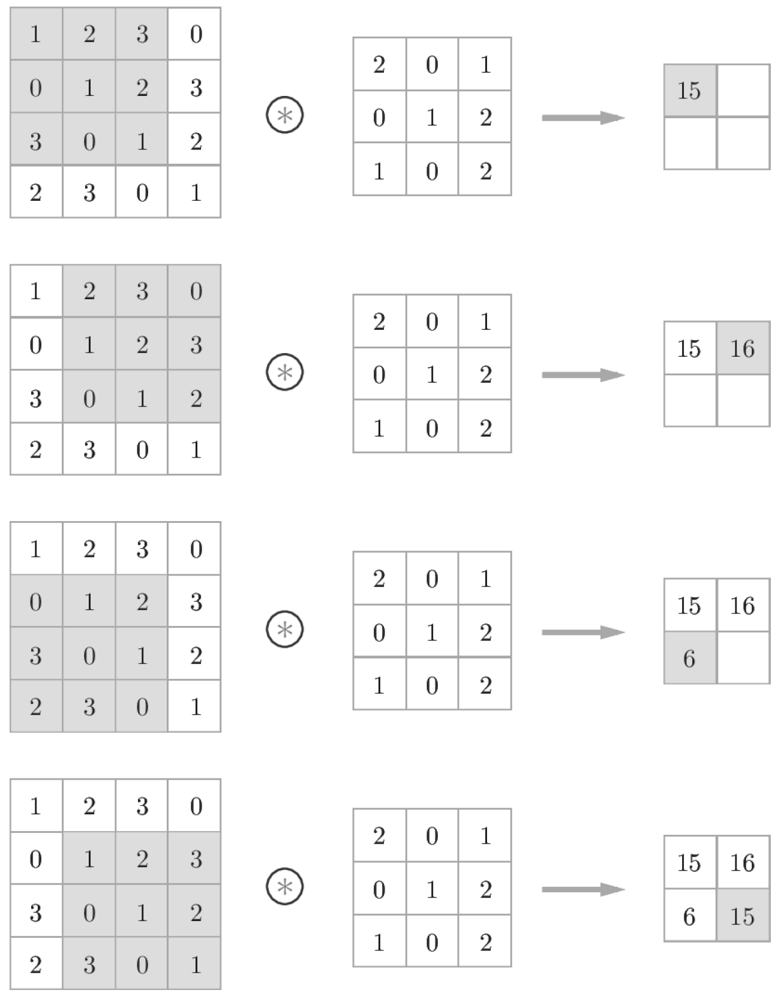

# Chapter 7 합성곱 신경망(CNN)
이번 장의 주제는 **합성곱 신경망(convolutional neural network, CNN)**이다. CNN은 이미지 인식과 음성 인식 등 다양한 곳에서 사용되는데, 특히 이미지 인식 분야에서 딥러닝을 활용한 기법은 거의 다 CNN을 기초로 한다. 이번 장에서는 CNN의 메커니즘을 자세히 설명하고 이를 파이썬으로 구현해보도록 한다.  

## 7.1 전체 구조
CNN도 지금까지 본 신경망과 같이 레고 블록처럼 계층을 조합하여 만들 수 있다. 다만, **합성곱 계층(convolutional layer)** 과 **풀링 계층(pooling layer)** 이 새롭게 등장한다.  

지금까지 본 신경망은 인접하는 계층의 모든 뉴런과 결합되어 있었다. 이를 **완전연결(fully-connected, 전결합)** 이라고 하며, 완전히 연결된 계층을 **Affine 계층**이라는 이름으로 구현했다. Affine 계층을 사용하면, 가령 층이 5개인 완전연결 신경망은 [그림 7-1]과 같이 구현할 수 있다.  

  
[그림 7-1] 완전연결 계층(Affine 계층)으로 이뤄진 네트워크의 예  

[그림 7-1]과 같이 완전연결 신경망은 Affine 계층 뒤에 활성화 함수를 갖는 ReLU 계층(혹은 Sigmoid 계층)이 이어진다. 이 그림에서는 Affine-ReLU 조합이 4개가 쌓였고, 마지막 5번째 층은 Affine 계층에 이어 소프트맥스 계층에서 최정 결과(확률)를 출력한다.  

  
[그림 7-2] CNN으로 이뤄진 네트워크의 예 : 합성곱 계층과 풀링 계층이 새로 추가(회색)  

[그림 7-2]와 같이 CNN에서는 새로운 `합성곱 계층(Conv)`과 `풀링 계층(Pooling)`이 추가된다. CNN의 계층은 `Conv-ReLU-(Pooling)` 흐름으로 연결 *(풀링 계층은 생략하기도 함)* 된다. 지금까지의 `Affine-ReLU` 연결이 `Conv-ReLU-(Pooling)`으로 바뀌었다고 생각할 수 있다.  

[그림 7-2]의 CNN에서 주목할 또 다른 점은 출력에 가까운 층에서는 지금까지의 `Affine-ReLU` 구성을 사용할 수 있다. 또, 마지막 출력 계층에서는 `Affine-Softmax` 조합을 그대로 사용한다. 일반적인 CNN에서 흔히 볼 수 있는 구성이다.  

## 7.2 합성곱 계층
CNN에서는 **패딩(padding)**, **스트라이드(stride)** 등 CNN 고유의 언어가 등장한다. 또, 각 계층 사이에는 3차원 데이터같이 입체적인 데이터가 흐른다는 점에서 완전연결 신경망과 다르다.     

### 7.2.1 완전연결 계층의 문제점
지금까지 본 완전연결 신경망에서는 완전연결 계층(Affine 계층)을 사용했다. 완전연결 계층에서는 인접하는 계층의 뉴런이 모두 연결되고 출력의 수는 임의로 정할 수 있다.  

완전연결 계층의 문제점은 `데이터의 형상이 무시`된다는 사실이다. 입력 데이터가 이미지인 경우를 예로 들면, 이미지는 통상 세로·가로·채널(색상)로 구성된 3차원 데이터다. 그러나 완전연결 계층에 입력할 때는 3차원 데이터를 평평한 1차원 데이터로 평탄화해줘야 한다. 사실 지금까지의 MNIST 데 이터셋을 사용한 사례에서는 형상이 (1, 28, 28)인 이미지(1채널, 세로 28픽셀, 가로 28픽셀)를 1줄로 세운 784개의 데이터를 첫 Affine 계층에 입력했다.  

이미지는 3차원 형상이며, 이 형상에는 소중한 공간적 정보가 담겨 있다. 예를 들어 공간적으로 가까운 픽셀은 값이 비슷하거나, RGB의 각 채널은 서로 밀접하게 관련되어 있거나, 거리가 먼 픽셀끼리는 별 연관이 없는 등, 3차원 속에서 의미를 갖는 본질적인 패턴이 숨어 있을 것이다. 그러나 완전연결 계층은 형상을 무시하고 모든 입력 데이터를 동등한 뉴런(같은 차원의 뉴런)으로 취급하여 형상에 담긴 정보를 살릴 수 없다.  

한편, 합성곱 계층은 형상을 유지한다. 이미지도 3차원 데이터로 입력받으며, 마찬가지로 다음 계층에도 3차원 데이터로 전달한다. 그래서 CNN에서는 이미지처럼 형상을 가진 데이터를 제대로 이해할 가능성이 있는 것이다.  

CNN에서는 합성곱 계층의 입출력 데이터를 **특징 맵(feature map)** 이라고도 한다. 합성곱 계층의 입력 데이터를 **입력 특징 맵(input feature map)**, **출력 특징 맵(output feature map)** 이라고 하는 식이다. 여기에선 `입출력 데이터`와 `특징 맵`을 같은 의미로 사용한다.    

### 7.2.2 합성곱 연산
합성곱 계층에서의 **합성곱 연산** 을 처리하는데, 합성곱 연산은 이미지 처리에서 말하는 **필터 연산**에 해당한다.  

  
[그림 7-3] 합성곱 연산의 예 : 합성곱 연산을 * 기호로 표기   

[그림 7-3]과 같이 합성곱 연산은 입력 데이터에 필터를 적용한다. 이 예에서 입력 데이터는 세로·가로 방향의 형상을 가졌고, 필터 역시 세로·가로 방향의 차원을 갖는다. 데이터와 필터의 형상을(높이*height*, 너비*width*)로 표기하며, 이 예에서는 입력은 (4, 4), 필터는 (3, 3), 출력은 (2, 2)가 된다. 필터를 **커널** 이라 칭하기도 한다.   

  
[그림 7-4] 합성곱 연산의 계산 순서   

합성곱 연산은 필터의 **윈도우***window*를 일정 간격으로 이동해가며 입력 데이터에 적용한다. 여기에서 말하는 우니도우는 [그림 7-4]의 회식 3 x 3 부분을 가리킨다. 이 그림에서 보듯 입력과 필터에서 대응하는 원소끼리 곱한 후 그 총합을 구한다(이 계산을 **단일 곱셈-누산***fused multiply-add, FMA*이라 한다). 그리고 그 결과를 출력의 해당 장소에 저장한다. 이 과정을 모든 장소에서 수행하면 합성곱 연산의 출력이 완성된다.  

완전연결 신경망에는 가중치 매개변수와 편향이 존재하는데, CNN에서는 필터의 매개변수가 그동안의 `가중치`에 해당한다. 그리고 CNN에도 편향이 존재한다. [그림 7-3]은 필터를 적용하는 단계까지만 보여준 것이고, 편향까지 포함하면 [그림 7-5]와 같은 흐름이 된다.  

  
[그림 7-5] 합성곱 연산의 편향 : 필터를 적용한 원소에 고정값(편향)을 더한다.   

[그림 7-5]와 같이 편향은 필터를 적용한 후의 데이터에 더해진다. 그리고 편향은 항상 하나(1x1)만 존재한다. 그 하나의 값을 필터로 적용한 모든 원소에 더하는 것이다.  

### 7.2.3 패딩
합성곱 연산을 수행하기 전에 입력 데이터 주변을 특정 값(예컨대 0)으로 채우기도 한다. 이를 **패딩(padding)** 이라 하며, 합성곱 연산에서 자주 이용하는 기법이다. 예를 들어 [그림 7-6]은 (4,4) 크기의 입력 데이터에 폭이 1인 패딩을 적용한 모습이다. 폭 1짜리 패딩이라 하면 입력 데이터 사방 1픽셀을 특정 값으로 채우는 것이다.  

  
[그림 7-6] 합성곱 연산의 패딩 처리 : 입력 데이터 주위에 0을 채운다(패딩은 점선으로 표시했으며 그 안의 값 '0'은 생략했다).   

[그림 7-6]과 같이 처음에 크기가 (4,4)인 입력 데이터에 패딩이 추가되어 (6,6)이 된다. 이 입력에 (3,3) 크기의 필터를 걸면 (4,4) 크기의 출력 데이터가 생성된다. 이 예에서는 패딩을 1로 설정했지만, 2나 3 등 원하는 정수로 설정할 수 있다. 만약 [그림 7-5]에 패딩을 2로 설정하면 입력 데이터의 크기는 (8,8)이 되고 3으로 설정하면 (10,10)이 된다.    

>패딩은 주로 출력 크기를 조정할 목적으로 사용한다. 예를 들어 (4,4) 입력 데이터에 (3,3) 필터를 적용하면 출력은 (2,2)가 되어, 입력보다 2만큼 줄어든다. 이는 합성곱 연산을 몇 번이나 되풀이하는 심층 신경망에서는 문제가 될 수 있다. 합성곱 연산을 거칠 때마다 크기가 작아져 어느 시점에서는 출력 크기가 1이 되면, 더 이상은 합성곱 연산을 적용할 수 없기 때문이다. 이러한 사태를 막기 위해 패딩을 사용한다. 앞의 예에서는 패딩의 폭을 1로 설정하니 (4,4) 입력에 대한 출력이 같은 크기인 (4,4)로 유지되었다. 한 마디로 입력 데이터의 공간적 크기를 고정한 채로 다음 계층에 전달할 수 있다.

