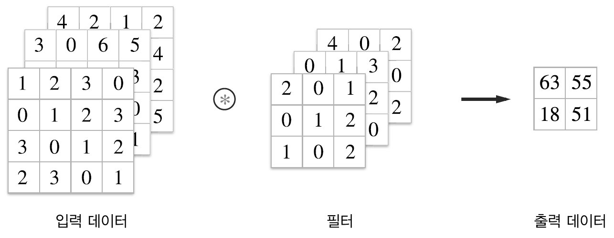

# Chapter 7 합성곱 신경망(CNN)
이번 장의 주제는 **합성곱 신경망(convolutional neural network, CNN)**이다. CNN은 이미지 인식과 음성 인식 등 다양한 곳에서 사용되는데, 특히 이미지 인식 분야에서 딥러닝을 활용한 기법은 거의 다 CNN을 기초로 한다. 이번 장에서는 CNN의 메커니즘을 자세히 설명하고 이를 파이썬으로 구현해보도록 한다.  

## 7.1 전체 구조
CNN도 지금까지 본 신경망과 같이 레고 블록처럼 계층을 조합하여 만들 수 있다. 다만, **합성곱 계층(convolutional layer)** 과 **풀링 계층(pooling layer)** 이 새롭게 등장한다.  

지금까지 본 신경망은 인접하는 계층의 모든 뉴런과 결합되어 있었다. 이를 **완전연결(fully-connected, 전결합)** 이라고 하며, 완전히 연결된 계층을 **Affine 계층**이라는 이름으로 구현했다. Affine 계층을 사용하면, 가령 층이 5개인 완전연결 신경망은 [그림 7-1]과 같이 구현할 수 있다.  

  
[그림 7-1] 완전연결 계층(Affine 계층)으로 이뤄진 네트워크의 예  

[그림 7-1]과 같이 완전연결 신경망은 Affine 계층 뒤에 활성화 함수를 갖는 ReLU 계층(혹은 Sigmoid 계층)이 이어진다. 이 그림에서는 Affine-ReLU 조합이 4개가 쌓였고, 마지막 5번째 층은 Affine 계층에 이어 소프트맥스 계층에서 최정 결과(확률)를 출력한다.  

  
[그림 7-2] CNN으로 이뤄진 네트워크의 예 : 합성곱 계층과 풀링 계층이 새로 추가(회색)  

[그림 7-2]와 같이 CNN에서는 새로운 `합성곱 계층(Conv)`과 `풀링 계층(Pooling)`이 추가된다. CNN의 계층은 `Conv-ReLU-(Pooling)` 흐름으로 연결 *(풀링 계층은 생략하기도 함)* 된다. 지금까지의 `Affine-ReLU` 연결이 `Conv-ReLU-(Pooling)`으로 바뀌었다고 생각할 수 있다.  

[그림 7-2]의 CNN에서 주목할 또 다른 점은 출력에 가까운 층에서는 지금까지의 `Affine-ReLU` 구성을 사용할 수 있다. 또, 마지막 출력 계층에서는 `Affine-Softmax` 조합을 그대로 사용한다. 일반적인 CNN에서 흔히 볼 수 있는 구성이다.  


## 7.2 합성곱 계층
CNN에서는 **패딩(padding)**, **스트라이드(stride)** 등 CNN 고유의 언어가 등장한다. 또, 각 계층 사이에는 3차원 데이터같이 입체적인 데이터가 흐른다는 점에서 완전연결 신경망과 다르다.     


### 7.2.1 완전연결 계층의 문제점
지금까지 본 완전연결 신경망에서는 완전연결 계층(Affine 계층)을 사용했다. 완전연결 계층에서는 인접하는 계층의 뉴런이 모두 연결되고 출력의 수는 임의로 정할 수 있다.  

완전연결 계층의 문제점은 `데이터의 형상이 무시`된다는 사실이다. 입력 데이터가 이미지인 경우를 예로 들면, 이미지는 통상 세로·가로·채널(색상)로 구성된 3차원 데이터다. 그러나 완전연결 계층에 입력할 때는 3차원 데이터를 평평한 1차원 데이터로 평탄화해줘야 한다. 사실 지금까지의 MNIST 데 이터셋을 사용한 사례에서는 형상이 (1, 28, 28)인 이미지(1채널, 세로 28픽셀, 가로 28픽셀)를 1줄로 세운 784개의 데이터를 첫 Affine 계층에 입력했다.  

이미지는 3차원 형상이며, 이 형상에는 소중한 공간적 정보가 담겨 있다. 예를 들어 공간적으로 가까운 픽셀은 값이 비슷하거나, RGB의 각 채널은 서로 밀접하게 관련되어 있거나, 거리가 먼 픽셀끼리는 별 연관이 없는 등, 3차원 속에서 의미를 갖는 본질적인 패턴이 숨어 있을 것이다. 그러나 완전연결 계층은 형상을 무시하고 모든 입력 데이터를 동등한 뉴런(같은 차원의 뉴런)으로 취급하여 형상에 담긴 정보를 살릴 수 없다.  

한편, 합성곱 계층은 형상을 유지한다. 이미지도 3차원 데이터로 입력받으며, 마찬가지로 다음 계층에도 3차원 데이터로 전달한다. 그래서 CNN에서는 이미지처럼 형상을 가진 데이터를 제대로 이해할 가능성이 있는 것이다.  

CNN에서는 합성곱 계층의 입출력 데이터를 **특징 맵(feature map)** 이라고도 한다. 합성곱 계층의 입력 데이터를 **입력 특징 맵(input feature map)**, **출력 특징 맵(output feature map)** 이라고 하는 식이다. 여기에선 `입출력 데이터`와 `특징 맵`을 같은 의미로 사용한다.    


### 7.2.2 합성곱 연산
합성곱 계층에서의 **합성곱 연산** 을 처리하는데, 합성곱 연산은 이미지 처리에서 말하는 **필터 연산**에 해당한다.  

  
[그림 7-3] 합성곱 연산의 예 : 합성곱 연산을 * 기호로 표기   

[그림 7-3]과 같이 합성곱 연산은 입력 데이터에 필터를 적용한다. 이 예에서 입력 데이터는 세로·가로 방향의 형상을 가졌고, 필터 역시 세로·가로 방향의 차원을 갖는다. 데이터와 필터의 형상을(높이*height*, 너비*width*)로 표기하며, 이 예에서는 입력은 (4, 4), 필터는 (3, 3), 출력은 (2, 2)가 된다. 필터를 **커널** 이라 칭하기도 한다.   

  
[그림 7-4] 합성곱 연산의 계산 순서   

합성곱 연산은 필터의 **윈도우***window*를 일정 간격으로 이동해가며 입력 데이터에 적용한다. 여기에서 말하는 우니도우는 [그림 7-4]의 회식 3 x 3 부분을 가리킨다. 이 그림에서 보듯 입력과 필터에서 대응하는 원소끼리 곱한 후 그 총합을 구한다(이 계산을 **단일 곱셈-누산***fused multiply-add, FMA*이라 한다). 그리고 그 결과를 출력의 해당 장소에 저장한다. 이 과정을 모든 장소에서 수행하면 합성곱 연산의 출력이 완성된다.  

완전연결 신경망에는 가중치 매개변수와 편향이 존재하는데, CNN에서는 필터의 매개변수가 그동안의 `가중치`에 해당한다. 그리고 CNN에도 편향이 존재한다. [그림 7-3]은 필터를 적용하는 단계까지만 보여준 것이고, 편향까지 포함하면 [그림 7-5]와 같은 흐름이 된다.  

  
[그림 7-5] 합성곱 연산의 편향 : 필터를 적용한 원소에 고정값(편향)을 더한다.   

[그림 7-5]와 같이 편향은 필터를 적용한 후의 데이터에 더해진다. 그리고 편향은 항상 하나(1x1)만 존재한다. 그 하나의 값을 필터로 적용한 모든 원소에 더하는 것이다.  


### 7.2.3 패딩
합성곱 연산을 수행하기 전에 입력 데이터 주변을 특정 값(예컨대 0)으로 채우기도 한다. 이를 **패딩(padding)** 이라 하며, 합성곱 연산에서 자주 이용하는 기법이다. 예를 들어 [그림 7-6]은 (4,4) 크기의 입력 데이터에 폭이 1인 패딩을 적용한 모습이다. 폭 1짜리 패딩이라 하면 입력 데이터 사방 1픽셀을 특정 값으로 채우는 것이다.  

  
[그림 7-6] 합성곱 연산의 패딩 처리 : 입력 데이터 주위에 0을 채운다(패딩은 점선으로 표시했으며 그 안의 값 '0'은 생략했다).   

[그림 7-6]과 같이 처음에 크기가 (4,4)인 입력 데이터에 패딩이 추가되어 (6,6)이 된다. 이 입력에 (3,3) 크기의 필터를 걸면 (4,4) 크기의 출력 데이터가 생성된다. 이 예에서는 패딩을 1로 설정했지만, 2나 3 등 원하는 정수로 설정할 수 있다. 만약 [그림 7-5]에 패딩을 2로 설정하면 입력 데이터의 크기는 (8,8)이 되고 3으로 설정하면 (10,10)이 된다.    

>패딩은 주로 출력 크기를 조정할 목적으로 사용한다. 예를 들어 (4,4) 입력 데이터에 (3,3) 필터를 적용하면 출력은 (2,2)가 되어, 입력보다 2만큼 줄어든다. 이는 합성곱 연산을 몇 번이나 되풀이하는 심층 신경망에서는 문제가 될 수 있다. 합성곱 연산을 거칠 때마다 크기가 작아져 어느 시점에서는 출력 크기가 1이 되면, 더 이상은 합성곱 연산을 적용할 수 없기 때문이다. 이러한 사태를 막기 위해 패딩을 사용한다. 앞의 예에서는 패딩의 폭을 1로 설정하니 (4,4) 입력에 대한 출력이 같은 크기인 (4,4)로 유지되었다. 한 마디로 입력 데이터의 공간적 크기를 고정한 채로 다음 계층에 전달할 수 있다.


### 7.2.4 스트라이드
필터를 적용하는 위치의 간격을 **스트라이드(stride)**라고 한다. 지금까지 본 예는 모두 스트라이드가 1이었지만, 예를 들어 스트라이드를 2로 하면 필터를 적용하는 윈도우가 두 칸씩 이동한다. 

  
[그림 7-7] 스트라이드가 2인 합성곱 연산   

[그림 7-7]에서는 크기가 (7,7)인 입력 데이터에 스트라이드를 2로 설정한 필터를 적용했더니 출력은 (3,3)이 된다. 패딩을 크게 하면 출력 크기가 커지고, 스트라이드를 키우면 출력 크기는 작아진다. 이러한 관계를 수식화하면 다음과 같다.  

입력 크기를 (H,W), 필터 크기를 (FH, FW), 출력 크기를 (OH, OW), 패딩을 P, 스트라이드를 S라 하면, 출력 크기는 다음 식으로 계산한다.  

  
[식 7.1]    

이 식을 사용하여 연습해보자.  

- 예 1 : [그림 7-6]  
  입력 : (4,4), 패딩 : 1, 스트라이드 : 1, 필터 : (3,3)  
  OH = (4+ 2*1 -3)/1 + 1 = 4  
  OW = (4 + 2*1 -3)/1 + 1 = 4  
- 예 2 : [그림 7-7]  
  입력 : (7,7), 패딩 : 0, 스트라이드 : 2, 필터 : (3,3)  
  OH = (7+ 2*0 -3)/2 + 1 = 3  
  OW = (7 + 2*0 -3)/2 + 1 = 3
- 예 3 :  
  입력 : (28,31), 패딩 : 2, 스트라이드 : 3, 필터 : (5,5)  
  OH = (28+ 2*2 -5)/3 + 1 = 10  
  OW = (31 + 2*2 -5)/3 + 1 = 11  

[식 7.1]에 단순히 값을 대입하기만 하면 출력 크기를 구할 수 있다. 단, [식 7.1]에 정수가 나눠떨어지는 값이어야 한다. 출력 크기가 정수가 아니면 오류를 내는 등의 대응을 해줘야 한다. 딥러닝 프레임워크 중에는 값이 딱 나눠 떨어지지 않을 때는 가장 가까운 정수로 반올림하는 등, 특별히 에러를 내지 않고 진행하도록 구현하는 경우도 있다.  


### 7.2.5 3차원 데이터의 합성곱 연산
[그림 7-8]은 3차원 데이터의 합성곱 연산 예다. 그리고 [그림 7-9]는 계산 순서이다. 2차원일 때(그림 7-3)와 비교하면, 길이 방향(채널 방향)으로 특징 맵이 늘어났다. 채널쪽으로 특징 맵(입출력 데이터)이 여러 개 있다면 입력 데이터와 필터의 합성곱 연산을 채널마다 수행하고, 그 결과를 더해서 하나의 출력을 얻는다.  

  
[그림 7-8] 3차원 데이터 합성곱 연산의 예   

  
[그림 7-9] 3차원 데이터 합성곱 연산의 계산순서   

3차원의 합성곱 연산에서 주의할 점은 **입력 데이터의 채널 수와 필터의 채널 수가 같아야 한다**는 것이다. 이 예에서는 모두 3개로 일치한다. 필터 자체의 크기는 원하는 값으로 설정할 수 있다(**단, 모든 채널의 필터가 같은 크기여야 한다**). 이 예에서 필터의 크기가 (3,3)이지만, 원한다면 (2,2)나 (1,1) 또는 (5,5) 등으로 설정해도 된다.  


### 7.2.6 블록으로 생각하기
3차원의 합성곱 연산은 데이터와 필터를 직육면체 블록이라고 생각하면 쉽다. 블록은 [그림 7-10]과 같은 3차원 직육면체다. 또 3차원 데이터를 다차원 배열로 나타낼 때는 (채널*channel*, 높이*height*, 너비*width*) 순서로 쓰자. 예를 들어 채널 수 C, 높이 H, 너비 W인 데 이터의 형상은 (C, H, W)로 쓴다. 필터도 같은 순서로 쓴다. 예를 들어 채널 수 C, 필터 높이 FH, 필터 너비 FW의 경우 (C, FH, FW)로 쓴다.  

  
[그림 7-10] 합성곱 연산을 직육면체 블록으로 생각한다. 블록의 형상에 주의.   

이 예에서 출력 데이터는 한 장의 특징 맵이다. 즉, 채널이 1개인 특징 맵이다. 합성곱 연산의 출력으로 다수의 채널을 내보내려면 필터(가중치)를 다수 사용해야 한다. 그림으로는 [그림 7-11]처럼 된다.  

  
[그림 7-11] 여러 필터를 사용한 합성곱 연산의 예   

이 그림과 같이 필터를 FN개 적용하면 출력 맵도 FN개가 생성된다. 그리고 그 FN개의 맵을 모으면 형상이 (FN, OH, OW)인 블록이 완성된다. 이 완성된 블록을 다음 계층으로 넘기겠다는 것이 CNN의 처리 흐름이다.  

합성곱 연산에서는 필터의 수도 고려해야 한다. 그런 이유로 필터의 가중치 데이터는 4차원 데이터이며 (출력 채널 수, 입력 채널 수, 높이, 너비) 순으로 쓴다. 예를 들어 채널 수 3, 크기 5 x 5인 필터가 20개 있다면 (20, 3, 5, 5)로 쓴다.  

합성곱 연산에도 (완전연결 계층과 마찬가지로) 편향이 쓰인다. [그림 7-12]는 [그림 7-11]에 편향을 더한 모습이다.  

  
[그림 7-12] 합성곱 연산의 처리 흐름(편향 추가)   

[그림 7-12]에서 보듯 편향은 채널 하나에 값 하나씩으로 구성된다. 잉 ㅖ에서는 편향의 형상은 (FN, 1, 1)이고, 필터의 출력 결과의 형상은 (FN, OH, OW)이다. 이들 두 블록을 더하면 편향의 각 값이 필터의 출력인 (FN, OH, OW) 블록의 대응 채널의 원소 모두에 더해진다. 참고로, 형상이 다른 블록의 덧셈은 넘파이의 브로드캐스트 기능으로 쉽게 구현할 수 있다.  


### 7.2.7 배치 처리
신경망 처리에서는 입력 데이터를 한 덩어리로 묶어 배치로 처리했다. 완전연결 신경망을 구현하면서는 이 방식을 지원하여 처리 효율을 높이고, 미니배치 방식의 학습도 지원하도록 했다.  

합성곱 연산도 마찬가지로 배치 처리를 지원하고자 한다. 그래서 각 계층을 흐르는 데이터의 차원을 하나 늘려 4차원 데이터로 저장한다. 구체적으로는 데이터를 (데이터 수, 채널 수, 높이, 너비) 순으로 저장한다. 데이터가 N개일 때 [그림 7-12]를 배치 처리한다면 데이터 형태가 [그림 7-13]처럼 되는 것이다.  

  
[그림 7-13] 합성곱 연산의 처리 흐름(배치 처리)   

배치 처리 시의 데이터 흐름을 나타낸 [그림 7-13]을 보면 각 데이터의 선두에 배치용 차원을 추가했다. 이처럼 데이터는 4차원 형상을 가진 채 각 계층을 타고 흐른다. 여기에서 주의할 점으로는 신경망에 4차원 데이터가 하나 흐를 때마다 데이터 N개에 대한 합성곱 연산이 이뤄진다는 것이다. 즉, N회 분의 처리를 한 번에 수행한다.  


## 7.3 풀링 계층
풀링은 세로·가로 방향의 공간을 줄이는 연산이다. 예를 들어 [그림 7-14]와 같이 2x2 영역을 원소 하나로 집약하여 공간 크기를 줄인다. 

  
[그림 7-14] 최대 풀링의 처리 순서   

[그림 7-14]는 2x2 **최대 풀링(max pooling)**을 스트라이드 2로 처리하는 순서다. 최대 풀링은 최댓값을 구하는 연산으로, `2x2`는 대상 영역의 크기를 뜻한다. 즉 2x2 최대 풀링은 그림과 같이 2x2 크기의 영역에서 가장 큰 원소 하나를 꺼낸다. 또 스트라이드는 이 예에서는 2로 설정했으므로 2x2 윈도우가 원소 2칸 간격으로 이동한다. 참고로, 풀링의 윈도우 크기와 스트라이드는 같은 값으로 설정하는 것이 보통이다. 예를 들어 윈도우가 3x3이면 스트라이드는 3으로, 윈도우가 4x4이면 스트라이드를 4로 설정한다.  

>풀링은 최대 풀링 외에도 **평균 풀링** 등이 있다. 최대 풀링은 대상 영역에서 최댓값을 취하는 연산인 반면, 평균 풀링은 대상 영역의 평균을 계산한다. 이미지 인식 분야에서는 주로 최대 풀링을 사용한다. 그래서 여기서 풀링 계층이라고 하면 최대 풀링을 말하는 것이다.  


### 7.3.1 풀링 계층의 특징
- **학습해야 할 매개변수가 없다**  
  풀링 계층은 합성곱 계층과 달리 학습해야 할 매개변수가 없다. 풀링은 대상 영역에서 최댓값이나 평균을 취하는 명확한 처리이므로 특별히 학습할 것이 없다.  
- **채널 수가 변하지 않는다**  
  풀링 연산은 입력 데이터의 채널 수 그대로 출력 데이터로 내보낸다. [그림 7-15]처럼 채널마다 독립적으로 계산하기 때문이다.  

  
[그림 7-15] 풀링은 채널 수를 바꾸지 않는다.    

- **입력의 변화에 영향을 적게 받는다(강건하다)**
  입력 데이터가 조금 변해도 풀링의 결과는 잘 변하지 않는다. 예를 들어 [그림 7-16]은 입력 데이터의 차이(데이터가 오른쪽으로 1칸씩 이동)를 풀링이 흡수해 사라지게 하는 모습을 보여준다. 

  
[그림 7-16] 입력 데이터가 가로로 1원소만큼 어긋나도 출력은 같다(데이터에 따라서는 다를 수도 있다)    


## 7.4 합성곱/풀링 계층 구현하기
합성곱 계층과 풀링 계층은 복잡해 보이지만, '트릭'을 사용하면 쉽게 구현할 수 있다.  

### 7.4.1 4차원 배열
CNN에서 계층 사이를 흐르는 데이터는 4차원이다. 예를 들어 데이터의 형상이 (10,1,28,28) 이라면, 높이 28, 너비 28, 채널 1개인 데이터가 10개라는 이야기다. 이를 파이썬으로 구현하면 다음과 같다.  

```python
>>> x = np.random.rand(10, 1, 28, 28)  # 무작위로 데이터 생성
>>> x.shape
(10, 1, 28, 28)
```

여기에서 10개 중 첫 번째 데이터에 접근하려면 단순히 x[0]이라고 쓴다. 마찬가지로 두 번째 데이터는 x[1] 위치에 있다.  

```python
>>> x[0].shape  # (1, 28, 28)
>>> x[1].shape  # (1, 28, 28)
```

첫 번째 데이터의 첫 채널의 공간 데이터에 접근하려면 다음과 같이 적는다.  

```python
>>> x[0,0].shape  # 또는 x[0][0]으로 표현 가능
(28, 28)
```
이처럼 CNN은 4차원 데이터를 다룬다. 그래서 합성곱 연산의 구현은 복잡해질 것 같지만, 다음 절에서 설명하는 `im2col`이라는 `트릭`이 문제를 단순하게 만들어준다.  


### 7.4.2 im2col로 데이터 전개하기
합성곱 연산을 곧이곧대로 구현하려면 for 문을 겹겹이 써야한다. 이번 절에서는 for 문 대신 **im2col**이라는 편의 함수를 사용해 간단하게 구현해보자.  

im2col은 입력 데이터를 필터링(가중치 계산)하기 좋게 전개하는 함수다. [그림 7-17]과 같이 3차원 입력 데이터에 im2col을 적용하면 2차원 행렬로 바뀐다(정확히는 배치 안의 데이터 수까지 포함한 4차원 데이터를 2차원으로 변환).  

  
[그림 7-17] (대략적인)im2col의 동작    

im2col은 필터링하기 좋게 입력 데이터를 전개한다. 구체적으로는 [그림 7-18]과 같이 입려 ㄱ데이터에서 필터를 적용하는 영역(3차원 블록)을 한 줄로 늘어놓는다. 이 전개를 필터를 적용하는 모든 영역에서 수행하는 게 im2col이다.  

  
[그림 7-18] 필터 적용 영역을 앞에서부터 순서대로 1줄로 펼친다.    

[그림 7-18]에서는 보기 좋게끔 스트라이드를 크게 잡아 필터의 적용 영역이 겹치지 않도록 했지만, 실제 상황에서는 영역의 겹치는 경우가 대부분이다. 필터 적용 영역이 겹치게 되면 im2col로 전개한 후의 원소 수가 원래 블록의 원소 수보다 많아진다. 그래서 im2col을 사용해 구현하면 메모리를 더 많이 소비하는 단점이 있다. 하지만 컴퓨터는 큰 행렬을 묶어서 계산하는 데 탁월하다. 그래서 문제를 행렬 계산으로 만들면 선형 대수 라이브러리를 활용해 효율을 높일 수 있다.  

>im2col은 `image to column`, 즉 `이미지에서 행렬로`라는 뜻이다. 카페*Caffe*와 체이너*Chainer* 등의 딥러닝 프레임워크는 im2col이라는 이름의 함수를 만들어 합성곱 계층을 구현할 때 이용하고 있다. 

im2col로 입력 데이터를 전개한 다음에는 합성곱 계층의 필터(가중치)를 1열로 전개하고, 두 행렬의 내적을 계산하면 된다(그림 7-19). 이는 완전연결 계층의 Affine 계층에서 한 것과 거의 같다.  

  
[그림 7-19] 합성곱 연산의 필터 처리 상세 과정 : 필터를 세로로 1열로 전개하고, im2col이 전개한 데이터와 행렬 내적을 계산한다. 마지막으로 출력 데이터를 변형(reshape)한다.    

[그림 7-19]와 같이 im2col 방식이 출력한 결과는 2차원 행렬이다. CNN은 데이터를 4차원 배열로 저장하므로 2차원인 출력 데이터를 4차원으로 변형*reshape*한다. 이상이 합성곱 계층의 구현 흐름이다. 


### 7.4.3 합성곱 계층 구현하기
```python
im2col(input_data, filter_h, filter_w, stride=1, pad=0)
```
- input_data - (**데이터 수, 채널 수, 높이, 너비**)의 4차원 배열로 이뤄진 입력 데이터
- filter_h - 필터의 높이
- filter_w - 필터의 너비
- stride - 스트라이드
- pad - 패딩

이 im2col은 `필터 크기`, `스트라이드`, `패딩`을 고려하여 입력 데이터를 2차원 배열로 전개한다.  

```python
import sys, os
sys.path.append(os.pardir)
import numpy as np
from common.util import im2col

x1 = np.random.rand(1, 3, 7, 7)  # (데이터 수, 채널 수, 높이, 너비)
col1 = im2col(x1, 5, 5, stride=1, pad=0)
print(col1.shape)  # (9, 75)

x2 = np.random.rand(10, 3, 7, 7)  # 데이터 10개
col2 = im2col(x2, 5, 5, stride=1, pad=0)
print(col2.shape)  # (90, 75)
```

두 가지 예를 보여주고 있다. 첫 번째는 배치 크기가 1(데이터 1개), 채널은 3개, 높이·너비가 7x7의 데이터이고, 두 번째는 배치 크기만 10이고 나머지는 첫 번째와 같다. im2col 함수를 적용한 두 경우 모두 2번째 차원의 원소는 75개다. 이 값은 필터의 원소 수와 같다(채널 3개, 5x5 데이터). 또한, 배치 크기가 1일 때는 im2col의 결과의 크기가 (9, 75)이고, 10일 때는 그 10배인 (90, 75) 크기의 데이터가 저장된다.  

이 im2col을 사용하여 합성곱 계층을 구현해보자. 여기에서는 합성곱 계층을 Convolution이라는 클래스로 구현한다.   

```python
class Convolution:
    def __init__(self, W, b, stride=1, pad=0):
        self.W = W
        self.b = b
        self.stride = stride
        self.pad = pad

    def forward(self, x):
        FN, C, FH, FW = self.W.shape
        N, C, H, W = x.shape
        out_h = 1 + int((H + 2*self.pad - FH) / self.stride)
        out_w = 1 + int((W + 2*self.pad - FW) / self.stride)
        
        # 구현 코드에서 중요한 부분(3줄)
        col = im2col(x, FH, FW, self.stride, self.pad)
        col_W = self.W.reshape(FN, -1).T  # 필터 전개
        out = np.dot(col, col_W) + self.b

        out = out.reshape(N, out_h, out_w, -1).transpose(0, 3, 1, 2)

        return out
```
합성곱 계층은 필터(가중치), 편향, 스트라이드, 패딩을 인수로 받아 초기화한다. 필터는 (FN, C, FH, FW)의 4차원 형상이다. 여기서 FN은 필터 개수, C는 채널, FH는 필터 높이, FW는 필터 너비이다.  

입력 데이터를 im2col로 전개하고 필터도 reshape을 사용해 2차원 배열로 전개한다. 그리고 이렇게 전개한 두 행렬의 내적을 구한다.  

필터를 전개하는 부분은 [그림 7-19]에서 보듯 각 필터 블록을 1줄로 펼쳐 세운다. reshape에 -1을 지정하면 다차원 배열의 원소 수가 변환 후에도 똑같이 유지되도록 적절히 묶어준다. 앞의 코드에서 (10,3,5,5) 형상을 한 다차원 배열 W의 원소 수는 총 750개다. 이 배열에 reshape(10, -1)을 호출하면 750개의 원소를 10묶음으로, 즉 형상이 (10,75)인 배열로 만들어준다.  

forward 구현의 마지막에서는 출력 데이터를 적절한 형상으로 바꿔준다. 이때 넘파이의 transpose 함수를 사용하는데, 이는 다차원 배열의 축 순서를 바꿔주는 함수다. [그림 7-20]과 같이 인덱스를 지정하여 축의 순서를 변경한다.  

  
[그림 7-20] 넘파이의 transpose 함수로 축 순서 변경하기 : 인덱스(번호)로 축의 순서를 변경한다.    

합성곱 계층의 역전파는 Affine 계층의 구현과 공통점이 많아 생략한다. 합성곱 계층의 역전파에서는 im2col을 역으로 처리해야 한다. col2im 을 사용한다는 점을 제외하면 합성곱 계층의 역전파는 Affine 계층과 똑같다.  

### 7.4.4 풀링 계층 구현하기


