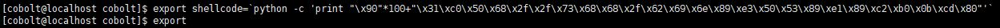

# [LOB] goblin Write-up


```
login : cobolt
Password : hacking exposed
```
로그인하면 접속되고, goblin.c 소스코드 내용은 다음과 같다.


이번 문제는 인자로 받는 것이 아닌 stdin으로 받는다.  
gets() 함수로 받기 때문에 파이프(|)를 이용해 문제를 풀 수 있다.  
쉘코드를 환경변수에 등록하고, 환경변수의 주소를 알아내 리턴주소에 넣어주면 된다.



환경변수로 등록하려면 `export` 를 사용하면 된다. **shellcode**란 이름의 환경변수에 NOP과 함께 쉘코드를 등록했다.

  
export라는 명령어로 확인해보면 등록된 것을 볼 수 있다.  
이제 환경변수의 주소를 알아내야 한다. 환경변수의 주소는 짧은 C언어 코드로 알아낼 수 있다.


매개변수로 전달받은 이름의 환경변수 주소를 출력해주는 코드이다.


컴파일 해준 뒤 **shellcode** 를 인자로 넘겨주어 환경변수의 주소를 알아냈다. 

파이프(|)는 왼쪽의 결과가 오른쪽의 입력값이 된다. NOP으로 buffer와 SFP를 채우고, 환경변수의 주소를 리턴주소로 넣어주었다. cat을 안써줬을 경우 왼쪽의 결과가 EOF까지 전달해 쉘코드가 실행되어도 즉시 종료되기 때문에 이를 막기 위해 써준다. 파이프 오른쪽에서 실행하면 문제가 풀린다.


password는 **hackers proof** 이다.