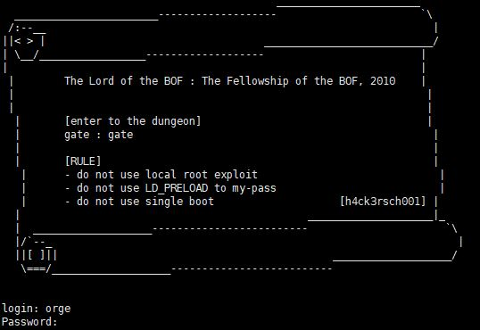
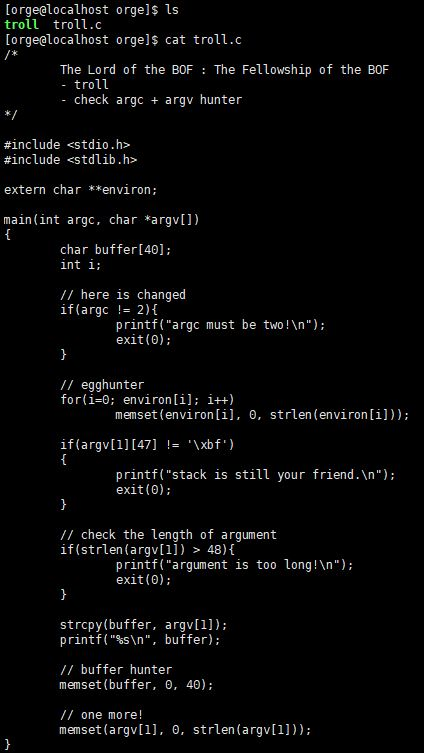
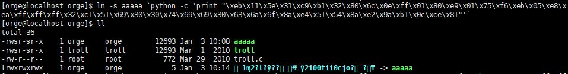
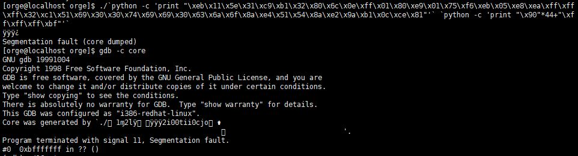
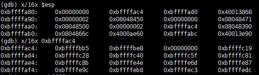
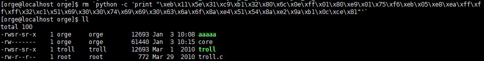
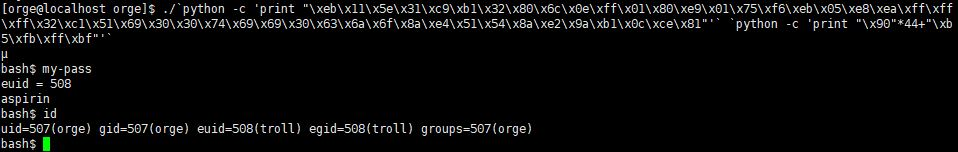

# [LOB] troll Write-up



```
login : orge
Password : timewalker
```

위의 계정으로 로그인하여 접속한다.

이번 문제의 소스코드는 다음과 같다.



argc가 2개여야 하고, buffer와 argv[1]을 초기화한다. 스택에서 남은 부분은 argv[0], 즉 파일 이름 뿐이다. 쉘코드로 된 이름의 파일로 심볼릭 링크를 걸어 실행하고, argv[0]의 시작 주소를 리턴 주소로 넣어주면 된다.

```
[orge@localhost orge]$ cp troll aaaaa
```

우선 파일을 복사하고, 복사한 파일에 쉘코드로 된 파일 이름으로 심볼릭 링크를 걸어준다. 



심볼릭 링크는 `ln [옵션] 원본파일 대상파일` 형식으로 사용한다. 심볼릭 링크가 걸린 것을 볼 수 있다.



실행할 때 쉘코드로 된 이름으로 실행을 시키고 인자로 NOP 44byte 주고, RET가 bf로 시작하게 줬다. 리턴주소가 이상해서 core dump가 생겼다.



core 덤프 분석을 해보면 esp는 argc를 가리키고 있고, 그 다음이 argv이다. `0xbffffac4`를 보면 순서대로 argv[0], argv[1]이다. `0xbffffbb5`가 argv[0] 임을 알 수 있다.



심볼릭 링크를 삭제해주고, troll에 다시 걸어주었다. 심볼릭 링크 이름으로 실행하여 인자로 buffer+SFP(44byte)를 NOP으로 채워주고, RET에 argc[0]의 시작주소인 `0xbffffbb5`를 넣어주었다. 



비밀번호는 **aspirin** 이다.